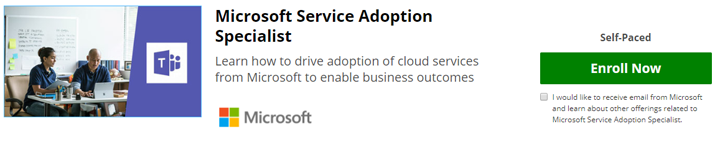

# 스킬 유효성 검사-서비스 채택 전문가 되기

서비스 채택이 역할에 포함 되어 있거나이 항목에 대 한 공식적인 교육을 보다 심층적으로 보려는 경우 파트너 사이트 EdX.org에서 Microsoft가 제공 하는 온라인 강좌를 등록할 수 있습니다. 

이 [서비스 채택 전문가 온라인 강좌](https://aka.ms/AdoptionCert) 는 **감사를 무료로**제공 합니다.  완료를 위해 EdX 인증서를 수신 하려면 $99.00에 대 한 비용이 필요 합니다.  이 과정은 여러 microsoft MVP 및 microsoft IT 전문가의 입력을 통해 microsoft 팀 엔지니어링의 [Karuana gatimu](https://linkedin.com/in/karuanagatimu) 에서 작성 되었습니다.  에 포함 된 모범 사례는 업계 전체를 관찰 하 고 공식적인 조직의 변경 관리 교육을 통해 수집 된 것입니다.  

이 코스에는이 중요 한 비즈니스 기능에 따라 사용자의 컴퓨터 \ 사용에 대 한 유효성을 검사 하는 데 사용할 수 있는 실용적인 지침, 도구 및 추가 콘텐츠가 포함 되어 있습니다.  

이 코스의 게시  에 대 한 자세한 내용을 알아보세요. 

business users 및 IT 전문가의 온라인 커뮤니티에 참여 하 여의 도입 https://aka.ms/DriveAdoption에 대해 학습 합니다. 