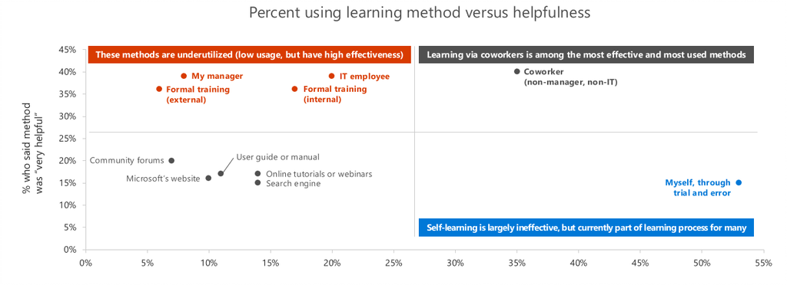

# 사용자 채택을 위한 챔피언 설정 

조직 변경 관리는 대상 사용자 그룹의 동작을 변경하는 아트입니다. 이 사례를 지원하는 많은 과학 및 연구가 있습니다. 이 문서에서는 회사의 비즈니스 결과를 도출하는 주요 서비스의 채택을 주도하는 데 도움을 줄 것입니다.  모범 사례에 따라 Office 365에서 평가 가능한 가치를 얻기 위한 시간을 단축할 수 있습니다.  

챔피언 프로그램은 채택을 주도하는 데 필수적인 부분입니다. 회사의 이러한 영향력 있는 직원은 새 기술을 채택하는 직원에게 많은 지원과 권장을 제공합니다. 이러한 페이지를 검토하여 채택 계획을 만들고 자체 챔피언 프로그램을 실행하는 방법을 알 수 있습니다. 

> [!NOTE]
> 조직 전체에서 참조할 수 있도록 이 재생 목록을 업데이트하거나 해당 프로그램에 대한 정보로 바꿀 수 있습니다.

## 챔피언이 누구고 어떤 틱을 이행할 수 있나요?

챔피언은 자신의 일에 열렬할 뿐만 아니라 자신의 지식을 공유하고 협력자가 보다 효과적인 해결 방법을 배우는 데 도움을 줄 수 있습니다. 챔피언은 열광적이기 때문에 기존 도구로 좌절하는 경우가 종종 있습니다. 이들이 워터풀러 챌린지에서 이길 수 있습니다!  

의미 있는 방식으로 챔피언에게 보상을 받는 것이 중요합니다. 몇 가지 제안 사항이 있습니다.

- 챔피언 프로그램의 성공적인 구성원이 직원의 성과 검토에 기여하도록 허용
- Office 스와그 및 직원의 보상으로 가장 성공적인 챔피언을 인정합니다.  
- 챔피언이 다른 직원에게 전달할 수 있는 지속적인 교육 및 콘텐츠에 참여 

챔피언 개성은 일반적으로 이러한 보상으로 인해 참여하지 않는 것이 아니라 직원 만족도에 영향을 미치기 위해 더 의미 있고 그에 대해 더 의미 있고 그에 대한 분석 가능한 환경을 생성하기 때문에 참여하지 않습니다. 

## 챔피언이 중요한 이유는 무엇입니까? 

직장을 통해 학습하는 것은 전문적인 환경에서 가장 효과적인 학습 방법입니다. 또한 챔피언은 채택 프로그램에 서비스 배포, 교육 프로그램 및 구현하는 변경 내용에 대한 전반적인 정서에 대한 유용한 정보를 제공합니다.  

## 챔피언은 어떻게 지원하나요?

챔피언은 핵심 프로젝트 팀의 리소스에 대한 부담을 줄이고 커뮤니티 전체에서 참여를 유도하는 데 도움이 됩니다. 또한 다음을 할 수 있습니다.

1. 개선된 작업 방식의 채택을 증가시키는 열의를 샘하기 위한 근거를 만들 수 있습니다.
1. 팀 간 영향력 원 구축
1. 팀 전체에서 ot 수명을 작업하는 새로운 방법 가져오기
1. 비즈니스 문제 및 가능한 해결 방법 식별
1. 프로젝트 팀 및 스폰서에게 피드백 제공
