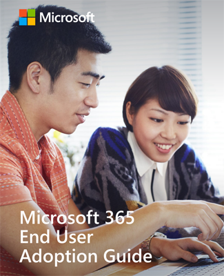

# Microsoft 365 최종 사용자 채택 가이드Microsoft 365 End User Adoption Guide

이 주제에 대 한 자세한 학습은 [Microsoft 365 최종 사용자 채택 가이드](https://aka.ms/adoptionguide)를 활용 하세요.For further learning on this subject utilize the [Microsoft 365 End User Adoption Guide](https://aka.ms/adoptionguide). 이 가이드에서는 다음과 같은 주요 영역에서 최종 사용자 채택을 추진 하는 단계를 설명 합니다.This guide lays out the steps toward driving end user adoption across the following key areas:

- 이해Stakeholders
- 시나리오Scenarios
- 인식Awareness
- 교육Training 
- 변경 계획, 구현 및 관리Plan, Implement and Manage Change
- 
- 이 가이드는 새로운 정보를 통합 하기 위해 자주 업데이트 됩니다.We update this guide frequently to incorporate new information.