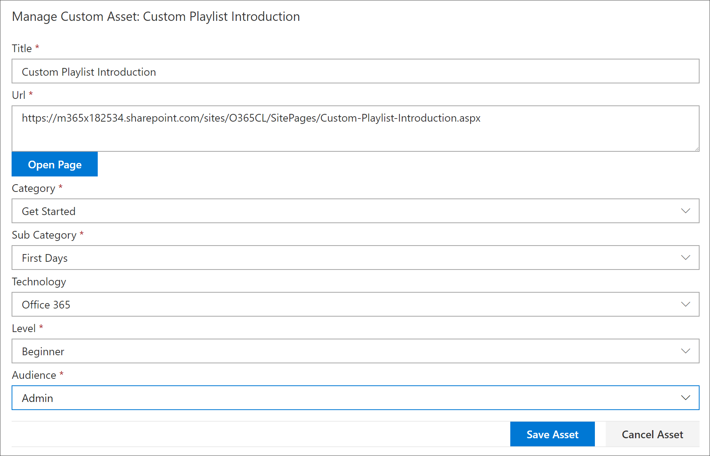

# 사용자 지정 재생 목록에 자산 추가

학습 경로를 사용하여 재생 목록에 다음 자산을 추가할 수 있습니다.

- **기존 Microsoft 365** 학습 경로 자산 - 이러한 자산은 Microsoft 온라인 카탈로그의 일부인 자산 또는 조직에서 학습 경로에 이미 추가한 자산입니다.
- **새 자산** - 만든 SharePoint 페이지 또는 조직의 SharePoint 사이트에서 이미 사용할 수 있는 SharePoint 자산을 사용하여 작성된 학습 경로에 추가하는 자산입니다. 

> [!TIP]
> Microsoft 재생 목록 자산이 요구 사항을 충족하지 않는 경우 새 재생 목록을 만든 다음 Microsoft 자산 및 새로 만든 자산을 재생 목록에 추가하여 원하는 환경을 구축합니다. Microsoft에서 제공하는 학습 경로 재생 목록을 수정할 수 없지만 학습 경로 제공 자산을 사용자 지정 재생 목록에 추가할 수 있습니다.   

## 재생 목록에 대한 새 자산 만들기

재생 목록에 새 자산을 추가하는 두 가지 옵션이 있습니다.

- **자산 페이지 만들기** - 이 옵션을 사용하면 학습 경로에서 비어 있는 새 SharePoint 페이지를 생성하고 재생 목록에 추가합니다. 그런 다음 페이지에 콘텐츠를 추가하고 저장할 수 있습니다.  
- **URL 입력** - 이 옵션을 사용하여 페이지를 미리 빌드하거나 이미 페이지를 사용할 수 있으며 재생 목록에 페이지를 추가할 URL을 지정합니다.

### 자산 만들기 페이지 
자산 **페이지** 만들기 옵션을 사용하여 자산 제목을 제공한 다음 자산 만들기 페이지를 클릭하여 편집할 새 SharePoint 페이지를 만들고 여십시오. 

1.  재생 목록이 편집할 수 있는 아직 열려 있지 않은 경우 사용자 지정 학습 관리 **페이지에서** 편집할 재생 목록을 클릭합니다. 
2. 재생 목록에 새 자산을 추가하려면 새 자산 **을 클릭합니다.** 
3. 제목을 입력합니다. 이 예제에서는 "재생 목록에 자산 추가"를 입력한 다음 자산 페이지 **만들기를 클릭합니다.**

4. 페이지 **열기 를 클릭합니다.**
5. 편집 **아이콘을** 클릭한 다음 제목 **영역의 웹 파트** 편집을 클릭합니다.
6. **레이아웃에서** 일반 을 **클릭합니다.** 
7. 한 열로 구성한 섹션을 새로 추가한 다음 페이지에 예제 텍스트를 추가하여 다음 예제와 같이 표시됩니다. 

7. **게시** 를 클릭합니다.
8. 사용자 지정 **학습 관리 페이지로** 돌아오십시오. 
9. 자산의 나머지 속성을 작성한 다음 자산 **저장을 클릭합니다.**

### URL 입력
URL **입력 옵션을** 사용하여 자산 제목을 입력한 다음 **URL** 입력을 클릭하여 재생 목록에 추가할 SharePoint 페이지를 지정합니다. 

1.  편집할 재생 목록이 열려 있지 않은 경우 사용자 지정 학습 관리 **페이지에서** 편집할 재생 목록을 클릭합니다. 
2. 재생 목록에 새 자산을 추가하려면 새 자산 **을 클릭합니다.** 
3. 제목을 입력합니다. 이 예에서는 "사용자 지정 재생 목록 소개"를 입력한 다음 **URL 입력 을 클릭합니다.** 

4. 이전 사용자 지정 재생 목록용 SharePoint 페이지 만들기 섹션에서 만든 [SharePoint ](custom_createnewpage.md) 페이지의 URL을 입력한 다음 다음 그림과 같이 필드의 나머지 부분을 입력합니다.

5. 자산 **저장을 클릭합니다.** 

## 재생 목록에 기존 자산 추가

기존 자산은 조직에서 학습 경로에 이미 추가한 Microsoft 제공 학습 경로 자산 또는 자산으로 구성됩니다. 

- 검색 **상자에** 검색 구를 입력한 다음 검색 결과에서 자산을 선택합니다. 이 예제에서는 "Excel이 무엇입니까?"를 입력합니다. 을(를) 추가합니다.

## 자산 편집, 이동 및 삭제
만든 사용자 지정 자산을 편집할 수 있지만 Microsoft의 자산은 편집할 수 없습니다. 그러나 재생 목록에서 모든 자산을 제거하고 주문 자산을 변경할 수 있습니다. 

### 자산 편집
- 자산에 대한 편집 단추를 클릭하고 자산을 수정한 다음 자산 저장을 클릭합니다. 

### 재생 목록에서 자산 이동
- 재생 목록에서 자산 순서를 이동하려면 자산 오른쪽의 위쪽 또는 아래쪽 화살표를 클릭합니다.

### 재생 목록에서 자산 제거
- 자산에 대한 재생 목록 X에서 제거 아이콘을 클릭합니다. 

## 동작에서 재생 목록 보기
이제 재생 목록에 자산을 추가했습니다. 이제 재생 목록을 닫고 실행 중으로 볼 수 있습니다. 

1. 재생 **목록 닫기 를 클릭합니다.**
2. **Office 365** 교육 페이지가 있는 탭을 클릭합니다.
3. 페이지를 새로 고치고 시작 에서 첫 **번째 일** **을 클릭합니다.**
4. 학습 **경로 시작 키트를** 클릭하여 첫 번째 재생 목록을 볼 수 있습니다. 

