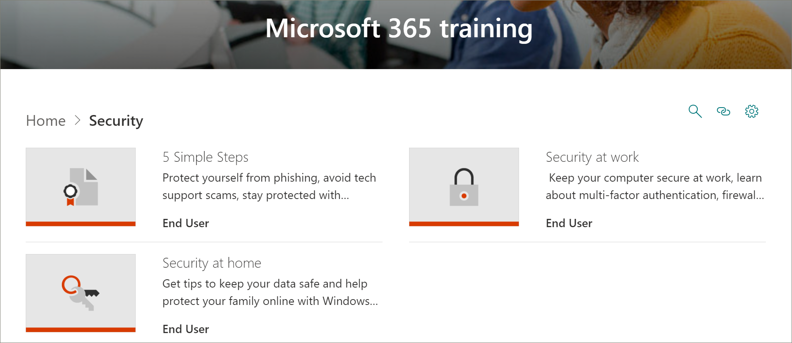

# Microsoft 365 학습 경로 콘텐츠 업데이트Microsoft 365 Learning Pathways Content Updates
학습 경로는 분기별 콘텐츠 업데이트 주기를 준수하기 위해 노력합니다.Learning pathways strives to adhere to a quarterly content update cycle. 다음 목록에는 2020년 9월 콘텐츠 업데이트가 나열됩니다.The following list the content updates for September 2020.

## 2020년 9월 콘텐츠 업데이트September 2020 Content Updates
학습 경로는 분기별 콘텐츠 업데이트 주기를 준수하기 위해 노력합니다.Learning pathways strives to adhere to a quarterly content update cycle. 콘텐츠 업데이트가 적용되는 방법 및 콘텐츠 업데이트를 관리하는 방법에 대한 자세한 내용은 콘텐츠 업데이트 관리 [를 참조하세요.](custom_contentupdatesmanage.md)To learn more about how content updates are applied, and how to manage content updates, see [Manage Content Updates](custom_contentupdatesmanage.md). 

> [!IMPORTANT]
> 9월 콘텐츠 업데이트는 영어, 중국어(간체), 프랑스어, 독일어, 이탈리아어, 일본어, 포르투갈어(브라질), 러시아어 및 스페인어로 출시되었습니다.The September content update has been released for English, Chinese (Simplified), French, German, Italian, Japanese, Portuguese (Brazilian), Russian, and Spanish.  

### 보안Security
사용자가 사무실과 가정에서 보다 안전하게 작업할 수 있도록 재생 목록 및 자산이 추가된 새로운 보안 하위 목록이 추가되었습니다.A new security subcategory has been added with playlists and assets to help users work more securely in the office and at home. 

#### "5개의 간단한 단계" 재생 목록"Five simple steps" playlist
- 피싱으로부터 자신 보호Protect yourself from phishing
- 기술 지원 사기 방지Avoid tech support scams
- 집에서 더욱 안전하게 작업Work from home more securely
- PC를 최신으로 유지Keep your PC up to date
- Windows 보안으로 보호 유지Stay protected with Windows security

#### "집에서 보안" 재생 목록"Security at home" playlist
- 데이터를 안전하게 유지하기 위한 팁Tips to keep your data safe
- 가정에서 컴퓨터 안전 유지Keep your computer safe at home
- Windows 보안으로 온라인으로 가족 보호Help protect your family online with Windows Security   

#### "직장의 보안" 재생 목록"Security at work" playlist
- 컴퓨터 보안 유지Keep your computer secure at work
- 다단계 인증이란?What is Multi-factor Authentication?
- Windows 보안의 방화벽 및 네트워크 보호Firewall and network protection in Windows security
- 변조 방지를 사용하여 보안 설정 변경 방지Prevent changes in security settings with Tamper Protection

### "Teams 시작" 재생 목록"Get started with Teams" playlist
사용자가 Teams를 시작하고 실행하는 데 도움이 되는 새로운 "Teams 시작" 재생 목록이 "시작/첫 번째 날" 하위 목록에 추가되었습니다.A new "Get Started with Teams" playlist has been added to the "Get Started/First Days" subcategory to help users get up and running with Teams. 재생 목록에는 다음이 포함됩니다.The playlist includes:
- Microsoft Teams에 오신 것을 환영합니다.Welcome to Microsoft Teams  
- 팀 운영Get your team up and running
- 채널에서 작업Work in channels  
- 파일 업로드 및 공유Upload and share files 
- 채팅 시작 및 고정Start and pin chats  
- Teams 모임 참가Join a Teams meeting 
- 모임 관리Manage meetings 
 
### Microsoft 365 기본Microsoft 365 Basics
제품 범주에서 "Office 365 기본" 하위 범주가 "Microsoft 365 기본" 범주로 업데이트되었습니다.In the Products category, the "Office 365 Basics" subcategory has been updated to the "Microsoft 365 Basics" category. "Office 365 기본" 범주의 사용 중지된 자산은 사용자 지정 재생 목록에 추가된 경우 계속 사용할 수 있습니다.Retired assets in the "Office 365 Basics" category are still available if they've been added to a custom playlist.

#### "시작" 재생 목록"Get started" playlist
- Microsoft 365란 무엇인가요?What is Microsoft 365?
- 로그인Sign in
- Office.comOffice.com

#### "만들기 및 저장" 재생 목록"Create and save" playlist
- 데스크톱 앱 사용Using the desktop apps
- 앱 Office.com 사용Using Office.com apps
- 클라우드에 파일 저장Save files to the cloud
- OneDrive와 요구 시 파일 동기화Sync Files on Demand with OneDrive

#### "공유 및 공동 작업" 재생 목록"Share and collaborate" playlist
- Microsoft 365에서 파일 공유Share files in Microsoft 365
- 공동 작성자Co-author
- 다음 @mentionsUse @mentions
- 후속Follow-ups

#### "Microsoft Teams 작업" 재생 목록"Work with Microsoft Teams" playlist
- Microsoft Teams에 오신 것을 환영합니다.Welcome to Microsoft Teams
- 팀 및 채널 개요Overview of teams and channels
- 게시물 만들기 및 서식 지정Create and format a post
- 채팅 시작 및 고정Start and pin chats
- 전화 걸기Make calls
- Teams 모임 참가Join a Teams meeting
- 더 나은 모임을 위한 팁Tips for better meetings

#### "Windows를 가장 많이 사용" 재생 목록"Get the most out of Windows" playlist
- 검색을 사용하여 문서, 앱 등 찾기Find your documents, apps, and more with Search
- Microsoft EdgeMicrosoft Edge
- Bing의 Microsoft SearchMicrosoft Search in Bing

#### "어디서나 작업" 재생 목록"Work from anywhere" playlist
- OneDrive 모바일 앱OneDrive mobile app
- Outlook 모바일 앱Outlook mobile app

#### "멋진 Microsoft 365 기능" 재생 목록"Cool Microsoft 365 features" playlist
- PowerPoint DesignerPowerPoint Designer
- Excel 아이디어Ideas in Excel
- Word의 편집기Editor in Word
- 콘텐츠에 액세스할 수 있도록 설정Make your content accessible

### Access의 "차트 만들기" 재생 목록"Create a chart" playlist in Access
"Products\Access" 하위 목록에 "차트 재생 목록 만들기"가 추가되었습니다.A "Create a chart playlist" has been added to the "Products\Access" subcategory.  
- 열 차트 만들기Create a column chart
- 막대형 차트 만들기Create a bar chart
- 선 차트 만들기Create a line chart
- 파이 차트 만들기Create a pie chart
- 콤보 차트 만들기Create a combo chart

### Teams 업데이트Teams updates
"Product\Microsoft Teams" 하위 제품이 다음 자산으로 업데이트되었습니다.The "Product\Microsoft Teams" subcategory has been updated with the following assets. 

#### "모임 관리" 재생 목록"Manage meetings" playlist
- Teams 모임 참가Join a Teams meeting
#### "게시물 및 메시지 작업" 재생 목록"Work with posts and messages" playlist
- 게시물 만들기 및 서식 지정Create and format a post

### PlannerPlanner 
"Products\Planner"의 "Planner 사용" 재생 목록에 팔로우 자산이 추가되었습니다.The follow assets have been added to the "Use Planner" playlist in "Products\Planner".
#### Planner 재생 목록 사용Use Planner playlist
- 할 일 및 플래너To Do vs Planner
- 수행할 작업의 Planner 작업 참조See your Planner Tasks in To Do
- Teams에서 작업 앱 사용Use the Tasks App in Teams

### WordWord
다음 자산은 "Word와 공유 및 공동 작성" 재생 목록에서 업데이트되었습니다.The following asset has been updated in the "Share and co-author with Word" playlist.

#### "Word와 공유 및 공동 작성" 재생 목록"Share and co-author with Word" playlist
- "실시간 공동 작성을 통해 Word 문서 공동 작업" 자산이 업데이트되었습니다."Collaborate on Word documents with real-time co-authoring" asset has been updated. 

### 웹용 OfficeOffice for the web
"웹용 Office: 웹용 Word" 재생 목록에서 다음 자산이 업데이트되었습니다.The following asset has been updated in the "Office for the web: Word for the web" playlist.

#### "웹용 Office: 웹용 Word" 재생 목록"Office for the web: Word for the web" playlist
- 녹음/녹화 기록Transcribe your recordings

### PowerPoint(신규, 업데이트)PowerPoint (new, updated)
다음 자산이 제품\PowerPoint 재생 목록에 업데이트되거나 추가되었습니다.The following assets have been updated or added to the Products\PowerPoint playlists. 

#### "Text & tables with PowerPoint" 재생 목록"Text & tables with PowerPoint" playlist
- PowerPoint에서 필기한 Ink를 도형, 텍스트 또는 수학으로 변경(신규)Change handwritten ink to shapes, text, or math in PowerPoint (new)

#### 슬라이드 쇼 재생 목록 발표Present slideshows playlist
- 프레젠테이션 기록(업데이트)Record a presentation (updated)

### Office 빠른 시작 가이드(업데이트)Office Quick Start guides (updated)
모든 Office 제품에 대한 Office 빠른 시작 가이드가 업데이트되었습니다.The Office Quick Start guides for all the Office products have been updated. 

## 2020년 4월 콘텐츠 업데이트April 2020 Content Updates
 현재 이벤트에 대한 응답으로 2020년 4월 콘텐츠 업데이트는 조직에서 원격 작업을 사용하도록 설계된 학습 재생 목록 및 리소스를 제공합니다.In response to current events, the April 2020 Content Update provides learning playlists and resources designed to enable remote work in your organization. Microsoft는 새로운 작업 원격 재생 목록 집합을 추가하고, 특히 Teams 모임을 위해 Microsoft Teams 콘텐츠를 업데이트했습니다.We’ve added a new set of Work remotely playlists, and updated the Microsoft Teams content, especially for Teams meetings. 또한 웹 재생 목록용 Office 집합을 새로 추가하고 새 Microsoft Forms 자산을 추가했습니다.We've also added a new set of Office for the web playlists, and added new Microsoft Forms assets. 관리자를 위한 원격 작업 리소스 목록도 제공했습니다.We've also provided a list of Remote Work resources for administrators.  
 
 콘텐츠 업데이트가 적용되는 방법 및 콘텐츠 업데이트를 관리하는 방법에 대한 자세한 내용은 콘텐츠 업데이트 관리 [를 참조하세요.](custom_contentupdatesmanage.md)To learn more about how content updates are applied, and how to manage content updates, see [Manage Content Updates](custom_contentupdatesmanage.md). 다음에는 2020년 4월 Microsoft 365 학습 경로 콘텐츠 업데이트가 나열됩니다.The following lists the April 2020 Microsoft 365 learning pathways content updates. 

### Office 365가 Microsoft 365로 리브랜드Office 365 was rebranded to Microsoft 365
Office 365는 Microsoft 365로 다시 브랜드가 업데이트됩니다.Office 365 has been rebranded to Microsoft 365. 이름 변경은 Microsoft 365 학습 경로 콘텐츠 전체에 반영됩니다.The name change is reflected throughout the Microsoft 365 learning pathways content. 

### 새 재생 목록 또는 업데이트된 재생 목록New or Updated Playlists
다음 재생 목록이 추가되거나 업데이트되었습니다.The following playlists have been added or updated.  

#### 원격으로 작업(새 재생 목록 2개/새 자산 11개)Work remotely (2 new playlists/11 new assets)
다음과 같은 재생 목록 및 자산을 특징으로 하는 학습 경로에 새로운 작업 원격 하위 목록이 추가되었습니다.A new Work remotely subcategory was added to learning pathways that features the following playlists and assets: 

##### 원격으로 작업(새 자산 5개)Work remotely (five new assets)
- Office 365를 사용하여 원격으로 작업Work remotely with Office 365
- 2016에서 Office.comGet started at Office.com
- 통신 또는 충족Communicate or meet
- 작업 파일 저장Store your work files
- 고급 대안Advanced alternatives
##### Office 365와 공동 작업하기 위한 모범 사례(새 자산 6개)Best practices for collaborating with Office 365 (6 new assets)
- 시작하기Get started
- 공유Share
- 공동 작성자Co-author
- 파일 채팅Chat in files
- MeetMeet
- MobileMobile

### Teams(새 자산 9개/업데이트된 자산 6개)Teams (nine new assets/six updated assets)
Teams 콘텐츠에 대한 다양한 업데이트가 있습니다.A variety of updates have been made to Teams content. 
#### 팀 및 채널에서 공동 작업(하나의 새 자산/하나의 업데이트된 자산)Collaborate in teams and channels (one new/one updated asset)
- 비공개 채널 만들기 및 사용(새 채널)Create and use private channels (new)
- 채널 표시 또는 숨기기(업데이트)Show or hide channels (updated)
#### 채팅 및 통화 시작(새로 추가된 두 개 업데이트)Start chats and calls (two new/one updated)
- 채팅 시작 및 고정(신규)Start and pin chats (new)
- 채팅 숨기기, 메시지 삭제(새로 추가)Hide chats, delete messages (new)
- 전화 걸기(업데이트)Make calls (updated)
#### 앱 및 도구 살펴보기(새로 추가된 앱)Explore apps and tools (one new)
- 앱 사용(새 앱)Use apps (new)
#### 게시물 및 메시지 작업Work with posts and messages
- 여러 채널에 메시지 게시(신규)Post a message to multiple channels (new)
#### 모임 관리(업데이트된 자산 3개/업데이트된 자산 3개)Manage meetings (three new/four updated assets)
- Teams 모임 참가(신규)Join a Teams meeting (new)
- 모임 시작을 사용하여 인스턴트 모임 만들기(업데이트)Create instant meetings with Meet now (updated)
- 채널에서 만나기(신규)Meet in a channel (new)
- 모임 관리(새 모임)Manage meetings (new)
- 모임 중에 화면 표시(업데이트)Show your screen during a meeting (updated)
- PowerPoint 슬라이드 표시(업데이트)Show PowerPoint slides (updated)
- Teams 모임 중에 이동(업데이트)Move around during a Teams meeting (updated)
#### 게시물 및 메시지 작업(새로 추가)Work with post and messages (one new)
- 여러 채널에 메시지 게시(신규)Post a message to multiple channels (new)

### 웹용 OfficeOffice for the web
웹용 Office는 사용자가 웹에서 Office를 만들고 공유하고 공동 작업하려는 시나리오에 대한 재생 목록 집합을 제공합니다.Office for the web provides a set of playlists for scenarios where users want to create, share, and collaborate with Office on the web. 이 콘텐츠 집합은 Google G Suite에서 Microsoft 365로 전환하는 조직에도 가치가 있습니다.This set of content is also valuable for organizations that are making the switch from Google G Suite to Microsoft 365.
#### 시작(새 자산 5개)Get started (five new assets)
- 시작하기Get started
- 검색을 사용하여 찾기Find it with Search
- 새 문서 만들기Create new documents
- 직장으로 돌아가기Get back to work
- 권장 파일Recommended files
#### 웹용 OutlookOutlook for the web
- 웹용 Outlook에 대해 알아가기Get to know Outlook for the Web
- 전자 메일에 회신 만들기Create a reply to email
- 받은 편지함 구성Organize your Inbox
- 서명 및 자동 회신 만들기Create a signature and automatic reply
- 약속 또는 모임 예약Schedule an appointment or meeting
- 연락처 편집 만들기Create an edit a contact
- 전자 메일, 연락처 및 이벤트 검색Search for email, contacts, and events
#### 웹용 WordWord for the web
- 웹용 Word에 대해 알아가기Get to know Word for the Web
- 문서 레이아웃 변경Change document layout
- 표 및 그림 삽입Insert tables and pictures
- 온라인으로 공동 작업Collaborate online
- Word for the Web의 멋진 것Cool things in Word for the Web
#### 웹용 ExcelExcel for the web
- 웹용 Excel에 대해 알아가기Get to know Excel for the Web
- 수식 만들기Create formulas
- 피벗Table 삽입Insert a PivotTable
- 아이디어로 인사이트 얻기Get insight with ideas
- 공동 작업Collaborate
- 플래시 채우기로 시간 절약Save time with Flash Fill
- 조건부 서식으로 그림 그리기Paint a picture with Conditional Formatting
#### 웹용 PowerPointPowerPoint for the web
- 웹용 PowerPoint에 대해 알아가기Get to know PowerPoint for the Web
- 그림, 도형 등 삽입Insert pictures, shapes, and more
- 애니메이션 및 전환Animation and transitions
- 다른 사용자와 프레젠테이션 만들기Create a presentation with others
- 발표할 준비가 된 경우When you’re ready to present
- 슬라이드 디자인Designing slides
#### 문서 공유Share your documents
- 문서 공유Share your documents
- 공유 가능한 링크 만들기Create a shareable link
- 특정 사용자만이 사용할 수 있는 Docs 보안Secure your docs only to specific people
- 조직 외부의 사용자와 공유Share with someone outside your organization 

### Microsoft FormsMicrosoft Forms 
요청에 따라 몇 가지 새로운 Forms 자산도 있습니다.By request, there are also some new Forms assets. 
#### 양식(새 자산 4개)Forms (four new assets) 
- 양식 만들기Create a form 
- 양식 공유Share a form 
- 양식의 결과 보기View results of a form 
- Microsoft Forms에 대한 질문과 대답Frequently Asked Questions about Microsoft Forms 

### 원격 작업자 지원을 위한 리소스Resources for supporting your remote workforce
학습 경로를 사용하여 원격 작업자를 지원하기 위한 학습 경로 사이트에 방문 페이지를 빌드할 수 있습니다.You can use learning pathways to build a landing page in your learning pathways site for supporting remote workers. 또는 학습 경로 사이트의 기존 지원 페이지에 학습 경로 웹 파트를 추가하고 웹 파트를 필터링하여 원격으로 작업 재생 목록을 표시할 수 있습니다.Or you can add the learning pathways web part to an existing support page on your learning pathways site and filter the web part to show the Work Remotely playlists. 다음은 조직에서 원격 작업을 지원하기 위한 Microsoft의 몇 가지 상위 리소스 목록입니다.Here’s a list of some of the top resources from Microsoft for supporting remote work in your organization. 
- [Microsoft Teams를 배포하는 방법How to roll out Microsoft Teams](https://docs.microsoft.com/microsoftteams/how-to-roll-out-teams)
- [Microsoft Teams에서의 모임 및 회의Meetings and conferencing in Microsoft Teams](https://docs.microsoft.com/microsoftteams/deploy-meetings-microsoft-teams-landing-page)
- [Microsoft Teams를 사용하여 원격 작업자 지원Support Remote Workers using Microsoft Teams](https://docs.microsoft.com/microsoftteams/support-remote-work-with-teams)
- [자주 묻는 질문(FAQ) - 원격 작업자 지원FAQ: Support your remote workforce](https://docs.microsoft.com/microsoftteams/faq-support-remote-workforce)
- [Microsoft IT가 직원을 위해 원격 작업을 사용하도록 설정하는 상위 9가지 방법The top 9 ways Microsoft IT is enabling remote work for its employees](https://www.microsoft.com/microsoft-365/blog/2020/03/12/top-9-ways-microsoft-it-enabling-remote-work-employees/)
- [Microsoft Teams 교육Microsoft Teams Training](https://docs.microsoft.com/microsoftteams/training-microsoft-teams-landing-page)
- [교육: Microsoft Education CenterEducation: Microsoft Education Center](https://education.microsoft.com) 
- [교육: 원격 학습 시작Education: Getting started with remote learning](https://education.microsoft.com/resource/4c0c02c0)

학습 경로를 사용자 지정하는 방법에 대한 자세한 내용은 학습 경로 사용자 [지정을 참조하십시오.](custom_overview.md)For more information about how to customize Learning Pathways, see [Customize learning pathways](custom_overview.md). 

## 2019년 11월 콘텐츠 업데이트November 2019 Content Updates
Microsoft 365 학습 경로 콘텐츠 업데이트입니다.Welcome to the Microsoft 365 learning pathways content update. 2019년 11월 업데이트를 시작으로 분기별 학습 경로 카탈로그의 업데이트된 인벤토리를 제공합니다.Starting with our November 2019 update, we'll provide an updated inventory of the learning pathways catalog on a quarterly basis. 2019년 11월 업데이트에서는 다음과 같은 새 콘텐츠 하위 목록 및 재생 목록이 학습 경로 카탈로그에 추가되었습니다.For the November 2019 update, the following new content subcategories and playlists have been added to the learning pathways catalog. 콘텐츠 업데이트가 적용되는 방법 및 콘텐츠 업데이트를 관리하는 방법에 대한 자세한 내용은 콘텐츠 업데이트 관리 [를 참조하세요.](custom_contentupdatesmanage.md)To learn more about how content updates are applied, and how to manage content updates, see [Manage Content Updates](custom_contentupdatesmanage.md).    

### TeamsTeams
Teams 하위 목록에 몇 가지 새 재생 목록이 추가되었습니다.Several new playlists have been added to the Teams subcategory.
- 게시물 및 메시지 작업(4개의 자산)Work with posts and messages (four assets)
- 파일 업로드 및 찾기(두 개의 자산)Upload and find files (two assets)
- 라이브 이벤트 설정 및 참석(4개의 자산)Set up and attend live events (four assets)
- 작업 피드 관리(두 개의 자산)Manage your activity feed (two assets)
- 이동 중 Teams(두 개의 자산)Teams on the go (two assets)

### Microsoft 365 성공 센터Microsoft 365 Success Center
Microsoft 365 학습 경로 성공 센터 하위ategory를 학습 경로 경험에 추가했습니다.We've added a Microsoft 365 learning pathways Success Center subcategory to the learning pathways experience. 성공 센터에서는 다음 재생 목록을 제공합니다.The Success Center provides the following playlists.
- 새로운 것, 변경된 것(3개의 자산)What’s New, What Changed (three assets)
- 학습 콘텐츠 계획(두 자산)Plan your learning content (two assets)
- 학습 경로 사용자 지정(8개의 자산?)Customize learning pathways (eight assets?)
- 학습 경로 채택 주도(하나의 자산)Drive Adoption of learning pathways (one asset)
- 학습 경로의 영향 측정(하나의 자산)Measure impact of learning pathways (one asset)

### OutlookOutlook
다음 재생 목록이 Outlook 하위 목록에 추가되었습니다.The following playlists have been added to the Outlook subcategory. 
- Outlook 모바일: 받은 편지함 관리(8개의 자산)Outlook mobile: Manage your inbox (eight assets)
- Outlook 모바일: 사람 및 연결(5개의 자산)Outlook mobile: People and connections (five assets)
- Outlook 모바일: 검색 및 공유(4개의 자산)Outlook mobile: Search and share (four assets)

### OneDriveOneDrive
OneDrive에 대해 추가된 비디오 자산은 다음과 같습니다.The following video assets have been added for OneDrive. 
- iPhone 또는 iPad 설정이 OneDrive 재생 목록의 시작에 추가되었습니다.Set up your iPhone or iPad has been added to the Intro to OneDrive playlist
- OneDrive 재생 목록으로 파일 관리에 OneDrive 백업 켜기가 추가되었습니다.Turn on OneDrive Backup has been added to the Manage your files with OneDrive playlist

### PlannerPlanner
다음 재생 목록 및 자산이 카탈로그에 추가되었습니다.The following playlists and assets have been added to the catalog.  
- Planner 빠른 시작(6개의 자산)Planner Quick Start (six assets)
- Planner 사용(8개의 자산)Use Planner (eight assets)

### 내게 필요한 옵션Accessibility
콘텐츠의 접근성 하위 목록이 다음 재생 목록과 함께 추가되었습니다.The Accessibility subcategory of content has been added with the following playlists. 
- Microsoft 365 접근성 개요 및 리소스(3개의 자산)Microsoft 365 Accessibility Overview and Resources (three assets)
- Outlook에서 접근성 있는 전자 메일 메시지 만들기(3가지 자산)Create more accessible email messages in Outlook (three assets)
- 접근성 있는 Word 문서 만들기(8개의 자산)Create more accessible Word documents (eight assets)
- 접근성 있는 Excel 통합 문서 만들기(3개의 자산)Create more accessible Excel workbooks (three assets)
- PowerPoint에서 접근성 있는 슬라이드 만들기(5개 자산)Create more accessible slides in PowerPoint (five assets)

### SwaySway
콘텐츠의 Sway 하위 목록이 다음 재생 목록과 함께 추가되었습니다.The Sway subcategory of content has been added with the following playlists. 
- Sway 빠른 시작(4개의 자산)Sway Quick Start (four assets)
- Sway 공유 및 액세스(5개의 자산)Share and access Sway (five assets)
- Sway에 콘텐츠 추가(11개 자산)Add content to Sway (11 assets)
- Sway 사용자 지정(5개의 자산)Customize Sway (five assets)

### 액세스Access
- Access 빠른 시작(4개의 자산)Access Quick Start (four assets)
- Access에 대한 Intro to Access(3개의 자산)Intro to Access (three assets)
- Access 데이터베이스 만들기(두 개의 자산)Create an Access database (two assets)
- 테이블 추가(두 개의 자산)Add tables (two assets)
- 관계 사용(5개의 자산)Use relationships (five assets)
- 데이터 추가 및 편집(두 개의 자산)Add and edit data (two assets)
- 쿼리를 사용하여 데이터 관리(5개의 자산)Manage data with queries (five assets)
- 양식 만들기(하나의 자산)Create forms (one asset)
- 보고서 만들기(두 개의 자산)Create reports (two assets)
- 데이터베이스 보호(하나의 자산)Protect databases (one asset)

