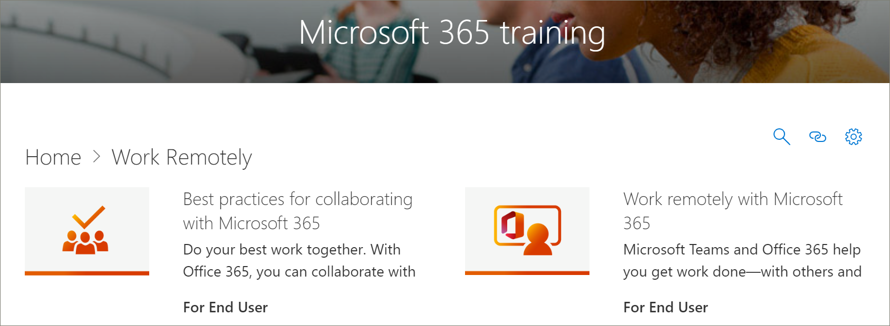

# 4 월에 대 한 Microsoft 365 학습 경로 콘텐츠 업데이트Microsoft 365 Learning Pathways Content Updates for April
학습 경로는 분기별 콘텐츠 업데이트 사이클을 따르도록 합니다.Learning pathways strives to adhere to a quarterly content update cycle. 다음 목록에는 4 월 2020 콘텐츠가 업데이트 되어 있습니다.The following list the content updates for April 2020.

## 2020 년 4 월 콘텐츠 업데이트April 2020 Content Updates
 현재 이벤트에 대 한 응답으로, 4 월 2020 콘텐츠 업데이트는 조직에서 원격 작업을 사용 하기 위해 디자인 된 학습 재생 목록과 리소스를 제공 합니다.In response to current events, the April 2020 Content Update provides learning playlists and resources designed to enable remote work in your organization. 새로운 작업을 원격으로 재생 목록 집합을 추가 하 고, Microsoft 팀 콘텐츠, 특히 팀 회의, 웹 재생 목록에 대 한 새로운 Office 집합 추가 및 새로운 Microsoft Forms 자산을 추가 했습니다.We’ve added a new set of Work remotely playlists, significantly updated the Microsoft Teams content, especially for Teams meetings, added a new set of Office for the web playlists, and added new Microsoft Forms assets. 업데이트의 일부로 관리자를 위한 원격 작업 리소스의 목록도 제공 했습니다.As part of the update, we've also provided a list of Remote Work resources for administrators.  
 
 콘텐츠 업데이트를 적용 하는 방법과 콘텐츠 업데이트를 관리 하는 방법에 대 한 자세한 내용은 [콘텐츠 업데이트 관리](custom_contentupdatesmanage.md)를 참조 하세요.To learn more about how content updates are applied, and how to manage content updates, see [Manage Content Updates](custom_contentupdatesmanage.md). 다음 목록에는 Microsoft 365 학습 경로 콘텐츠 업데이트의 4 월 2020이 나와 있습니다.The following lists the April 2020 Microsoft 365 learning pathways content updates. 

### Office 365이 Microsoft 365에 다시 참가 했습니다.Office 365 was rebranded to Microsoft 365
Office 365이 Microsoft 365에 다시 참가 했습니다.Office 365 has been rebranded to Microsoft 365. 이름 변경 내용은 Microsoft 365 학습 경로 콘텐츠 전체에 반영 됩니다.The name change is reflected throughout the Microsoft 365 learning pathways content. 

### 새로 추가 되거나 업데이트 된 재생 목록New or Updated Playlists
다음 재생 목록이 추가 되거나 업데이트 되었습니다.The following playlists have been added or updated.  

#### 원격으로 작업 (2 개의 새 재생 목록/11 개 새 자산)Work remotely (2 new playlists/11 new assets)
다음과 같은 재생 목록 및 자산을 제공 하는 학습 경로에 원격으로 새 작업에 하위 범주가 추가 되었습니다.A new Work remotely subcategory was added to learning pathways that features the following playlists and assets: 

##### 원격으로 작업 (5 개의 새 자산)Work remotely (5 new assets)
- Office 365에서 원격으로 작업Work remotely with Office 365
- Office.com에서 시작Get started at Office.com
- 통신 또는 모임Communicate or meet
- 작업 파일 저장Store your work files
- 고급 대체 방법Advanced alternatives
##### Office 365의 공동 작업을 위한 모범 사례 (새 자산 6 개)Best practices for collaborating with Office 365 (6 new assets)
- 시작하기Get started
- 공유Share
- 공동 작성자Co-author
- 파일에서 채팅Chat in files
- 조건Meet
- MobileMobile

### 팀 (9 개의 새 자산/6 개의 업데이트 된 자산)Teams (9 new assets/6 updated assets)
팀 콘텐츠에 대 한 다양 한 업데이트가 수행 되었습니다.A variety of updates have been made to Teams content. 
#### 팀 및 채널에서 공동 작업 (1 개 신규/1 개의 업데이트 된 자산)Collaborate in teams and channels (1 new/1 updated asset)
- 개인 채널 만들기 및 사용 (신규)Create and use private channels (new)
- 채널 표시 또는 숨기기 (업데이트 됨)Show or hide channels (updated)
#### 채팅 및 통화 시작 (2 개 신규/1 개 업데이트 됨)Start chats and calls (2 new/1 updated)
- 채팅 시작 및 고정 (신규)Start and pin chats (new)
- 채팅 숨기기, 메시지 삭제 (신규)Hide chats, delete messages (new)
- 통화 만들기 (업데이트 됨)Make calls (updated)
#### 앱 및 도구 살펴보기 (1 새로 만들기)Explore apps and tools (1 new)
- 앱 사용 (신규)Use apps (new)
#### 게시물 및 메시지에 대 한 작업Work with posts and messages
- 여러 채널에 메시지 게시 (신규)Post a message to multiple channels (new)
#### 모임 관리 (3 개의 신규/4 개의 업데이트 된 자산)Manage meetings (3 new/4 updated assets)
- 팀 회의에 참가 (신규)Join a Teams meeting (new)
- 모임 시작 (업데이트 됨)을 사용 하 여 인스턴트 모임 만들기Create instant meetings with Meet now (updated)
- 채널에서 모임 (신규)Meet in a channel (new)
- 모임 관리 (신규)Manage meetings (new)
- 모임 중에 화면 표시 (업데이트 됨)Show your screen during a meeting (updated)
- PowerPoint 슬라이드 표시 (업데이트 됨)Show PowerPoint slides (updated)
- 팀 회의 중에 이동 (업데이트 됨)Move around during a Teams meeting (updated)
#### 게시물 및 메시지에 대 한 작업 (신규 1 개)Work with post and messages (1 new)
- 여러 채널에 메시지 게시 (신규)Post a message to multiple channels (new)

### 웹용 OfficeOffice for the web
Web for office에서는 사용자가 웹에서 Office를 만들고 공유 하 고 공동으로 작업할 수 있는 시나리오에 사용할 수 있는 재생 목록 집합을 제공 합니다.Office for the web provides a set of playlists for scenarios where users want to create, share, and collaborate with Office on the web. 이 콘텐츠 집합은 Google G Suite에서 Microsoft 365로 전환 하는 조직에도 유용 합니다.This set of content is also valuable for organizations that are making the switch from Google G Suite to Microsoft 365.
#### 시작 (새 자산 5 개)Get started (5 new assets)
- 시작하기Get started
- 검색을 통해 찾기Find it with Search
- 새 문서 만들기Create new documents
- 작업으로 돌아가기Get back to work
- 추천 파일Recommended files
#### 웹용 OutlookOutlook for the web
- 웹용 Outlook 알아보기Get to know Outlook for the Web
- 전자 메일에 대 한 회신 만들기Create an reply to email
- 받은 편지함 구성Organize your Inbox
- 서명 및 자동 회신 만들기Create a signature and automatic reply
- 약속 또는 모임 예약Schedule an appointment or meeting
- 연락처 편집Create an edit a contact
- 전자 메일, 연락처 및 이벤트 검색Search for email, contacts, and events
#### 웹용 WordWord for the web
- 웹에 대 한 단어 알아보기Get to know Word for the Web
- 문서 레이아웃 변경Change document layout
- 표 및 그림 삽입Insert tables and pictures
- 온라인으로 공동 작업Collaborate online
- 웹에 대 한 Word의 유용한 사항Cool things in Word for the Web
#### 웹용 ExcelExcel for the web
- 웹에 대 한 Excel 알아보기Get to know Excel for the Web
- 수식 만들기Create formulas
- 피벗 테이블 삽입Insert a PivotTable
- 아이디어 이해Get insight with ideas
- 공동 작업Collaborate
- 빠른 채우기를 사용 하 여 시간 절약Save time with Flash Fill
- 조건부 서식을 사용 하 여 그림 그리기Paint a picture with Conditional Formatting
#### 웹용 PowerPointPowerPoint for the web
- 웹에 대 한 PowerPoint 알아보기Get to know PowerPoint for the Web
- 그림, 도형 등을 삽입 합니다.Insert pictures, shapes, and more
- 애니메이션 및 전환Animation and transitions
- 다른 사용자와 프레젠테이션 만들기Create a presentation with others
- 프레젠테이션 준비 완료 시When you’re ready to present
- 슬라이드 디자인Designing slides
#### 문서 공유Share your documents
- 문서 공유Share your documents
- 공유 가능한 링크 만들기Create a shareable link
- 특정 사용자 에게만 문서 보호Secure your docs only to specific people
- 조직 외부의 사용자와 공유Share with someone outside your organization 

### Microsoft FormsMicrosoft Forms 
요청에 따라 몇 가지 새로운 양식 자산도 있습니다.By request, there are also some new Forms assets. 
#### 양식 (4 개 새 자산)Forms (4 new assets) 
- 양식 만들기Create a form 
- 양식 공유Share a form 
- 양식 결과 보기View results of a form 
- Microsoft Forms에 대 한 질문과 대답Frequently Asked Questions about Microsoft Forms 

### 원격 작업자 지원을 위한 리소스Resources for supporting your remote workforce
학습 경로를 사용 하 여 원격 작업자를 지원 하기 위한 학습 경로 사이트의 랜딩 페이지를 작성할 수 있습니다.You can use learning pathways to build a landing page in your learning pathways site for supporting remote workers. 또는 학습 경로 사이트의 기존 지원 페이지에 학습 경로 웹 파트를 추가 하 고 웹 파트를 필터링 하 여 작업 시간 원격 재생 목록을 표시할 수 있습니다.Or you can add the learning pathways web part to an existing support page on your learning pathways site and filter the web part to show the Work Remotely playlists. 다음은 조직에서 원격 작업을 지원 하기 위한 Microsoft의 몇 가지 주요 리소스 목록입니다.Here’s a list of some of the top resources from Microsoft for supporting remote work in your organization. 
- [Microsoft Teams를 배포하는 방법How to roll out Microsoft Teams](https://docs.microsoft.com/microsoftteams/how-to-roll-out-teams)
- [Microsoft Teams에서의 모임 및 회의Meetings and conferencing in Microsoft Teams](https://docs.microsoft.com/microsoftteams/deploy-meetings-microsoft-teams-landing-page)
- [Microsoft 팀을 사용 하 여 원격 작업자 지원Support Remote Workers using Microsoft Teams](https://docs.microsoft.com/microsoftteams/support-remote-work-with-teams)
- [자주 묻는 질문(FAQ) - 원격 작업자 지원FAQ: Support your remote workforce](https://docs.microsoft.com/microsoftteams/faq-support-remote-workforce)
- [Microsoft IT가 직원 들에 대해 원격 작업을 사용 하도록 설정 하는 경우의 최고 9 개 방법The top 9 ways Microsoft IT is enabling remote work for its employees](https://www.microsoft.com/microsoft-365/blog/2020/03/12/top-9-ways-microsoft-it-enabling-remote-work-employees/)
- [Microsoft 팀 교육Microsoft Teams Training](https://docs.microsoft.com/microsoftteams/training-microsoft-teams-landing-page)
- [교육: Microsoft 교육 센터Education: Microsoft Education Center](https://education.microsoft.com) 
- [교육: 원격 학습 시작Education: Getting started with remote learning](https://education.microsoft.com/resource/4c0c02c0)

학습 경로를 사용자 지정 하는 방법에 대 한 자세한 내용은 [사용자 지정 학습 경로](custom_overview.md)를 참조 하십시오.For more information about how to customize Learning Pathways, see [Customize learning pathways](custom_overview.md). 

## 2019 년 11 월 콘텐츠 업데이트November 2019 Content Updates
Microsoft 365 학습 경로 콘텐츠 업데이트에 오신 것을 환영 합니다.Welcome to the Microsoft 365 learning pathways content update. 2019 년 11 월 부터는 업데이트 된 학습 경로 카탈로그의 인벤토리를 분기별 기준으로 제공 합니다.Starting with our November 2019 update, we'll provide an updated inventory of the learning pathways catalog on a quarterly basis. 2019 년 11 월 업데이트의 경우 학습 경로 카탈로그에 다음과 같은 새 콘텐츠 하위 범주 및 재생 목록이 추가 되었습니다.For the November 2019 update, the following new content subcategories and playlists have been added to the learning pathways catalog. 콘텐츠 업데이트를 적용 하는 방법과 콘텐츠 업데이트를 관리 하는 방법에 대 한 자세한 내용은 [콘텐츠 업데이트 관리](custom_contentupdatesmanage.md)를 참조 하세요.To learn more about how content updates are applied, and how to manage content updates, see [Manage Content Updates](custom_contentupdatesmanage.md).    

### TeamsTeams
팀 하위 범주에 여러 개의 새 재생 목록이 추가 되었습니다.Several new playlist have been added to the Teams subcategory.
- 게시물 및 메시지에 대 한 작업 (자산 3 개)Work with posts and messages (3 assets)
- 업로드 및 파일 찾기 (자산 2 개)Upload and find files (2 assets)
- 라이브 이벤트 설정 및 참석 (자산 4 개)Set up and attend live events (4 assets)
- 작업 피드 관리 (자산 2 개)Manage your activity feed (2 assets)
- 이동 중인 팀 (자산 2 개)Teams on the go (2 assets)

### Microsoft 365 성공 센터Microsoft 365 Success Center
학습 경로 환경에 Microsoft 365 학습 경로 성공 센터 하위 범주가 추가 되었습니다.We've added a Microsoft 365 learning pathways Success Center subcategory to the learning pathways experience. 성공 센터에서는 다음과 같은 재생 목록을 제공 합니다.The Success Center provides the following playlists.
- 새로운 기능, 변경 된 기능 (3 자산)What’s New, What Changed (3 asset)
- 학습 콘텐츠 계획 (2 개 자산)Plan your learning content (2 assets)
- 학습 경로 사용자 지정 (자산 8 개?)Customize learning pathways (8 assets?)
- 학습 경로의 도입 (자산 1 개)Drive Adoption of learning pathways (1 asset)
- 학습 경로의 영향 측정 (자산 1 개)Measure impact of learning pathways (1 asset)

### OutlookOutlook
Outlook 하위 범주에 다음과 같은 재생 목록이 추가 되었습니다.The following playlists has been added to the Outlook subcategory. 
- Outlook mobile: 받은 편지함 관리 (4 자산)Outlook mobile: Manage your inbox (4 assets)
- Outlook mobile: 시간 관리 (자산 8 개)Outlook mobile: Manage your time (8 assets)
- Outlook 모바일: 사용자 및 연결 (5 자산)Outlook mobile: People and connections (5 assets)
- Outlook 모바일: 검색 및 공유 (4 개 자산)Outlook mobile: Search and share (4 assets)

### OneDriveOneDrive
OneDrive에 대해 다음과 같은 비디오 자산이 추가 되었습니다.The following video assets have been added for OneDrive. 
- OneDrive에 대 한 설치 재생 목록에 iPhone 또는 iPad가 추가 되었습니다.Set up your iPhone or iPad has been added to the Intro to OneDrive playlist
- Onedrive 백업 기능을 사용 하도록 설정 하는 것이 바이러스 재생 목록으로 파일 관리Turn on OneDrive Backup has been added to the Manage your files with OneDrive playlist

### PlannerPlanner
카탈로그에 다음과 같은 재생 목록 및 자산이 추가 되었습니다.The following playlists and assets have been added to the catalog.  
- Planner 빠른 시작 (자산 6 개)Planner Quick Start (6 assets)
- Planner 사용 (자산 8 개)Use Planner (8 assets)

### 내게 필요한 옵션Accessibility
콘텐츠의 접근성 하위 범주가 다음 재생 목록으로 추가 되었습니다.The Accessibility subcategory of content has been added with the following playlists. 
- Microsoft 365 접근성 개요 및 리소스 (3 자산)Microsoft 365 Accessibility Overview and Resources (3 assets)
- Outlook에서 내게 필요한 옵션 전자 메일 메시지 만들기 (자산 3 개)Create more accessible email messages in Outlook (3 assets)
- 내게 필요한 옵션 Word 문서 만들기 (자산 8 개)Create more accessible Word documents (8 assets)
- 내게 필요한 옵션 Excel 통합 문서 만들기 (자산 3 개)Create more accessible Excel workbooks (3 assets)
- PowerPoint에서 내게 필요한 옵션 슬라이드 만들기 (자산 5 개)Create more accessible slides in PowerPoint (5 assets)

### OneDriveOneDrive
참고: 변경 내용을 여기에 추가 해야 합니다 ...NOTE: Changes need to be added here.....

### SwaySway
콘텐츠의 Sway 하위 범주가 다음 재생 목록으로 추가 되었습니다.The Sway subcategory of content has been added with the following playlists. 
- Sway 빠른 시작 (4 자산)Sway Quick Start (4 assets)
- Sway 공유 및 액세스 (5 자산)Share and access Sway (5 assets)
- Sway에 콘텐츠 추가 (11 개 자산)Add content to Sway (11 assets)
- Sway 사용자 지정 (자산 5 개)Customize Sway (5 assets)

### AccessAccess
- Access 빠른 시작 (4 자산)Access Quick Start (4 assets)
- 액세스 소개 (3 자산)Intro to Access (3 assets)
- Access 데이터베이스 만들기 (자산 2 개)Create an Access database (2 assets)
- 테이블 추가 (자산 2 개)Add tables (2 assets)
- 관계 사용 (자산 5 개)Use relationships (5 assets)
- 데이터 추가 및 편집 (자산 2 개)Add and edit data (2 assets)
- 쿼리를 사용 하 여 데이터 관리 (자산 5 개)Manage data with queries (5 assets)
- 양식 만들기 (자산 1 개)Create forms (1 asset)
- 보고서 만들기 (자산 2 개)Create reports (2 assets)
- 데이터베이스 보호 (1 자산)Protect databases (1 asset)

