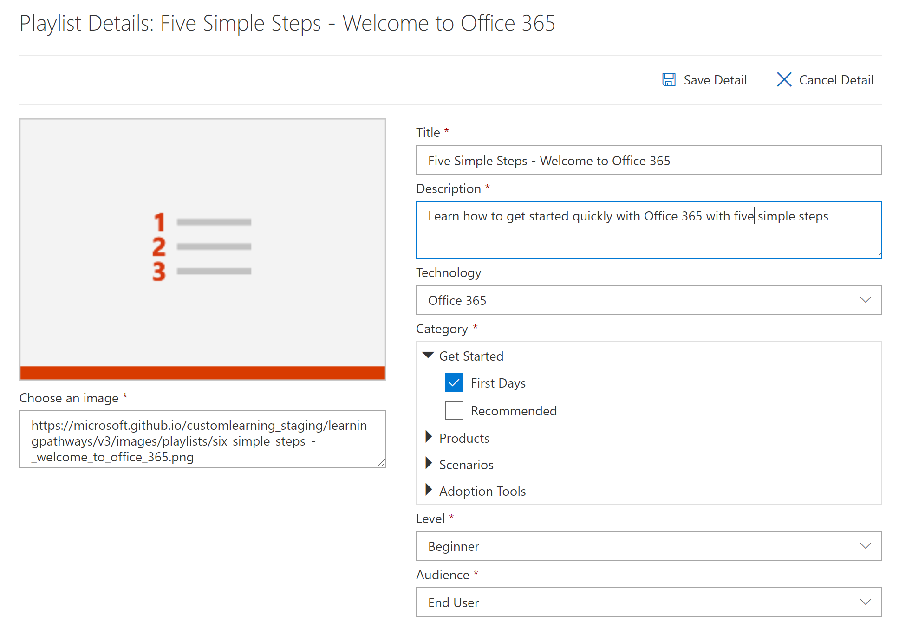

# 재생 목록 복사
조직에서는 조직을 통해 만든 자산을 제거 하거나 교체 하 여 Microsoft에서 제공 하는 재생 목록을 수정 해야 하는 경우가 많습니다. 예를 들어 처음에 여섯 가지 간단한 단계 재생 목록에서 단계를 제거할 수 있습니다. 이제 학습 경로 복사 재생 목록 기능을 사용 하 여 6 개의 간단한 단계 재생 목록을 쉽게 복사 하 고 단순히 자산을 제거 하거나 새 자산을 추가할 수 있습니다. 

## 재생 목록을 복사 하려면

1. Microsoft 365 학습 경로 **홈** 페이지에서 **Office 365 학습**을 클릭 합니다.
2. **관리** 아이콘을 클릭 합니다.
3. **1 일**에는 **6 가지 간단한 단계-Office 365 시작** 목록을 클릭 한 다음 **재생 목록 복사**를 클릭 합니다. 
4. **세부 정보 편집**을 클릭 하 고 다음 예제와 같이 **제목** 및 **설명** 필드에 입력 한 다음 **세부 정보 저장**을 클릭 합니다.  
 

## 재생 목록에서 에셋 추가 또는 제거
사용자 지정 재생 목록을 사용 하 여 다음을 수행할 수 있습니다.
- microsoft 자산을 추가 및 제거 하 되 Microsoft에서 자산을 편집 하지는 않음
- 사용자가 만든 조직 또는 SharePoint 자산에서 기존 SharePoint 자산을 추가, 제거 및 편집 합니다. 

### 재생 목록에서 에셋 제거
- **관리** 페이지 아래로 스크롤한 다음 **재생 목록 자산** 에서 5 단계에 대 한 삭제 아이콘을 클릭 **합니다. 모바일 앱을 설정**합니다. 

## 재생 목록에서 자산이 제거 되었는지 확인
1. **Microsoft 365 교육** 페이지를 사용 하 여 탭으로 돌아갑니다.
2. **처음 일**을 클릭 하 고 **간단한 5 단계-Office 365 재생 목록 시작을** 클릭 합니다. 
3. 재생 목록을 통해 자산이 제거 되었는지 확인 합니다.

