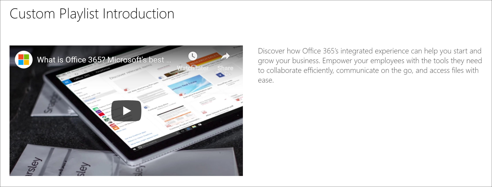

# 사용자 지정 재생 목록에 대 한 SharePoint 페이지 만들기

사용자 지정 학습의 고유한 기능 중 하나는 Microsoft와 만든 SharePoint 자산의 자산에서 어셈블된 재생 목록을 만드는 기능입니다. 이 예제에서는 재생 목록을 만들기 전에 SharePoint 페이지를 만듭니다. SharePoint 페이지에서 재생 목록을 작성 하는 기능은 Microsoft 또는 조직에서 사용할 수 있는 웹 파트를 사용 하 여 페이지를 작성할 수 있는 다양 한 기회를 제공 합니다. 예를 들어 재생 목록에는 YouTube의 포함 비디오가 있는 SharePoint 페이지 또는 Office 365 양식에서 작성 된 양식 또는 임베디드 Power BI 보고서가 포함 될 수 있습니다. 이 예제에서는 Embed 웹 파트 및 텍스트 웹 파트가 포함 된 페이지를 작성 하는 방법을 보여 줍니다.  

## 사용자 지정 재생 목록에 대 한 SharePoint 페이지 만들기

1. SharePoint **기어** 아이콘을 클릭 한 다음 **페이지 추가**를 클릭 합니다.
2. 페이지 왼쪽에서 **새 섹션 (+) 추가** 를 클릭 한 다음 섹션 레이아웃에 대해 **두 개의 열** 을 클릭 합니다.
3. 왼쪽 열에서 +를 클릭 하 고 **Embed** 웹 파트를 클릭 합니다. 
4. 오른쪽 열에서 +를 클릭 하 고 **텍스트** 웹 파트를 클릭 합니다. 페이지 모양은 다음과 같습니다.

### YouTube에서 비디오 및 텍스트 추가

1. 브라우저에서 YouTube로 이동 합니다. 이 예에서는 "Office 365-Microsoft의 최상의 생산성 앱"을 검색 합니다.
2. 동영상을 클릭 하 여 재생 한 다음 일시 중지 하 고 마우스 오른쪽 단추로 클릭 합니다. 
3. **embed 태그 복사**를 클릭 하 고 SharePoint 페이지로 돌아갑니다. 
4. **embed** 웹 파트에서 **embed 태그 추가** 를 클릭 한 다음 YouTube 비디오에서 코드를 추가 합니다.
5. YouTube 페이지로 돌아간 후 비디오에 대 한 **설명** 텍스트를 복사 합니다. 
6. SharePoint 페이지로 돌아와서 **텍스트** 웹 파트를 선택한 다음 YouTube 비디오에서 텍스트를 복사 합니다.
7. SharePoint 페이지의 제목 영역에서 **웹 파트 편집** 아이콘을 선택 하 고 페이지 이름을 "사용자 지정 재생 목록 소개"로 지정한 다음 
8. **레이아웃**에서 **일반**을 선택한 다음 **제목 영역** 속성 창을 닫습니다. 페이지의 모양은 다음과 같습니다. 

### 페이지 게시

- **게시** 단추를 선택 합니다. 이제이 SharePoint 페이지를 사용자 지정 재생 목록에 추가할 준비가 되었습니다. 