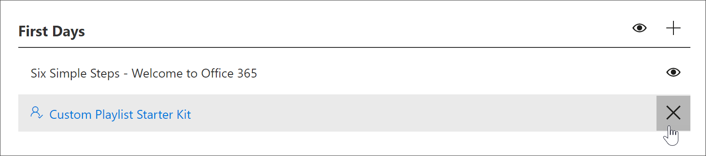

# 사용자 지정 재생 목록 만들기

재생 목록을 만들 때 먼저 재생 목록 세부 정보를 사용 하 여 재생 목록을 만든 다음 재생 목록에 자산을 추가 합니다. 하위 범주에 재생 목록을 추가할 수 있습니다. 예를 들어 **첫 번째 요일** 하위 범주 또는 **Excel**과 같은 **제품** 하위 범주에 재생 목록을 추가할 수 있습니다. 이 섹션에서는 재생 목록을 만든 다음 다음 섹션의 재생 목록에 자산을 추가 하 여 [사용자 지정 재생 목록에 자산을 추가](custom_addassets.md)하는 방법에 대해 설명 합니다.

## 재생 목록 만들기 

1. 사용자 지정 학습 **홈** 페이지에서 **Office 365 학습**을 클릭 하 고 웹 파트에서 시스템 메뉴를 선택한 다음 **재생 목록 관리**를 선택 합니다. 
2. 하위 범주를 선택 합니다. 이 예에서는 **First Days**를 선택 합니다.  
3. + 아이콘을 클릭 합니다.  

4.  다음 예에 표시 된 대로 재생 목록의 필드를 채웁니다. 이 예제의 기본 아이콘은 사용할 수 있습니다. 

5.  작업을 마치면 **세부 정보 저장**을 선택 합니다. 

## 재생 목록 편집

- **사용자 지정 학습 관리** 페이지에서 재생 목록을 클릭 한 다음 **세부 정보 편집**을 클릭 합니다.  

### 재생 목록 삭제

- 사용자 지정 학습 관리 페이지에서 재생 목록에 대 한 **삭제** 아이콘을 클릭 합니다.  

