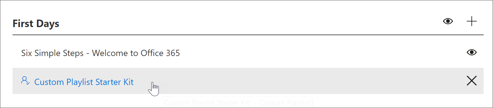

# 사용자 지정 재생 목록 만들기Create a Custom Playlist

재생 목록을 만들 때 먼저 재생 목록 세부 정보를 사용 하 여 재생 목록을 만든 다음 재생 목록에 자산을 추가 합니다.When you create a playlist, you first create the playlist with the playlist details, and then add assets to the playlist. 하위 범주에 재생 목록을 추가할 수 있습니다.You can add a playlist to any subcategory. 예를 들어 **첫 번째 요일** 하위 범주 또는 **Excel**과 같은 **제품** 하위 범주에 재생 목록을 추가할 수 있습니다.For example, you can add a playlist to the **First Days** subcategory or a **Product** subcategory like **Excel**. 이 섹션에서는 재생 목록을 만든 다음 다음 섹션의 재생 목록에 자산을 추가 하 여 [사용자 지정 재생 목록에 자산을 추가](custom_addassets.md)하는 방법에 대해 설명 합니다.In this section, we’ll cover how to create a playlist, and then cover adding assets to a playlist in the following section, [Add assets to a custom playlist](custom_addassets.md).

## 재생 목록 만들기Create a playlist 

1. 사용자 지정 학습 **홈** 페이지에서 **Office 365 학습**을 클릭 하 고 웹 파트에서 시스템 메뉴를 선택한 다음 **재생 목록 관리**를 선택 합니다.From the Custom Learning **Home** page, click **Office 365 training**, select the system menu from the Web part, and then select **Administer Playlist**. 
2. 하위 범주를 선택 합니다.Select a subcategory. 이 예에서는 **First Days**를 선택 합니다.In this example, select **First Days**.  
3. + 아이콘을 클릭 합니다.Click the + icon.  

4.  다음 예에 표시 된 대로 재생 목록의 필드를 채웁니다.Fill out the fields in the playlist as shown in the following example. 이 예제의 기본 아이콘은 사용할 수 있습니다.You can leave the default icon for this example. 

5.  작업을 마치면 **세부 정보 저장**을 선택 합니다.When you are done, select **Save Detail**. 

## 재생 목록 편집Edit a playlist

- **사용자 지정 학습 관리** 페이지에서 재생 목록을 클릭 한 다음 **세부 정보 편집**을 클릭 합니다.From the **Custom Learning Administration** page, click the playlist, and then click **Edit Detail**.  

### 재생 목록 삭제Delete a playlist

- 사용자 지정 학습 관리 페이지에서 재생 목록에 대 한 **삭제** 아이콘을 클릭 합니다.From the Custom Learning Administration page, click the **Delete** icon for the playlist.  

