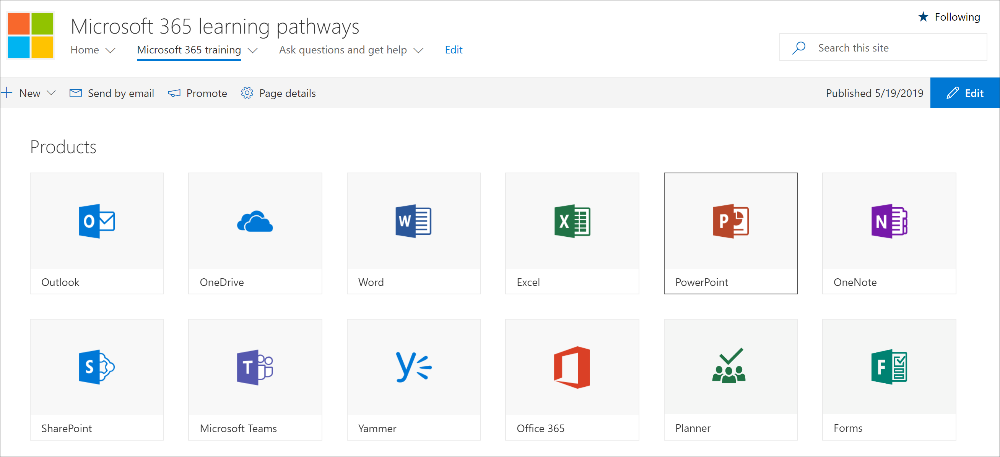

# 학습 경로 사이트 살펴보기Explore the learning pathways site

> 참고: 학습 경로 사이트 및 관리 기능을 살펴보기 위해 사이트 모음 관리자, 소유자 또는 구성원에 대 한 권한이 있어야 합니다.Note: To explore the learning pathways site and it's administrative features, you'll need Site Collection Admin, Owner, or Member permissions to the site. Neccesary 권한이 없는 경우 사이트의 사이트 관리자에 게 문의 하십시오.If you don't have the neccesary permissions, contact the Site Administrator for the site. 학습용 경로 사이트는 Office 365 테 넌 트에서 호스팅되므로 Office 365에 로그인 하 여 사이트에 액세스 해야 합니다.The learning pathways site is hosted in your Office 365 tenant, so you'll need to sign in to Office 365 to get to the site. 아직 Office 365에 로그인 하지 않은 경우 지금 로그인 하세요.If you haven’t already signed into Office 365, sign in now. 

## Office 365에 로그인 합니다.Sign in to Office 365 

1.  웹 브라우저를 열고 office.com 또는 조직의 로그인 위치로 이동합니다.Open your Web browser and navigate to office.com or your organization’s sign-in location. 
2.  사용자 이름 및 암호로 로그인합니다.Sign in with your user name and password.
3.  테 넌 트 관리자가 제공한 URL을 사용 하 여 사이트 위치로 이동 하거나 Office 365 홈 페이지에서 SharePoint를 선택한 후 사이트를 선택 합니다.Navigate to the location of the site using the URL supplied by your tenant administrator or select SharePoint from the Office 365 Home page, and then select the site. 

## 학습 경로 사이트 살펴보기Explore the learning pathways site

학습 경로 사이트는 SharePoint 통신 템플릿을 기반으로 하므로 조직의 요구 사항을 충족 하도록 사이트를 쉽게 수정할 수 있습니다.The learning pathways site is based on a SharePoint communication template, so it's easy to modify the site to meet the needs of your organization. 사이트 이름, 로고, 메뉴 항목 및 페이지의 콘텐츠를 변경할 수 있습니다.You can change the site name, logo, menu items, and the content on the pages. 조직에 대해 수정 하려는 페이지 중 하나는 질문 하기 및 도움말 보기 페이지입니다.One of the pages you'll want to modify for your organization is the Ask questions and get help page. 잠시 살펴보겠습니다.Let's take a look.

### 질문 하기 및 도움말 보기 페이지View the Ask questions and get help page

학습 경로 사이트에서는 교육 및 지원 포털 작성을 시작 하는 데 도움이 되는 기본 콘텐츠를 제공 합니다.The learning pathways site provides default content to help you get starting building your training and support portal. 사이트의 관리자가 또는 소유자 인 경우에는 질문에 대 한 링크를 변경 하 고 조직의 리소스를 **지원 하도록 도움말 페이지를 보는** 것이 좋습니다.As an admininstrator or owner of the site, one of the things you’ll want to do is change the links on the **Ask question and get help page** point to resources in your organization. 

1.  Microsoft 365 학습 경로 홈 페이지에서 **질문 하기 및 도움말 보기** 메뉴 항목을 클릭 합니다.From the Microsoft 365 learning pathways Home page, click the **Ask questions and get help** menu item.
2.  **편집** 단추를 클릭합니다.Click the **Edit** button.
3.  도움말 옵션 이미지를 가리킨 다음 **웹 파트 편집**을 클릭 합니다.Hover over a Help option image, then click **Edit web part**.

사이트 페이지를 사용자 정의 하는 방법에 대 한 자세한 내용은 [사이트 사용자 지정](custom_edithelp.md)을 참조 하십시오.For instructions on customizing site pages, see [Customize the site](custom_edithelp.md).

### 웹 파트의 학습 경로 콘텐츠 보기View the learning pathways content in the web part
Microsoft 365 교육 페이지에서는 학습 경로에 사용할 수 있는 모든 학습을 표시 하도록 구성 된 학습 경로 웹 파트를 호스팅합니다.The Microsoft 365 training page hosts the learning pathways Web part configured to show all the training available for learning pathways. 

1. 페이지 아래로 스크롤하여 모든 범주 및 하위 범주를 확인 합니다.Scroll down the page to view all the categories and subcategories.
2. 타이어를 비트 단위로 시작 합니다.Kick the tires a bit. 몇 가지 하위 범주를 클릭 한 후 몇 가지 재생 목록을 클릭 하 여 학습용 경로 콘텐츠를 구성 하는 방법을 알아봅니다.Click a few subcategories, and then click a few playlists to get a feel for how learning pathways content is organized. 

학습 경로 웹 파트를 사용자 지정 하는 방법에 대 한 자세한 내용은 [학습 환경 사용자 지정](custom_overview.md)을 참조 하십시오.For instructions on customizing the learning pathways web part, see [Customize the Learning Experience](custom_overview.md).

### 전체 사이트 둘러보기 및 사용자 지정 지침 보기Get a complete site tour and customization guidance
학습 경로에 대 한 자세한 내용은 사이트, 웹 파트, 관리 기능 및 환경에 맞는 고유한 학습 환경을 구축 하는 방법에 대 한 지침을 참조 하세요. [학습 환경 사용자 지정](custom_overview.md)For a detailed look at learning pathways, incuding the site, the web part, administrative features, and guidance on how to build unique learning experiences for your environment, see [Customize the Learning Experience](custom_overview.md)

## 다음 단계Next Steps
- [학습 환경 사용자 지정Customize the Learning Experience](custom_overview.md)
- [드라이브 도입Drive adoption](driveadoption.md) 
