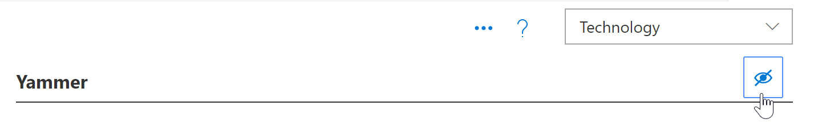

# 기술 숨기기 및 표시Hide and show Technology

일부 경우에는 조직에서 지원 되지 않는 기술에 대 한 콘텐츠를 숨기려는 경우가 있습니다.In some cases, you’ll want to hide content for a technology that’s not supported in your organization. 숨기기 기술 기능은 웹 파트 전체에 기술이 나타나지 않도록 설계 되었습니다.The Hide Technology feature is designed to prevent technology from appearing throughout the Web part. 하위 범주 또는 재생 목록에서 콘텐츠를 숨기는 것 보다 더 광범위 한 방법을 제공 합니다.It offers a broader way to hide and show content than hiding it by subcategory or playlist. 예를 들어 yammer 하위 범주를 숨길 수는 있지만 "yammer와 조직 연결"과 같은 특정 시나리오 재생 목록에는 yammer가 계속 표시 될 수 있습니다.For example, you can hide a Yammer subcategory, but Yammer may still show up in certain scenario playlists such as "Connect your organization with Yammer". 특정 기술이 최종 사용자에 게 노출 되지 않도록 하려면 기술에 따라 숨길 수 있습니다.To ensure a specific technology is not exposed to end users, you can hide it by Technology. 

## 기술 숨기기Hide a Technology

1. 사용자 지정 학습 **홈** 페이지에서 **Office 365 트레이닝** 타일을 클릭 합니다.From the Custom Learning **Home** page, click the **Office 365 training** tile.
2. 사용자 지정 학습 웹 파트에서 **시스템** 메뉴를 선택한 다음 **재생 목록 관리**를 선택 합니다.From the Custom Learning Web part, select the **System** menu, then select **Administer Playlist**. 이제 두 개의 탭이 열려 있어야 합니다.You should now have two tabs open. **사용자 지정 학습 관리** 페이지와 **Office 365 교육** 페이지를 포함 한 하나입니다.One with the **Custom Learning Administration** page, and one with the **Office 365 training** page. 
3. **사용자 지정 학습 관리** 페이지에서 **기술을**클릭 하 고 기술을 eyeball 선택 합니다.From the **Custom Learning Administration** page, click a **Technology**, and then select the eyeball for the Technology to hide it. 이 예에서는 **Yammer** 기술을 클릭 한 다음 숨깁니다.For this example, click the **Yammer** technology, and then hide it.  

### 재생 목록이 숨겨져 있는지 확인Verify the playlist is hidden
1. **Yammer** 기술이 숨겨져 있는지 확인 하려면 **Office 365 교육** 페이지가 로드 된 브라우저 탭을 선택한 다음 페이지를 새로 고칩니다.To verify **Yammer** technology is hidden, select the browser tab with the **Office 365 training** page loaded, and then refresh the page. 이제 Yammer 하위 범주가 숨겨져 있는 것을 볼 수 있습니다.You should now see the Yammer subcategory is hidden. 
2. **추천** 하위 범주를 클릭 합니다.Click the **Recommended** subcategory. Yammer를 사용 하 여 조직 연결 확인란이 숨겨져 있는 것을 확인할 수 있습니다.You'll notice that the Connect your organization with Yammer playlist is hidden. 

## 기술 숨기기Unhide a Technology

- **사용자 지정 학습 관리** 페이지의 **기술**에서 기술을 선택한 다음 숨겨진 기술에 대 한 eyeball를 선택 하 여 숨기기를 취소 합니다.From the **Custom Learning Administration** page, under **Technology**, select a technology, then select the eyeball for the hidden technology to unhide it. 이 예제에서는 **Yammer** 기술을 숨기지 않습니다.For this example, unhide the **Yammer** technology. 