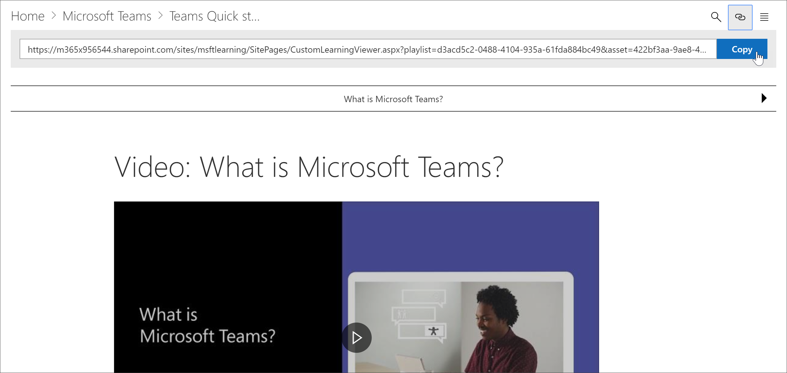

# 학습 경로 콘텐츠 링크Link to learning pathways content

학습 경로를 사용 하면 다음과 같은 두 가지 방법으로 콘텐츠에 연결할 수 있습니다.With learning pathways, there are two ways to link to content:

- 표시할 콘텐츠에 대해 필터링 된 웹 파트를 호스트 하는 페이지에 대 한 링크Link to the page that host the Web part filtered for the content you want to display 
- 웹 파트 인스턴스에 직접 연결Link directly to an instance of the Web part

## 페이지에 연결Link to a page

Microsoft 365 learning 경로 웹 파트에서 새 페이지 및 학습 환경을 만든 경우에는 웹 파트가 구성 된 페이지에 연결 하 여 표시 하려는 콘텐츠를 표시할 수 있습니다.If you've created new pages and learning experiences with the Microsoft 365 learning pathways web part, you can link to the page with the Web part configured to show the content you want to display. 이전 섹션에서는 페이지에 Excel 재생 목록을 표시 하는 방법을 다루었습니다.In the previous section, we covered how to display Excel playlists on a page. 이제 홈 페이지를 편집 하 여 페이지에 연결할 수 있습니다.You could now edit the Home page to link to the page. 

1. 홈 페이지에서 **편집**을 클릭 합니다.From the Home page, click **Edit**.
2. 홈 페이지 타일 중 하나에서 **세부 정보 편집** 을 클릭 합니다.Click **Edit details** in one of the Home page tiles. 이 예에서는 **권장 재생 목록** 타일을 편집 합니다.In this example, we edit the **Recommended playlists** tiles.
3. **연결**에서 **변경을**클릭 합니다.Under **Link**, click **Change**.

4. **사이트**, **사이트 페이지**를 차례로 클릭 하 고 연결할 페이지를 클릭 한 다음 **열기**를 클릭 합니다.Click **Site**, then **Site Pages**, click the page you want to link to, and then click **Open**. 이 예제에서는 이전 섹션에서 설명한 **Create-your-own-experience** 페이지에 연결 합니다.In this example, we link to the **Create-your-own-experience.aspx** page covered in the previous section.
5. 주인공 속성 창을 닫고 **게시**를 클릭 한 다음 링크를 테스트 합니다.Close the Hero properties pane, click **Publish**, and then test the link. 

## Microsoft 365 learning 경로 웹 파트에 연결Link to the Microsoft 365 learning pathways web part
학습 경로를 사용 하면 관리자 또는 최종 사용자가 웹 파트가 포함 된 페이지에 독립적으로 웹 파트 인스턴스에 연결할 수 있습니다.Learning pathways gives you, the administrator, or an end-user, the ability to link to an instance of the Web part independent of the page that contains the Web part. 복사 된 링크를 공유 하거나 다른 페이지에서 링크를 공유할 수 있습니다.You can share the copied link or link to it from other pages. 복사 된 링크를 클릭 하면 CustomLLearningViewer 페이지에 Microsoft 365 learning 경로 웹 파트 인스턴스가 표시 됩니다.The copied link, when clicked, shows the Microsoft 365 learning pathways web part instance in the CustomLLearningViewer.aspx page. 예를 살펴보겠습니다.Let's look at an example. 

1. 홈 페이지에서 **Microsoft365 트레이닝**을 클릭 합니다.From the Home page, click **Microsoft365 training**.
2. **Microsoft 팀**을 클릭 하 고 **microsoft 팀 소개를**클릭 합니다.Click **Microsoft Teams**, and then click **Intro to Microsoft Teams**.
3. **복사** 아이콘을 클릭 합니다.Click the **Copy** icon.

4. Microsoft 365 학습 경로 사이트 메뉴에서 홈을 클릭 합니다.Click Home from the Microsoft 365 learning pathways site menu.
5. 브라우저의 주소 표시줄에 복사한 URL을 붙여넣고 enter 키를 누릅니다.Paste the copied URL in the address bar of the browser and press ENTER. 

다음 그림에 표시 된 것 처럼 링크는 CustomLearningViewer 페이지로 이동 하 고 복사 된 링크의 매개 변수에 따라 콘텐츠를 표시 합니다.As shown in the following illustration, the link goes to the CustomLearningViewer.aspx page and displays the content based on the parameters in the copied link. 

