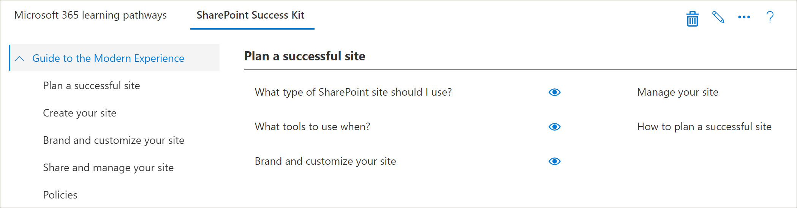

# 파트너 통합 모델Partner integration models
SharePoint Online 프로 비전 서비스에서 Microsoft 365 learning 경로 콘텐츠를 직접 보완 하는 것은 불가능 하지만 파트너가 정렬 된 값 추가 서비스를 만들기 위해 사용할 수 있는 몇 가지 통합 모델이 있습니다. 사항.While it’s not possible to supplement the Microsoft 365 learning pathways content directly ‘out of the box’ from the SharePoint Online Provisioning service, there are several integration models that partners can leverage to create aligned value-add service offerings. 위의 파트너 통합 모델은 오름차순 및 투자 수준 순으로 제공 됩니다.The partner integration models above are presented in order of ascending complexity and levels of investment. 따라서 비즈니스 모델에 따라 고급 수준에 대 한 전문 지식 및 졸업을 구축 하는 것이 좋습니다.Hence our guidance is to build your expertise and graduate to more advanced levels based on your business models.

 

## 시작 하려면 어떻게 해야 합니까?How should I get started? 
시작 하기 위한 몇 가지 모범 사례는 다음과 같습니다.To get started, here are some best practices to follow.     

### 1. it로의 건물 전문 지식을 사용 하 여 시작 합니다.1. Begin with building expertise as an Enabler. 
학습 경로 교육 포털을 사용 하도록 설정 하 고 대상 지정 Microsoft 콘텐츠를 수행 하 여 고객 기지에 대 한 비율을 즉시 확인할 수 있습니다.You can help a percentage of your customer base right away by enabling their learning pathways training portal and performing targeted Microsoft content curation. 학습 경로를 구축 하는 방법에 https://docs.microsoft.com/en-us/office365/customlearning/custom_provision대 한 자세한 내용은를 참조 하세요.For instructions on provisioning learning pathways, see https://docs.microsoft.com/en-us/office365/customlearning/custom_provision.  

### 2. 그런 다음 서비스를 인티그레이터로 확장 합니다.2. Then extend your services as an Integrator
콘텐츠 및/또는 서비스 통합 요구 사항의 수량에 따라 투자 분석에 대 한 자동화를 수행 합니다.Perform an automation return on investment analysis - depending on the quantity of your content and/or services integration needs. 예를 들어 유료 콘텐츠를 가리키거나 서비스를 참조 하는 대상 사용자 지정 재생 목록을 빠르게 만들 수 있는 경우에는 콘텐츠 통합 지침에 따라 개발 및 운영 비용을 고려 하는 것이 좋을 수 있습니다.For example, it may not make sense to take on the development and operational costs with respect to our content integration guidelines if you can quickly manually create a targeted custom playlist(s) pointing to your for-pay content or reference your services.

### 3. 투자 수익률이 합리적 이면 재배포할 것을 고려 하십시오.3. When the return on investment makes sense – consider Redistribution 
투자 수익률이 합리적 이면 재배포 또는 관련 학습 경로 파트너와 함께 작업을 수행 하 여 리 패키징된 솔루션을 작성 하는 것이 좋습니다.When the return on investment makes sense – consider Redistribution (or working with related learning pathways partners) to build repackaged solutions. 사용자 지정 된 사이트를 추출한 다음 고객 환경에 배포 하는 솔루션을 제공 하는 SharePoint 패턴 및 연습 프레임 워크를 기반으로 합니다.These are based on the SharePoint Patterns and Practice framework which provides solutions to extract customized sites and then deploy into customer environments 

## 파트너 제공 콘텐츠 통합 지침Partner-provided content integration guidelines
Microsoft 365 학습 경로에 대 한 콘텐츠는 학습 패키지에 대 한 콘텐츠 매니페스트 역할을 하는 JSON 파일 집합에 따라 구동 됩니다.Content for Microsoft 365 learning pathways is driven by a set of JSON files that act as content manifests for your learning package. 메타 데이터는 다음 세 가지 파일로 제공 됩니다.There are three files: metadata.json, playlists.json, and assets.json. 웹 파트에서 인식 한 다음 CDN (콘텐츠 배달 네트워크)에서 호스트 되는 모델을 일치 시키려면 이러한 파일을 구성 해야 합니다.These files need to be structured to match the models the web part recognizes and then hosted from a content delivery network (CDN) to allow the web part to load them. Microsoft는 시작 하는 데 사용할 수 있는 이러한 파일의 스타터 템플릿을 제공 합니다.Microsoft will provide starter templates of these files to get you started.  

고 **지 사항:** JSON 파일 구조는 예정 된 솔루션 작업에 따라 변경 될 수 있습니다.**Disclaimer:** the JSON file structure is subject to change based on upcoming solution work. Microsoft 365 learning 경로 파트너는 이러한 특성에 대 한 임박한 변경 사항에 대 한 알림을 받게 됩니다.The Microsoft 365 learning pathways partner Early Adopter Program (EAP) will be informed of any impending changes of this nature. 모든 고객이 이전 버전과의 호환성 및/또는 전환 지침을 제공 합니다.Along with any customer backwards compatibility and/or transition guidance. 

### Microsoft 365 학습 경로 솔루션 다운로드Download the Microsoft 365 learning pathways solution
GitHub 리포지토리에서 https://github.com/pnp/custom-learning-office-365Microsoft 365 learning 경로 솔루션을 JSON 파일과 함께 다운로드할 수 있습니다.You can download the Microsoft 365 learning pathways solution, along with the JSON files, from the GitHub repository: https://github.com/pnp/custom-learning-office-365. 현재 Microsoft는 솔루션에 대해 GitHub 끌어오기 요청을 수행 하 고 있지 않습니다.Note that at this time, Microsoft is not taking GitHub pull request on the solution. 그러나 GitHub 파일을 사용 하 여 고유한 사용자 지정 콘텐츠 팩을 만들 수 있습니다.But you can use the GitHub files as a starting point for creating your own custom content pack. 

## Metadata. json 구조Metadata.json Structure
이 파일은 메뉴 및 구조의 brains 것으로 간주할 수 있습니다.You can think of this file as the brains of the menus and structure. 여기에는 모든 탐색 구조 뿐만 아니라 다른 두 파일의 데이터에 대 한 선택 목록도 포함 되어 있습니다.It contains all the navigation structure as well as pick lists for data in the other two files. 

|              NameName        |                     DescriptionDescription                                                               | 
|:-----------------------------|-------------------------------------------------------------------------------------------|
|**개발****Technologies**              |태그가 지정 되 고, 할당 된 기술에 따라 콘텐츠를 숨길 수 있습니다.Content is tagged and can be hidden based on the Technology it’s assigned.                 |  
|&nbsp;&nbsp;I&nbsp;&nbsp;Id                |기술을 나타내는 GUID입니다.GUID representing the technology                                                           |  
|&nbsp;&nbsp;Name&nbsp;&nbsp;Name              |기술의 표시 이름Display name of the technology                                                             |
|&nbsp;&nbsp;*과목 []*&nbsp;&nbsp;*Subjects[ ]*     |기술의 하위 집합인 주체 배열An array of subjects that are a subset of the technology                                   | 
|&nbsp;&nbsp;&nbsp;&nbsp;I&nbsp;&nbsp;&nbsp;&nbsp;Id    |제목을 나타내는 GUID입니다.GUID representing the subject                                                              |
|&nbsp;&nbsp;&nbsp;&nbsp;Name&nbsp;&nbsp;&nbsp;&nbsp;Name  |제목의 표시 이름입니다.Display name of the subject                                                                |
|**Categories []****Categories [ ]**             |범주는 webpart를 탐색 함을 알립니다.Categories inform the navigation of the webpart. 각 범주는 탐색의 최상위 수준을 나타냅니다.Each category represents a top level of the navigation                                                                                                                 |
|&nbsp;&nbsp;I&nbsp;&nbsp;Id                |범주/하위 범주를 나타내는 GUID입니다.GUID representing the category/subcategory                                                 |
|&nbsp;&nbsp;Name&nbsp;&nbsp;Name              |범주/하위 범주에 대 한 표시 이름Display name for the category/subcategory                                                  |
|&nbsp;&nbsp;이미지나&nbsp;&nbsp;Image             |UX에 표시 해야 하는 이미지의 URL (CDN 기준에 상대적)URL for the image that should be displayed in the UX (relative to the CDN base)            |
|&nbsp;&nbsp;TechnologyId&nbsp;&nbsp;TechnologyId      |해당 콘텐츠와 관련 된 기술의 GUID (선택 사항-빈 문자열)The GUID of the Technology this content is related to (optional – empty string)            |
|&nbsp;&nbsp;SubjectId&nbsp;&nbsp;SubjectId         |이 콘텐츠와 관련 된 주체의 GUID입니다 (선택 사항-빈 문자열).The GUID of the Subject this content is related to (optional – empty string)               |
|&nbsp;&nbsp;소스인&nbsp;&nbsp;Source            |원본 배열에서 사용자가 추가한 사용자 지정 데이터 이외의 UX에서 특별히 사용 하는 것은 "테 넌 트"로 표시 되 고, UX 관리 영역에서는 "테 넌 트"로 표시 되지 않은 모든 것을 편집할 수 없습니다.From Source array, not specifically used in UX other than custom data added by the user is marked as “Tenant” and the UX admin area does not allow editing of anything not marked “Tenant”.                           |
|&nbsp;&nbsp;*하위 범주 []*&nbsp;&nbsp;*Subcategories[ ]*|하위 범주는 기본적으로 수준 2에서 아래로 이동 하는 수준입니다.Sub-Categories are basically the nav level from level 2 down. 이 구조는 단순히 중첩 된 범주와 같습니다.The structure is the same as a Category just nested.          |
|**대상 그룹 []****Audiences [ ]**             |범주/하위 범주와 연결 된 재생 목록에 태그가 지정 된 여러 대상 그룹이 있는 경우 사용 가능한 대상 그룹을 표시할 수 있습니다.When playlists associated with a category/subcategory are various audiences tagged, a selector will be available to show the available audiences. |         
|&nbsp;&nbsp;I&nbsp;&nbsp;Id                |대상 그룹의 GUID입니다.GUID of the audience                                                                       |  
|&nbsp;&nbsp;Name&nbsp;&nbsp;Name              |대상 그룹의 표시 이름입니다.Display name of the audience                                                               |       
|**Sources []****Sources [ ]**               |사용자가 추가한 사용자 지정 데이터 이외의 UX에서 특별히 사용 하는 것이 아니라 해당 원본과 콘텐츠를 태그 하는 문자열의 배열은 "테 넌 트"로 표시 되며 UX 관리 영역에서는 "테 넌 트"로 표시 되지 않은 항목을 편집할 수 없습니다.Array of strings that tag content with its source, not specifically used in UX other than custom data added by the user is marked as “Tenant” and the UX admin area does not allow editing of anything not marked “Tenant”.                                                   |  
|**Levels []****Levels  [ ]**               |범주/하위 범주와 연결 된 재생 목록에 태그가 지정 된 여러 수준이 있으면 사용 가능한 수준을 표시할 선택기를 사용할 수 있습니다.When playlists associated with a category/subcategory are various levels tagged, a selector will be available to show the available levels.             |  
|&nbsp;&nbsp;I&nbsp;&nbsp;Id                |수준의 GUIDGUID of the Level                                                                          |  
|&nbsp;&nbsp;Name&nbsp;&nbsp;Name              |수준의 표시 이름입니다.Display name of the Level                                                                  | 
|**StatusTag [ ]****StatusTag  [ ]**           |Status 태그는 UX에 제공 되는 다양 한 상태의 콘텐츠를 식별 하는 데 사용 됩니다.Status tag is to identify content with various status that will be exposed in the UX. 이러한 플래그 중 일부는 소비자에 게 표시 되 고 관리자만 사용할 수 있습니다.Some of these flags will be show to the consumer and some only to the admin.                                                   |  
|&nbsp;&nbsp;I&nbsp;&nbsp;Id                |StatugTag의 GUID입니다.GUID of the StatugTag                                                                      |  
|&nbsp;&nbsp;Name&nbsp;&nbsp;Name              |StatusTag의 표시 이름입니다.Display name of the StatusTag                                                              | 
|**원격 분석 []****Telemetry  [ ]**            |                                                                                           |  
|&nbsp;&nbsp;AppInsightsKey&nbsp;&nbsp;AppInsightsKey    |뷰어 웹 파트의 로드를 추적 하기 위해 설정한 application insights 키의 GUID입니다.GUID of the app insights key that you have set up to track the loading of the viewer web part. 전체 테 넌 트에 대해 관리자가 추적을 해제할 수 있지만 전송 되는 정보는 익명 사용자에 게 테 넌 트 id가 사용 됩니다. 자세한 내용은이 섹션을 참조 하세요.https://github.com/pnp/custom-learning-office-365#disabling-telemetry-collectionTracking can be turned off by an administrator for the entire tenant, but the information sent is anonymized user with the tenant id. Please see this section for more information https://github.com/pnp/custom-learning-office-365#disabling-telemetry-collection               |  
|**버전****Version**                   |솔루션에서는 버전 정보를 사용 하 여 웹 파트가 업데이트 되었음을 나타내는 관리자를 지정 하 고, 중요 한 변경 내용이 적용 된 경우 웹 파트에서 최신 버전의 매니페스트로 사용자 지정 콘텐츠를 자동으로 업데이트 하도록 허용 하기도 합니다.Version information is used by the solution to indicate to administrators that the webpart has updated and also allow the webpart to self-update custom content to the latest version of the manifest if significant changes have been made.         | 
|&nbsp;&nbsp;매니페스트&nbsp;&nbsp;Manifest          |매니페스트의 버전The version of the manifest                                               |
|&nbsp;&nbsp;ManifestMinWebPart&nbsp;&nbsp;ManifestMinWebPart|매니페스트 버전에서 작동 하는 최소 버전의 웹 파트입니다.The minimum version of the webpart that works with the version of the manifest             |
|&nbsp;&nbsp;CurrentWebPart&nbsp;&nbsp;CurrentWebPart    |UX에 표시 해야 하는 이미지의 URL (CDN 기준에 상대적)URL for the image that should be displayed in the UX (relative to the CDN base)            |
|&nbsp;&nbsp;RepoURL&nbsp;&nbsp;RepoURL           |웹 파트 업데이트 지침이 있는 저장소의 url입니다.The url of the repository where the updating web part instructions are.                    |
|**콘텐츠 팩****Content Packs**             |이 시간에는 추가 CDN의 콘텐츠 팩은 지원 되지 않습니다.At this time content packs for additional CDN’s is not supported. Microsoft는 콘텐츠 팩을 사용 하 여 M365LP을 활용 하 여 콘텐츠를 전달 하 고 자체 사용자 지정 CDNs를 제공 하는 프로 비전 서비스를 통해 프로 비전 할 수 있는 Microsoft에서 작성 된 다른 솔루션을 제안할 수도Content packs allow Microsoft to suggest other Microsoft created solutions that can be provisioned via the Provisioning service that leverage M365LP to deliver content and are in and of themselves custom CDNs.       | 
|&nbsp;&nbsp;I&nbsp;&nbsp;Id                |콘텐츠 팩/CDN의 GUID입니다.GUID of the content pack/CDN                                                              |
|&nbsp;&nbsp;Name&nbsp;&nbsp;Name              |CDN의 표시 이름입니다.Display name of the CDN                                                                   |
|&nbsp;&nbsp;설명이&nbsp;&nbsp;Description       |콘텐츠 팩을 추가 하기 위한 UI에 표시할 설명Description to be displayed in UI for adding a content pack                               |
|&nbsp;&nbsp;이미지나&nbsp;&nbsp;Image             |콘텐츠 팩을 추가 하기 위한 UI에 표시할 이미지Image to be displayed in UI for adding a content pack                                     |
|&nbsp;&nbsp;ProvisionURL&nbsp;&nbsp;ProvisionURL      |콘텐츠 팩의 사이트 모음을 만드는 프로 비전 서비스 패키지의 URL입니다.The URL to the provisioning service package to create the content pack’s site collection  |
|&nbsp;&nbsp;CDNbase&nbsp;&nbsp;CDNbase           |콘텐츠 팩에 대 한 매니페스트의 기본 URLThe Base URL for the manifests for the content pack                                       |
|AssetOriginsAssetOrigins                  |나중에 설명 된 자산과 파일에서 사용 되는 URL 원본의 배열입니다.An array of URL origin’s utilized in the assets.json file described later. 원본 URL이이를 지 원하는 경우 post 메시지가 help_getClientHeight 전송 됩니다.If the origin URL supports it, a post message will be sent to help_getClientHeight. 데이터 속성의 "help_getClientHeight = {height} help_getClientHeight"와 같은 응답에 따라 iFrame의 크기를 프레임 콘텐츠의 적절 한 높이로 조정할 수 있습니다.A response in the data property of: "help_getClientHeight={height of content}" (for example "help_getClientHeight=5769") will allow the iFrame to be resized to the appropriate height of the framed content.         |

## 재생 목록-json 구조Playlists.json Structure
재생 목록-재생 목록 매니페스트는 재생 목록 및 재생 목록에 포함 된 자산에 대 한 메타 데이터를 설명 하는 개체의 배열입니다.playlists.json – The playlists manifest is an array of objects that describe the metadata about a playlist and the assets that are included in the playlist.

|              NameName        |                     설명Description                                                               | 
|:-----------------------------|-------------------------------------------------------------------------------------------|
|IdId                            |재생 목록을 나타내는 GUIDGUID representing the playlist                                                             |  
|제목Title                         |재생 목록의 표시 이름Display name of the playlist                                                               |
|이미지나Image                         |재생 목록을 시각화 하기 위해 CDN에서 이미지에 대 한 상대 URL입니다.Relative URL (from CDN) to an image to visualize the playlist                              |                      
|LevelIdLevelId                       |연결 된 수준Associated level                                                                           |
|AudienceIdAudienceId                   |연결 된 대상 그룹Associated audience                                                                        |
|TechnologyIdTechnologyId                 |연결 된 기술Associated technology                                                                      |
|SubjectIdSubjectId                    |범주/하위 범주에 대 한 표시 이름Display name for the category/subcategory                                                  |
|원본Source                        |원본 배열에서 사용자가 추가한 사용자 지정 데이터 이외의 UX에서 특별히 사용 하는 것은 "테 넌 트"로 표시 되 고, UX 관리 영역에서는 "테 넌 트"로 표시 되지 않은 모든 것을 편집할 수 없습니다.From the source array, not specifically used in UX other than custom data added by the user is marked as “Tenant” and the UX admin area does not allow editing of anything not marked “Tenant”.                                              |
|CatIdCatId                         |재생 목록이 표시 되는 컨테이너를 나타내는 범주 또는 하위 범주 ID입니다.The Category or SubCategory ID that represents the container the playlist should be shown in. 현재 매니페스트에서 범주 또는 하위 범주에 하위 범주 하위 항목도 있으면이를 컨테이너로 선택할 수 없습니다.Currently the manifest does not support selecting a Category or SubCategory as the container if it also has SubCategory children.        |
|DescriptionDescription                   |UX의 각 재생 목록에 대해 보여 주는 설명A description showed for each playlist in the UX                                           |
|StatusTagIdStatusTagId                   |연결 된 상태 태그Associated status tag                                                                      |
|StatusNoteStatusNote                    |관리자에 게 표시 되는 콘텐츠에 대 한 참고 사항Notes about content displayed to administrators                                            |
|*자산 []**Assets[]*                        |이 재생 목록의 일부인 자산에 대 한 GUID의 배열을 표시 순서로 나타냅니다.An array of GUID’s for the assets that are part of this playlist, in display order.        |         

## Asset. json 구조Asset.json Structure
재생 목록-재생 목록 매니페스트는 재생 목록 및 재생 목록에 포함 된 자산에 대 한 메타 데이터를 설명 하는 개체의 배열입니다.playlists.json – The playlists manifest is an array of objects that describe the metadata about a playlist and the assets that are included in the playlist.

|              NameName        |                     설명Description                                                               | 
|:-----------------------------|-------------------------------------------------------------------------------------------|
|IdId                            |재생 목록을 나타내는 GUIDGUID representing the playlist                                                             |  
|제목Title                         |재생 목록의 표시 이름Display name of the playlist                                                               |
|DescriptionDescription                   |---                                                                                           |                      
|URLURL                           |IFrame에 적용할 해당 자산의 원본 url입니다.The source url for the asset, to be applied to the iFrame                                  |
|TechnologyIdTechnologyId                  |연결 된 기술Associated technology                                                                      |
|SubjectIdSubjectId                     |관련 주체Associated subject                                                                         |
|원본Source                        |범주/하위 범주에 대 한 표시 이름Display name for the category/subcategory                                                  |
|StatusTagIdStatusTagId                   |연결 된 상태 태그Associated status tag                                                                      |
|StatusNoteStatusNote                    |관리자에 게 표시 되는 콘텐츠에 대 한 참고 사항Notes about content displayed to administrators.                                           |

## 캐싱할Caching
현재 버전의 뷰어 웹 파트는 캐시 된 버전의 매니페스트 파일을 24 시간 동안 활용 합니다.The current version of the viewer web part utilizes a cached version of the manifest files for 24 hours. 24 시간 후에 웹 파트를 방문 하는 첫 번째 사용자는 소스 CDN에서 매니페스트를 다운로드 하 고 해당 정보를 숨겨진 기술 및 재생 목록과 병합 하 여 사용자 지정 하위 범주에서 병합 하는 방식으로 캐시를 새로 고칠 때 성능 저하가 발생 합니다. 재생 목록 및 자산After 24 hours, the first user that hit’s the webpart takes the performance hit to refresh the cache by downloading the manifests from the source CDN and merge that information with hidden technologies and playlists as well as merging in custom sub-categories, playlists, and assets. 또한 관리 웹 파트는 항상 매니페스트의 콘텐츠를 다운로드 하 여 병합 하 고 캐시를 업데이트 합니다.Alternately the admin web part always downloads the content from the manifests and merges them in and updates the cache.  즉, 관리자는 관리 페이지로 이동 하는 즉, 관리 웹 파트를 로드 하 여 언제 든 지 강제로 캐시를 업데이트할 수 있습니다.So, in other words, the administrator can force a cache update at any time by loading the admin web part, aka going to the Administration page.

## 콘텐츠 팩 지침Content Pack Guidelines
콘텐츠 팩 기능은 다음과 같은 시나리오의 잠금을 해제 합니다.The Content Pack feature unlocks the following scenarios:
- 파트너가 추가 된 사용자 지정 학습 콘텐츠를 재배포 하는 기능 (고객 환경에 맞게 맞춤형)The ability for partners to redistribute value-added custom learning content custom tailored to customers’ environment
- 강력한 교육 팀과 IT가 자신의 내부 시스템 및 거 버 넌 스로 향하는 사용자 지정 학습 콘텐츠를 작성 하도록 지 원하는 조직의 기능The ability for organizations with a strong training team and IT support to build custom learning content directed at their own internal systems and governance
- 고객이 선택할 수 있는 향후 추가 학습 경로를 Microsoft가 제공 하는 기능The ability for Microsoft to deliver additional learning pathways in the future that customers can opt into

이 현재 문서 집합은 기능의 복잡도로 인해 파트너를 대상으로 의도적으로 지정 되었습니다.This current documentation set is intentionally targeted for Partners due to the feature’s complexity. 서비스 팀은 현재 #2 보다 향상 된 지원 및 사용 시나리오를 제공 합니다.The service team is actively working to better support and enable scenario #2, in the future. 

## 콘텐츠 팩 작동 방식How Content Packs work
Microsoft는 GitHub 페이지를 매니페스트 파일 및 이미지에 대 한 CDN (콘텐츠 배달 네트워크) 원본으로 활용 합니다.Microsoft utilizes GitHub pages as a Content Delivery Network (CDN) source for its manifest files and images. 각 매니페스트 파일 버전의 하위 폴더가 포함 된 GitHub 리포지토리의 루트에 docs 폴더가 있습니다.We have a docs folder at the root of our GitHub repository that includes sub folders for each version of the manifest files. 각 폴더에는 세 개의 매니페스트 파일 및 모든 범주, 하위 범주 및 재생 목록 이미지를 저장 하는 이미지 폴더가 있습니다.Inside each folder there are three manifest files, plus an images folder to store all the category, subcategory, and playlist images. 

학습용 경로 솔루션을 자신만의 콘텐츠 팩으로 확장 하도록 선택 해야 하는 것과 동일한 버전 관리 구조를 유지 관리 하는 것이 중요 합니다.It is important that you maintain the same versioning structure that Microsoft does should you choose to extend the learning pathways solution with your own content pack. 웹 파트에서 지 원하는 매니페스트 버전이 해당 폴더에 baked CDN url에 자동으로 추가 되므로 CDN 끝점에 버전 폴더가 포함 되어서는 안 됩니다.Your CDN endpoint should not include the version folder, as the manifest version the web part supports is baked into it and is automatically appended to the CDN url. 여기서는 수정할 때 언제 든 지 매니페스트 파일의 새 인스턴스를 만들 수 있도록 합니다.We will obviously give you time to create new instances of your manifest files any time we revision it.

 

GitHub 페이지를 CDN 소스로 활용 하는 방법에 대 한 자세한 내용은 다음 도움말 설명서를 [https://help.github.com/en/articles/configuring-a-publishing-source-for-github-pages](https://help.github.com/en/articles/configuring-a-publishing-source-for-github-pages)참조 하세요.For more information about utilizing GitHub pages as your CDN source please see the following help documentation: [https://help.github.com/en/articles/configuring-a-publishing-source-for-github-pages](https://help.github.com/en/articles/configuring-a-publishing-source-for-github-pages).

Microsoft의 솔루션은 이러한 파일에 액세스할 수 있는 사용자에 대 한 보안 기능을 제공 하지 않으므로 자산에 대 한 정보를 공용에 공개 합니다.Microsoft’s solution makes the information about the assets open to the public as there is no security around who has access to these files. 소비자를 위한 무료 콘텐츠 계층이 있어야 하 고, 일부 또는 전체 콘텐츠에 대 한 요금이 결제 해야 하는 경우에는 솔루션의 기술적 제한 내에서이를 다르게 구현 해야 하며, GitHub 페이지를 사용 하는 경우에는 어떠한 평균이 있는지는 생각 하지 않습니다. s 요구 사항We believe that there should be a free layer of content for a consumer, that said if you have a need for pay wall for some or all of your content you will need to implement this differently within the technical limitations of the solution and using GitHub pages is by no means a requirement. 지금까지 설명 했던 버전 번호 매기기 구조를 유지 관리 하는 경우에는 사용 하려는 CDN 공급자가 모두 적절 합니다.Any CDN provider you would like to use is fine if you maintain the version numbering structure we’ve outlined. 앞에서 설명한 것 처럼 웹 파트가 지 원하는 매니페스트 구조의 버전은 코드에 baked CDN URL에 자동으로 추가 됩니다.As stated previously, the version of the manifest structure the web part supports is baked into the code and is automatically appended to the CDN URL. 

## 콘텐츠 팩 통합 지침Content Pack Integration Guidance 
소비자가 테 넌 트에서 추가 CDN 끝점을 구성할 수 있도록 관리자 및 뷰어 웹 파트를 확장 하 여 사용자가 표시 하는 데이터를 원본으로 사용 하는 CDN을 선택 합니다.The admin and viewer web parts have been extended to allow the consumer to configure additional CDN endpoints in their tenant which will then allow the viewer web part to select which CDN they should source the data they display. 

이 기능에 대해 염두에 두어야 하는 주요 프레이밍:Key framing to keep in mind for this feature: 
- 이 기능은 수동 재생 목록 구성이 너무 번거로울 수 있는 파트너 재배포 시나리오에 주로 적용 됩니다.This is primary applicable for partner redistribution scenarios – where manual playlist configuration is too cumbersome 
- 사용자 지정 콘텐츠 팩은 고급 기능이 며 웹 콘텐츠를 관리 하는 환경에서 파트너만 사용 해야 합니다.Custom Content Packs are an advanced feature and should only be used by Partners with experience administrating web content. 신뢰할 수 없는 콘텐츠 원본은 사이트에 안전 하지 않은 콘텐츠를 도입할 수도 있습니다.Untrustworthy content sources may introduce unsafe content into your site. 신뢰할 수 있는 원본만 추가 해야 합니다.You should only add sources that you trust.

> **중요** 사용자 지정 콘텐츠 팩을 추가 하기 전에 Microsoft 365 learning 경로 3.0 이상을 프로 비전 해야 합니다.**IMPORTANT** Before adding a Custom Content Pack, you must have provisioned Microsoft 365 learning pathways 3.0 or later. Microsoft 365 학습 경로를 프로 비전 하는 방법에 대 한 자세한 내용은 informataion [microsoft 365 learning 경로](https://docs.microsoft.com/en-us/office365/customlearning/custom_provision)를 참조 하십시오.For informataion about provisioning Microsoft 365 learning pathways, see [Provision Microsoft 365 learning pathways](https://docs.microsoft.com/en-us/office365/customlearning/custom_provision).

## 콘텐츠 허용 목록이Content Whitelisting
파트너는 사용자의 환경에서 콘텐츠가 프록시의 허용 목록 확인 하기 위해 소비자에 게 도움을 주기 위한 책임입니다.As a partner it’s your responsibility to assist your consumers in making sure your content is whitelisted in their environment. 콘텐츠를 방화벽 내부의 SharePoint 페이지에 iFrame으로 표시할 수 있는지 확인 하기 위해 환경에서 테스트 시나리오를 만드는 것이 좋습니다.We suggest you create a test scenario in their environment to validate that your content can be iFrame’d into a SharePoint page inside of their firewall. [사용자 지정 재생 목록에 대 한 SharePoint 페이지 만들기](https://docs.microsoft.com/en-us/office365/customlearning/custom_createnewpage) 지침에 따라 해당 사례 인지 확인 합니다.Follow the [Create SharePoint pages for Custom Playlists](https://docs.microsoft.com/en-us/office365/customlearning/custom_createnewpage) instructions to confirm this is the case.

## 콘텐츠 팩을 학습 경로에 추가Add a Content Pack to Learning Pathways
수정한 JSON을 만들고 CDN을 정의한 후에는 학습 경로에 연락처 팩을 추가할 수 있습니다.Once you've created modified the JSON and defined your CDN, you can add the Contact Pack to learning pathways. 

1. 학습 경로 사이트 **홈** 페이지에서 **home** 을 가리킨 다음 **학습용 경로 관리**를 클릭 합니다.From the learning pathways site **Home** page, point to **Home** and then click **Learning pathways administration**. 
2. **관리** 페이지에서 다음을 클릭 합니다 \*\*. \*\*페이지의 오른쪽 위 모서리에 콘텐츠 팩을 추가 합니다.From the **Administration** page, click the **... Add Content Pack** in the upper-right corner of the page.
3. 사용자 지정 콘텐츠 팩을 클릭 하 고 콘텐츠 팩의 이름을 입력 한 다음 JSON 파일이 있는 CDN을 지정 합니다.Click Custom Content Pack, and then enter a name of the Content Pack and then specify the CDN where the JSON files are located.

4. **저장**을 클릭합니다.Click **Save**. 이제 사용자 지정 콘텐츠 팩의 콘텐츠가 관리 페이지에 표시 됩니다.The content from your Custom Content Pack should now appear in the Administration page. 예를 들면 다음과 같습니다.Here is an example. 

## 웹 파트의 콘텐츠 팩에 대 한 필터링Filter to the Content Pack in the web part
학습 경로를 사용 하 여 페이지에 학습용 경로 웹 파트를 추가 하 고, 사용자 지정 콘텐츠 팩 원본을 가리키도록 웹 파트를 필터링 한 다음 웹 파트를 원하는 범주, 하위 범주, 재생 목록 및 자산으로 필터링 할 수 있습니다.With learning pathways, you can add the learning pathways web part to a page, filter the web part to point to the Custom Content Pack source, and then filter the web part to the category, subcategory, playlist, and asset that you want. 

1. 학습 경로 사이트에서 **새로 만들기**, **페이지**를 차례로 클릭 합니다.From the learning pathways site, click **New**, and then **Page**.
2. **새로**만들기를 클릭 한 다음 **페이지를 만듭니다**.Click **Blank**, and then **Create Page**.
3. 페이지에 이름을 지정 합니다.Give the page a name. 
4. 페이지 왼쪽에서 **+ 새 섹션 추가** 를 클릭 합니다.Click **+ Add a new section** on the left side of the page.
5. 새 **+** 섹션의 위쪽 가운데를 클릭 한 다음 **Microsoft 365 학습 경로** 웹 파트를 추가 합니다.Click **+** in the top-middle of the new section, and then add the **Microsoft 365 learning pathways** web part.
6. 웹 파트를 클릭 하 고 **편집** 아이콘을 클릭 합니다.Click the Web part, and then click the **Edit** icon.
7. **학습 소스 선택** 상자에서 사용자 지정 콘텐츠 팩을 선택 하 고 원하는 콘텐츠로 웹 파트를 필터링 합니다.In the **Select the Learning Source** box, select your Custom Content Pack, and and then filter the web part to the content you want. 다음은 사용자 지정 콘텐츠 팩에서 재생 목록으로 필터링 된 웹 파트의 예를 보여 줍니다.The following provides an example of the Web part filtered to a playlist from a Custom Content Pack.

  

