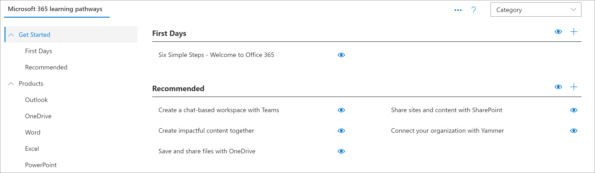

# 새 학습 경로 솔루션 프로 비전Provision a new learning pathways solution 
테 넌 트에 프로 비전 된 학습 경로가 없는 조직에서는 SharePoint 보기 책 서비스를 사용 하 여 다국어 학습 경로 솔루션을 추가할 수 있습니다.Organizations that that don’t have learning pathways provisioned in their tenant can use the SharePoint look book service to add the multilingual learning pathways solution. 이 옵션을 사용 하면 학습 경로 SharePoint 서식 파일은 9 개의 언어로 번역 되며 최소한의 수정 내용과 함께 사용할 수 있습니다.With this option, the learning pathways SharePoint template is translated into nine languages and can be used with a minimum of modification.

> [!IMPORTANT]
> 테 넌 트에 이미 구축 된 학습 경로가 있는 경우에는 학습 경로를 [업데이트](custom_update.md) 하는 것이 좋습니다.If you already have learning pathways provisioned in your tenant, it's recommended that you [update](custom_update.md) learning pathways. 새 학습 경로 인스턴스를 설치 하는 경우 기존 사이트에서 새 사이트로 사용자 지정 내용을 수동으로 전송 해야 합니다.If you install a new instance of learning pathways, you will need to manually transfer any customizations from the existing site to the new site. 

## 다국어 지원을 위한 필수 구성 요소Prerequisites for multilingual support
 
Book 주소록 서비스를 사용 하 여 Microsoft 365 학습 경로를 설정 하려면 프로 비전을 수행 하는 사람이 다음과 같은 사전 요구 사항을 충족 해야 합니다.To successfully set up Microsoft 365 learning pathways with the look book service, the person doing the provisioning must meet the following pre-requisites: 
 
- 학습용 경로는 학습용 경로가 프로 비전 될 테 넌 트의 테 넌 트 관리자 여야 합니다.The person provisioning learning pathways must be a Tenant Administrator of the tenant where learning pathways will be provisioned.  
- SharePoint 관리 센터의 앱 옵션 내에서 테 넌 트 앱 카탈로그를 사용할 수 있어야 합니다.A tenant App Catalog must be available within the Apps option of the SharePoint Admin Center. 조직에 SharePoint 테 넌 트 앱 카탈로그가 없는 경우 [Sharepoint Online 문서](https://docs.microsoft.com/sharepoint/use-app-catalog) 를 참조 하 여 만듭니다.If your organization doesn't have an SharePoint tenant App Catalog, refer to the [SharePoint Online documentation](https://docs.microsoft.com/sharepoint/use-app-catalog) to create one. 학습 경로를 프로 비전 하기 전에 앱 카탈로그를 만든 후 2 시간 이상 기다려야 합니다.You must wait at least two hours after creating the App Catalog before provisioning learning pathways.  
- 학습용 경로는 테 넌 트 앱 카탈로그의 사이트 모음 소유자 여야 합니다.The person provisioning learning pathways must be a Site Collection Owner of the Tenant App Catalog. 학습 경로를 프로 비전 하는 사람이 앱 카탈로그의 사이트 모음 소유자가 아닌 경우에는 [이러한 지침을 완료](addappadmin.md) 하 고 계속 진행 합니다.If the person provisioning learning pathways is not a Site Collection Owner of the App Catalog, [complete these instructions](addappadmin.md) and continue. 

## 테 넌 트 관리자 계정에 선택 된 언어가 없는지 확인Ensure the Tenant Admin account doesn't have a language selected
학습 경로를 프로 비전 하기 전에 테 넌 트의 관리자 계정에 선택 된 언어가 없는지 확인 합니다.Before you provision learning pathways, ensure that the Admin Account for the tenant doesn't have a language selected. 관리자 계정에 선택 된 언어가 없는지 확인 하는 방법은 다음과 같습니다.Here’s how to verify if the Admin account doesn't have a language selected. 
1.  에 지 관리자 프로필을 사용 하 여 office.com로 이동 합니다.With your Edge Admin profile, go to office.com.
2.  사용자 자격 증명을 입력 합니다 (필요한 경우).Enter the user credentials (if necessary).
3.  Microsoft 365에서 **모든 앱** > Delve를 클릭 합니다.In Microsoft 365, click **All Apps** > Delve. 
4.  **Me**  >  **프로필 업데이트**를 클릭 합니다.Click **Me** > **Update Profile**.
5.  페이지를 아래로 스크롤하고 **언어 및 국가별 설정을 변경할 수 있는 방법을**클릭 합니다.Scroll down the page and click **How can I change language and regional settings**.
6.  **여기**를 클릭 하 고 줄임표 ...를 **클릭 합니다.**Click **here**, and then click the ellipses **...**.
7.  **내 표시 언어**아래에 **언어를 선택 하지 않은**것으로 표시 됩니다.Under **My Display Languages**, you should see **No languages selected**. 언어를 선택 하는 경우 선택을 취소 합니다.If a language is selected, unselect it.

### 학습 경로를 프로 비전 하려면To provision learning pathways

1. [Microsoft 365 학습 경로 솔루션 페이지로](https://lookbook.microsoft.com/details/3df8bd55-b872-4c9d-88e3-6b2f05344239)이동 합니다.Go to the [Microsoft 365 learning pathways solution page](https://lookbook.microsoft.com/details/3df8bd55-b872-4c9d-88e3-6b2f05344239).
2. **테 넌 트에 추가를**클릭 합니다.Click **Add to your tenant**. 테 넌 트에 로그인 하지 않은 경우 프로 비전 서비스가 테 넌 트 관리자 자격 증명을 요청 합니다.If you aren't signed into to your tenant, the Provisioning Service will ask for your Tenant Admin credentials. 
3. 요청 된 사용 권한 대화 상자에서 **조직 대신 동의** 를 선택 하 고 **수락**을 선택 합니다.From the Permissions requested dialog box, select **Consent on behalf of your organization** and then select **Accept**.

이 보기 서비스에는 테 넌 트 앱 카탈로그를 만들고 해당 응용 프로그램을 테 넌 트 앱 카탈로그에 설치 하 고 사이트 서식 파일을 프로 비전 하기 위해 이러한 권한이 필요 합니다.The look book service requires these permissions to create the tenant App Catalog, install the application into the tenant App Catalog and provision the site template. 테 넌 트에는 전체적으로 영향을 주지 않습니다.There's no overall impact on your tenant. 이러한 사용 권한은 솔루션 설치의 목적에 명시적으로 사용 됩니다.These permissions are explicitly used for the purpose of the solution installation. 설치를 계속 하려면 이러한 사용 권한을 수락 해야 합니다.You must accept these permissions to continue with the installation.

4. 설치에 적합 하도록 프로 비전 정보 페이지의 필드를 완성 합니다.Complete the fields on the provisioning information page as appropriate for your installation. 적어도 프로 비전 프로세스에 대 한 알림을 받을 전자 메일 주소와 사이트를 프로 비전 할 대상 URL을 입력 합니다.At a minimum, enter the email address where you wish to get notifications about the provisioning process and the destination URL for your site to be provisioned to.  
> [!NOTE]
> "/Sites/MyTraining" 또는 "/teams/LearnMicrosoft365"과 같은 직원에 게 친숙 한 사이트의 대상 URL을 만듭니다.Make the destination URL for your site something friendly to your employees such as "/sites/MyTraining" or "/teams/LearnMicrosoft365".

6. 사용자의 테 넌 트 환경에 학습 경로를 설치할 준비가 되 면 **프로 비전** 을 클릭 합니다.Click **Provision** when ready to install learning pathways into your tenant environment.  구축 프로세스는 최대 15 분까지 소요 될 수 있습니다.The provisioning process can take up to 15 minutes. 사이트가 준비 되 면 전자 메일을 통해 알림을 받게 됩니다.You will be notified via email when the site is ready. 

> [!IMPORTANT]
> 학습 경로 사이트를 프로 비전 하는 테 넌 트 관리자는 해당 사이트로 이동한 다음 **CustomLearningAdmin** 를 열어 학습 경로 관리 속성을 초기화 해야 합니다.The Tenant Admin who provisions the learning pathways site must go to the site, and then open **CustomLearningAdmin.aspx** to initialize learning pathways Admin properties. 현재, 테 넌 트 관리자는 소유자를 사이트에도 할당 해야 합니다.At this time, the Tenant Admin should also assign Owners to the site. 

## 프로 비전 성공 유효성 검사 및 CustomConfig 목록 초기화Validate Provisioning Success and Initialize the CustomConfig List

프로비저닝이 완료 되 면 사이트를 프로 비전 한 테 넌 트 관리자는 look book 서비스에서 전자 메일을 받습니다.When provisioning is complete, the Tenant Admin who provisioned the site receives an email from the look book service. 전자 메일에 사이트에 대 한 링크가 포함 되어 있습니다.The email contains a link to the site. 이때 테 넌 트 관리자는 전자 메일에 제공 된 링크를 사용 하 여 사이트에 방문 하 고 처음 사용할 수 있도록 사이트를 설정 해야 합니다.At this point, the Tenant Admin should go to the site using the link provided in the email and set up the site for first use:

- `<YOUR-SITE-COLLECTION-URL>sites/<YOUR-SITE-NAME>/SitePages/CustomLearningAdmin.aspx`(으)로 이동합니다.Go to `<YOUR-SITE-COLLECTION-URL>sites/<YOUR-SITE-NAME>/SitePages/CustomLearningAdmin.aspx`. **CustomLearningAdmin** 를 열면 처음 사용할 학습 경로를 설정 하는 **customconfig** 목록 항목이 초기화 됩니다.Opening **CustomLearningAdmin.aspx** initializes the **CustomConfig** list item that sets up learning pathways for first use. 다음과 같은 페이지가 표시 됩니다.You should see a page that looks like this:

## 사이트에 소유자 추가Add Owners to Site
테 넌 트 관리자는 사이트를 사용자 지정 하는 사용자가 될 가능성은 없으며, 사이트에 소수의 소유자를 할당 해야 합니다.As the Tenant Admin, it's unlikely you'll be the person customizing the site, so you'll need to assign a few owners to the site. 소유자는 사이트 페이지를 수정 하 고 사이트를 다시 브랜딩 할 수 있도록 사이트에 대 한 관리 권한을 가집니다.Owners have administrative privileges on the site so they can modify site pages and rebrand the site. 또한 콘텐츠를 숨기 거 나 표시 하 고 사용자 지정 재생 목록 및 하위 범주를 작성할 수 있습니다.They also have the ability to hide and show content and build custom playlist and subcategories.  

1. SharePoint **설정** 메뉴에서 **사이트 사용 권한을**클릭 합니다.From the SharePoint **Settings** menu, click **Site Permissions**.
2. **고급 사용 권한 설정을**클릭 합니다.Click **Advanced Permission Settings**.
3. **Microsoft 365 learning 경로 소유자**를 클릭 합니다.Click **Microsoft 365 learning pathways Owners**.
4. **새로 만들기**  >  **사용자를이 그룹에 추가**를 클릭 한 다음 소유자가 하려는 사용자를 추가 합니다.Click **New** > **Add Users to this group**, and then add the people you want to be Owners. 
5. 링크를 추가 하 여 공유 메시지에서 [사이트를 탐색](custom_exploresite.md) 하 고 **공유**를 클릭 합니다.Add a link to [Explore the Site](custom_exploresite.md) in the Share message, and then click **Share**.

## 사이트에 번역기 추가Add translators to the site
사이트에 번역기를 사용 하는 경우 사용 권한을 할당할 수 있습니다.If you will be using translators for the site, you can assign them permissions. 번역자에 게는 구성원 이상의 사용 권한 이상이 필요 합니다.Translators require Member permissions or higher. 

## 사이트에서 여러 언어를 사용 하기 위한 옵션을 선택 합니다.Choose options for using multiple languages on the site
SharePoint look book 서비스는 9 가지 언어로 학습 경로 사이트를 만듭니다.The SharePoint look book service creates the Learning Pathways site in nine languages. 다음 권장 사항이 적용 됩니다.The following recommendations apply:
- 지원 하지 않을 언어를 해제 합니다.Turn off the languages you don’t want to support
- 다국어 사이트를 지원 하지 않는 경우에는 다국어 기능을 사용 하지 않도록 설정 합니다.If you are not supporting a multilingual site, turn off the multi-lingual feature. 이 항목 뒷부분의 "다국어 지원 해제" 섹션을 참조 하십시오.See the "Turn off multilingual support" section later in this topic.

### 지원 하지 않을 언어 제거Remove languages you don’t want to support
기본 영어 외에 하나의 언어만 지원 하도록 선택한 조직의 경우 지원 되지 않는 언어를 제거 하는 것이 좋습니다.For organizations that choose to support only one language, in addition to the default English language, we recommend removing languages that aren’t supported. 
1. 학습 경로 사이트의 페이지 오른쪽 위에서 **설정을** 선택한 다음 **사이트 정보**를 선택 합니다.From the Learning Pathways site, select **Settings** from the top-right of the page, and then select **Site information**.
2. 사이트 정보 창 아래쪽에서 **모든 사이트 설정 보기**를 선택 합니다.At the bottom of the site information pane, select **View all site settings**.
3. **사이트 관리**에서 **언어 설정을**선택 합니다.Under **Site Administration**, select **Language settings**.
4. **페이지 및 뉴스를 여러 언어로 번역할 수 있도록 설정**아래에서 **켜기를 설정 합니다 .로**이동 합니다.Under **Enable pages and news to be translated into multiple languages**, slide the toggle to **On**. 기본적으로 설정 되어 있어야 합니다.It should be On by default.
5. 사이트 언어 추가 또는 제거에서 **제거** 를 클릭 하 여 사이트에 필요 하지 않은 언어를 제거 합니다.Under Add or remove site languages, click **Remove** to remove the languages you don't need for the site. 다음은 기본 영어 외에도 사이트에 대해 지원 되는 이탈리아어를 표시 하는 언어 설정 페이지의 예입니다.The following shows an example of the Language Settings page to show Italian supported for the site, in addition to the default English language.

> [!NOTE]
> 언어를 제거할 때 기본 영어는 제거할 수 없습니다.When removing languages you cannot remove the default English language. 

### 번역기 지정Assign translators
페이지를 번역 하려는 경우 필요에 따라 각 언어에 대해 하나 이상의 번역기를 할당 합니다 (사이트 기본 언어 제외).If you're going to translate pages, optionally assign one or more translators for each language (except the site default language). 
- **번역기 열에서** 번역기로 사용할 사용자의 이름을 입력 하 고 목록에서 이름을 선택 합니다.In the **Translator** column, start typing the name of a person you want to be a translator, and then select the name from the list. 

> [!NOTE]
> 조직의 Active Directory에 있는 모든 사용자를 번역기로 할당할 수 있습니다.Anyone in your organization's Active Directory can be assigned as a translator. 번역자로 할당 된 사용자에 게는 적절 한 사용 권한이 자동으로 부여 되지 않습니다.People assigned as translators will not automatically be given appropriate permissions. 사이트에 대 한 편집 권한이 없는 사용자가 사이트에 액세스 하려고 하면 액세스 권한을 요청할 수 있는 웹 페이지로 리디렉션됩니다.When someone without edit permissions to a site tries to access the site, they will be directed to a web page where they can request access.

## 다국어 지원 해제Turn off multilingual support
예를 들어 영어 전용 사이트를 사용 하지 않으려면 다국어 기능을 해제 하는 것이 좋습니다.If you don’t want a multilingual site, for example, you want an English-only site, it’s recommended that you turn off the multilingual feature. 

1. 학습 경로 사이트의 페이지 오른쪽 위에서 **설정을** 선택한 다음 **사이트 정보**를 선택 합니다.From the Learning Pathways site, select **Settings** from the top-right of the page, and then select **Site information**.
2. 사이트 정보 창 아래쪽에서 **모든 사이트 설정 보기**를 선택 합니다.At the bottom of the site information pane, select **View all site settings**.
3. **사이트 관리**에서 **언어 설정을**선택 합니다.Under **Site Administration**, select **Language settings**.
4. **페이지 및 뉴스를 여러 언어로 번역할 수 있도록 설정**아래에서 **켜기를 설정 합니다 .로**이동 합니다.Under **Enable pages and news to be translated into multiple languages**, slide the toggle to **On**. 기본적으로 설정 되어 있어야 합니다.It should be On by default.
- **페이지 및 뉴스를 번역할 수 있도록 설정**에서 **끄기를**선택 합니다.Under **Enable pages and news to be translated**, select **Off**. 

### 언어 추가Add languages
학습 경로는 9 개의 언어를 지원 하지만, 학습 경로 사이트를 지 원하는 데 필요한 언어만 추가 하는 것이 좋습니다.Learning pathways supports 9 languages, but it’s recommended that you add only the languages you need to support for the learning pathways site. 언제 든 지 제외한를 추가할 수 있습니다.You can add langauges at any time. 
- **사이트 언어 추가 또는 제거**에서 언어 이름 입력을 시작 **하거나 언어를 입력**하거나 드롭다운 목록에서 언어를 선택 합니다.Under **Add or remove site languages**, start typing a language name in **Select or type a language**, or choose a language from the dropdown. 이 단계를 반복 하 여 여러 언어를 추가할 수 있습니다.You can repeat this step to add multiple languages. 언제 든 지이 페이지로 다시 이동 하 여 사이트에서 언어를 추가 하거나 제거할 수 있습니다.You can add or remove languages from your site at any time by going back to this page.
