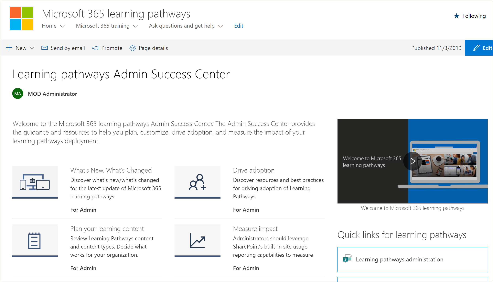

# 학습 경로 관리 성공 센터Learning pathways Admin Success Center

Microsoft 365 학습 경로 관리 성공 센터에 오신 것을 환영합니다.Welcome to the Microsoft 365 learning pathways Admin Success Center. 관리 성공 센터에서는 학습 경로 배포를 계획, 사용자 지정, 채택을 주도하고 영향을 측정하는 데 도움이 되는 지침과 리소스를 제공합니다.The Admin Success Center provides the guidance and resources to help you plan, customize, drive adoption, and measure the impact of your learning pathways deployment.

## Office 365에 로그인Sign in to Office 365 

1.  웹 브라우저를 열고 office.com 또는 조직의 로그인 위치로 이동합니다.Open your Web browser and navigate to office.com or your organization’s sign-in location. 
2.  사용자 이름 및 암호로 로그인합니다.Sign in with your user name and password.
3.  테넌트 관리자가 제공한 URL을 사용하여 사이트의 위치로 이동하거나 Office 365 홈 페이지에서 SharePoint를 선택한 다음 사이트를 선택합니다.Navigate to the location of the site using the URL supplied by your tenant administrator or select SharePoint from the Office 365 Home page, and then select the site. 

### 관리 성공 센터 시작Get started with the Admin Success Center

관리 성공 센터에서는 학습 경로 배포를 계획, 사용자 지정, 채택을 주도하고 영향을 측정하는 데 도움이 되는 지침과 리소스를 제공합니다.The Admin Success Center provides the guidance and resources to help you plan, customize, drive adoption, and measure the impact of your learning pathways deployment. 

- Microsoft 365 학습 경로  홈 페이지에서 관리 성공 센터 **시작을 클릭합니다.**From the Microsoft 365 learning pathways **Home** page, click **Get started with the Admin Success Center**.

학습 경로는 솔루션의 관리 성공 센터 내에서 지침을 제공합니다.Learning pathways provides guidance within the Admin Success Center in the solution. 관리 성공 센터에 대한 설명서는 이 설명서 집합에서도 사용할 수 있습니다.Documentation for the Admin Success Center is also available in this documentation set: 

- [학습 콘텐츠 계획Plan your learning content](custom_plancontent.md)
- [학습 경로 사용자 지정Customize learning pathways](custom_overview.md)
- [채택 주도Drive adoption](driveadoption.md)
- [영향 측정Measure impact](custom_measureimpact.md)

