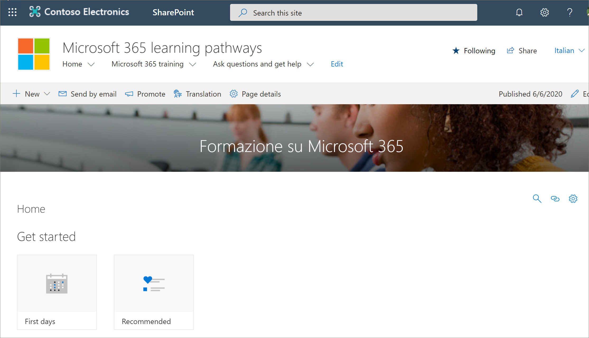

# 사이트 페이지 번역Translate site pages
기존 버전의 학습 경로를 버전 4.0으로 업데이트 했거나 새 사이트를 프로 비전 했는지 여부에 관계 없이 사이트 페이지 번역 프로세스는 동일 합니다.Whether you've updated an existing version of learning pathways to version 4.0 or you've provisioned a new site, the process for translating site pages is the same. 그러나 몇 가지 사항을 알아야 합니다.However, there are a few things to be aware of. 
- 다국어 4.0 버전의 새 학습 경로를 프로 비전 하는 경우 사이트 페이지는 9 개의 언어로 번역 됩니다.When a new learning pathways multilingual 4.0 version is provisioned, the site pages are translated for you into 9 languages. 
- 학습 경로 솔루션이 다국어 4.0 버전으로 업데이트 되 면 학습 경로 SharePoint 사이트 페이지는 변경 되지 않은 상태로 유지 됩니다.When the learning pathways solution is updated to the multilingual 4.0 version, the learning pathways SharePoint site pages remain unchanged. 번역은 수동으로 수행 해야 합니다.Translations must be done manually. 

기본적으로 학습 경로 사이트에서는 다음과 같은 페이지를 제공 합니다.The learning pathways site, by default, provides the following pages:

- Home.aspxHome.aspx
- Start-with-Six-Simple-Steps .aspxStart-with-Six-Simple-Steps.aspx
- Get-started-with-Microsoft-365 .aspxGet-started-with-Microsoft-365.aspx
- Get-started-with-Microsoft-Teams .aspxGet-started-with-Microsoft-Teams.aspx
- Get-started-with-SharePoint .aspxGet-started-with-SharePoint.aspx
- Get-started-with-OneDriive .aspxGet-started-with-OneDriive.aspx
- Ask-questions-and-get-help .aspxAsk-questions-and-get-help.aspx
- 교육 이벤트 일정 .aspxTraining events calendar.aspx
- Become-a-Champion .aspxBecome-a-Champion.aspx
- Recommended-Playlists .aspxRecommended-Playlists.aspx
- 학습 경로 관리 성공 센터Learning pathways Admin Success Center

## 원하는 언어에 대 한 페이지 만들기Create pages for the languages you want
다국어 기능에 대 한 사이트를 사용 하도록 설정 하 고 사용 가능 하도록 설정할 언어를 선택한 후에는 원하는 번역 페이지를 만들 수 있습니다.Once you've enabled your site for multilingual features and you've chosen the languages you want to make available, you can create the translation pages you want. 몇 가지 중요 한 개념을 설명 하기 위해 Microsoft 365 교육 페이지를 예로 사용 합니다.To help demonstrate some important concepts, we'll use the Microsoft 365 training page as an example. 이렇게 하려면 다음을 실행합니다.To do this:

1.  학습 경로 **홈** 페이지에서 **Microsoft 365 교육**을 클릭 합니다.From the learning pathways **Home** page, click **Microsoft 365 training**.  
2.  위쪽 막대에서 **번역**을 선택 합니다.On the top bar, select **Translation**.

3. 사이트에 사용할 수 있는 각 언어의 번역 페이지를 만들려면 **모든 언어에 대해 만들기**를 선택 합니다.If you want to create a page for translation in each of all languages available for your site, select **Create for all languages**. 그렇지 않은 경우 원하는 언어에 대해서만 **만들기** 를 선택 합니다.Otherwise, select **Create** only for the languages you want. 이 예에서는 이탈리아어를 선택 합니다.In this example, we'll select Italian.
4.  **보기**를 클릭 합니다.Click **View**. 이제 페이지를 번역할 준비가 되었습니다.The page is now ready for translation. 

### 알아야 할 중요 한 개념An important concept to know
다음 예제에서는 페이지가 이탈리아어로 변환 되었습니다.Notice that in the following example, the page has been translated to Italian. 하지만 사이트 제목, 탐색 및 웹 파트는 여전히 영어로 표시 됩니다.But the Site title, navigation, and web part, still appear in English. 

 사이트가 영어로 설정 되 면 스페인어 (예: 기본 설정 된 개인 언어)를 사용 하는 사용자는 수동으로 제목, 탐색, 바닥글 내용을 스페인어로 편집 하 고 변환 합니다.After the site is set up in English, a user with Spanish, for example, as their preferred personal language, manually edits and translates the title, navigation, and footer content into Spanish. 독일어로 표시 되는 사용자는 독일어와 동일한 방식으로 사용 됩니다.A user with German as their preferred personal language does the same for German. 콘텐츠를 번역 하면 해당 기본 언어의 모든 사용자에 대해 표시 됩니다.Once the content is translated, it will display for all users of those preferred languages. 웹 파트는 사용자의 기본 설정 언어를 선택 하 고 해당 언어로 번역 된 콘텐츠를 표시 합니다.The Web part picks up the user's preferred language and shows the content translated in that language. 

> [!IMPORTANT]
> 중요: 번역 페이지를 만든 후에는 기본 영어 페이지를 게시 하거나 다시 게시 해야 다음을 확인할 수 있습니다.Important: After you create the translation pages, you must publish (or republish) the default English-language page to ensure that:
- 번역 페이지는 해당 언어 사이트에 표시 됩니다.Translation pages are shown in the corresponding language site
- 뉴스 웹 파트 및 강조 표시 된 콘텐츠 웹 파트에서 번역 페이지가 올바르게 표시 됨Translation pages display correctly in the News web part and the Highlighted content web parts
- 사이트 위쪽의 언어 드롭다운에서 사용 하도록 설정한 모든 언어를 포함 합니다.The language dropdown at the top of the site includes all of the languages you've enabled
- 번역자는 번역 요청에 대 한 알림을 받습니다.Translators are notified of the translation request.

## 번역기는 어떤 역할을 하나요?What does a translator do?
번역자는 기본 언어 페이지의 복사본을 지정 된 언어로 수동으로 번역 합니다.Translators manually translate the copies of the default language page into the language(s) specified. 페이지 복사본을 만들 때 번역자에 게 전자 메일로 알림이 전송 됩니다.When the copies of the page(s) are created, translators are notified in email. 이 전자 메일에는 기본 언어 페이지와 새로 만든 번역 페이지에 대 한 링크가 포함 되어 있습니다.The email includes a link to the default language page and the newly created translation page. 변환기는 다음과 같은 작업을 수행 합니다.The translator will:
1. 전자 메일에서 **번역 시작** 단추를 선택 합니다.Select the **Start translating** button in the email.
2. 페이지 오른쪽 위에서 **편집** 을 선택 하 고 콘텐츠를 번역 합니다.Select **Edit** on the top right of the page, and translate the content.
3. 작업이 완료 되 면 **초안으로 저장** (독자에 게 공개할 준비가 되지 않은 경우)을 선택 하 고, 사이트에서 해당 언어를 사용 하는 모든 사용자가 페이지를 볼 준비가 되 면 **게시** 또는 **게시물**게시를 선택 합니다.When done, select **Save as draft** (if you're not ready to make it visible to readers)or, if the page is ready to be visible to everyone who is using that language on the site, select **Publish** or **Post news**.

변환 프로세스에 대 한 자세한 내용은 [다국어 통신 사이트, 페이지 및 뉴스 만들기](https://support.office.com/en-us/article/2bb7d610-5453-41c6-a0e8-6f40b3ed750c)를 참조 하세요.For more information about the translation process, see [Create multilingual communication sites, pages, and news](https://support.office.com/en-us/article/2bb7d610-5453-41c6-a0e8-6f40b3ed750c). 

## 기본 언어 페이지 업데이트Updating the default language page
기본 언어 페이지가 업데이트 되 면 페이지를 다시 게시 해야 합니다.When the default language page is updated, the page must be republished. 그러면 번역 페이지의 변환기에 게 업데이트를 적용 하 여 개별 번역 페이지에 대 한 업데이트를 수행할 수 있는 전자 메일 알림이 제공 됩니다.Then, the translator(s) for the translation pages are notified in email that an update has been made so updates can be made to the individual translation pages.

## 다음 단계Next Steps
- [사용자 지정 재생 목록 변환Translate custom playlists](custom_translate_pl_ml.md)
- [Multiligual 콘텐츠 숨기기 및 표시Hide and show multiligual content](custom_translate_pl_ml.md)
