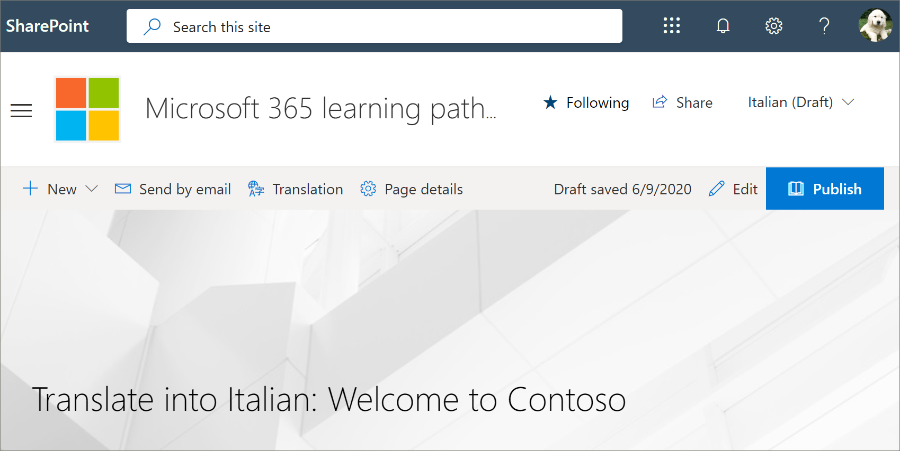
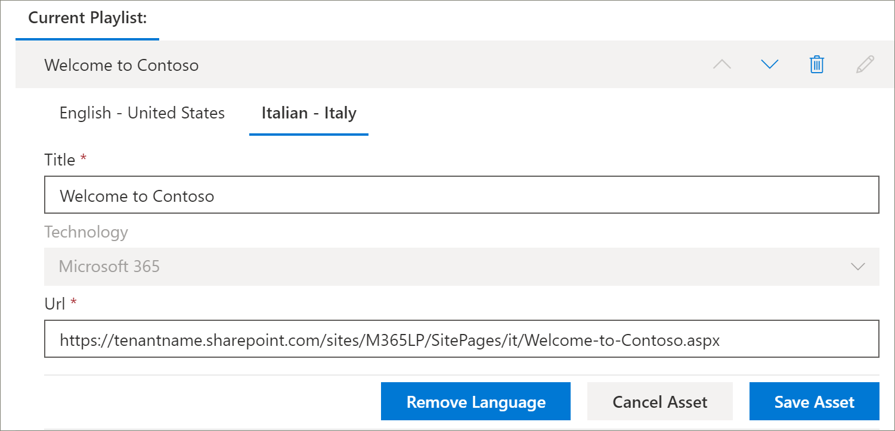

# 학습용 경로 사용자 지정 재생 목록 번역Translate a learning pathways custom playlist
사이트에 대 한 학습 경로 사용자 지정 재생 목록을 만든 경우이 사이트에서 사용 하도록 설정 된 언어로 재생 목록을 번역할 수 있습니다.If you've created learning pathways custom playlists for your site, you can translate the playlists into the languages enabled for this site.

1.  학습 경로 **홈** 메뉴에서 **경로 관리**를 클릭 합니다.From the learning pathways **Home** menu, click **Learning pathways administration**. 
2.  사용자 지정 재생 목록을 클릭 합니다.Click the custom playlist. 이 예에서는 **Contoso에 대 한 5 가지 간단한 단계**를 소개 합니다.In this example, we'll use **Five Simple Steps - Welcome to Contoso**. 
3.  **세부 정보 편집**을 클릭 한 다음 **언어 추가** 상자에서 언어를 선택 합니다.Click **Edit Detail**, then in the **Add language** box, select a language. 이 예에서는 **이탈리아어-이탈리아**를 사용 합니다.In this example, we'll use **Italian – Italy**. 
5.  **세부 정보 저장**을 클릭 합니다.Click **Save Detail**. 

> [!IMPORTANT]
> 변환기 알림은 사용자 지정 재생 목록에 기본적으로 제공 되지 않습니다.Translator notifications are not built into custom playlists. 번역자에 게는 알림을 제공 해야 합니다.Translators will need to be notified manually. 

## 번역기는 어떤 역할을 하나요?What does a translator do?
번역자는 기본 언어 페이지의 복사본을 지정 된 언어로 수동으로 번역 합니다.Translators manually translate the copies of the default language page into the language(s) specified. 재생 목록 세부 정보에 필요한 번역을 번역자에 게 알려야 합니다.You will need to notify the translator of the translations required for playlist details. 재생 목록 자산을 추가, 편집 또는 삭제 하는 것을 포함 하 여 재생 목록 변경 내용을 모두 완료 한 다음 번역자에 게 필요한 번역을 알리는 것이 좋습니다.It's recommended that you finish all playlist changes,including adding, editing, or deleting playlist assets, then notify the translator of the required translations.

## 사용자 지정 재생 목록의 에셋 번역Translate the assets in the custom playlist
Microsoft에서 제공 하는 재생 목록의 모든 자산은 편집할 수 없으며 변환이 필요 하지 않습니다.Any assets in a playlist that are supplied by Microsoft are not editable and do not require translation. 테 넌 트의 SharePoint 사이트에서 사용자 지정 자산을 추가한 경우 이러한 자산에 변환이 필요 합니다.If you’ve added custom assets from your tenant's SharePoint site, those assets will require translation. 재생 목록의 사용자 지정 자산을 번역 하는 방법을 살펴보겠습니다.Let's take a look at how to translate a custom asset in a playlist.

### 기존 자산의 언어 추가Add a language for an existing asset
1. **자산**에서 사용자 지정 자산 옆에 있는 **편집** 아이콘을 선택 합니다.Under **Assets**, select the **Edit** icon next to the custom asset. 
2. **언어 추가** 상자에서 언어를 선택 하 고 **자산 저장**을 선택 합니다.Select a language from the **Add language** box, and then select **Save Asset**.

### 기존 자산의 언어 페이지 추가Add a language page for an existing asset
1. 자산 목록에서 영어 자산을 클릭 하 고 **열기**를 클릭 합니다.In the asset list, click the English asset, and then click **Open**.
2. 위쪽 막대에서 **번역**을 선택 합니다.On the top bar, select **Translation**.
3. 언어 드롭다운에서 자산의 언어를 선택 하 고 **만들기**를 선택한 다음 **보기**를 선택 합니다.From the language dropdown, select the language for the asset, select **Create**, and then **View**. 페이지가 이제 다음과 같이 표시 됩니다.Your page should now look something like this. 

4. **게시**를 클릭 한 다음 페이지에 대 한 URL을 복사 합니다.Click **Publish**, and then copy the URL for the page. URL의 언어 코드와 함께 다음과 같이 나타나야 합니다.It should look something like this, with the language code in the URL.
https://tenantname.sharepoint.com/sites/M365LP/SitePages/it/Welcome-to-Contoso.aspx.https://tenantname.sharepoint.com/sites/M365LP/SitePages/it/Welcome-to-Contoso.aspx.
5. SharePoint 관리 페이지로 돌아가서 해당 자산의 언어에 대 한 URL을 추가한 다음 **저장**을 클릭 합니다.Return to the SharePoint Administration page, add the URL for the language for the asset, and then click **Save**. 

6.  페이지를 위로 스크롤한 다음 **재생 목록 닫기를**클릭 합니다.Scroll up the page and click **Close Playlist**.

## 번역자가 수행 하는 작업What the translator does?
변환기는 다음과 같은 작업을 수행 합니다.The translator will:
- 재생 목록 세부 정보를 번역 합니다.Translate playlist details.
- 자산 정보를 번역 합니다.Translate asset details.
- 자산에 대 한 추가 된 언어 페이지를 번역 합니다.Translate added language pages for asset.
- 번역을 검토할 준비가 되었음을 번역에 대 한 요청자에 게 알립니다.Notify the requestor of the translations that the translations are ready for review

### 재생 목록 세부 정보 변환Translate playlist details
학습 경로 **홈** 메뉴에서 **경로 관리**를 클릭 합니다.From the Learning Pathways **Home** menu, click **Learning pathways administration**. 
1. 변환이 필요한 사용자 지정 재생 목록을 클릭 한 다음 언어를 클릭 합니다.Click the custom playlist that requires translation, then click the languages. 
2. **자세한 정보 편집**을 클릭 하 고 재생 목록에 대 한 번역을 수행한 후Click **Edit Detail**, make the translations for the playlist, then click 
3. **세부 정보 저장**을 클릭 합니다.Click **Save Detail**. 
4. 번역이 완료 되었음을 번역 요청자에 게 알립니다.Notify the translation requestor that the translation is complete. 

### 자산 정보 번역Translate asset details
학습 경로 **홈** 메뉴에서 **경로 관리**를 클릭 합니다.From the Learning Pathways **Home** menu, click **Learning pathways administration**. 
1. 변환이 필요한 사용자 지정 재생 목록을 클릭 합니다.Click the custom playlist that requires translation. 
2. 페이지 아래로 스크롤한 다음 자산에서 편집 하려는 자산의 편집을 선택한 다음 해당 언어를 선택 합니다.Scroll down the page, then under Assets, select edit for the asset you want to edit, then select the language. 
3. 자산에 대 한 번역을 수행한 다음 **자산 저장**을 클릭 합니다.Make the translations for the asset, and then click **Save Asset**.  

## 자산에 대 한 추가 된 언어 페이지 번역Translate the added language page for the asset
학습 경로 **홈** 메뉴에서 **경로 관리**를 클릭 합니다.From the Learning Pathways **Home** menu, click **Learning pathways administration**. 
1. 변환이 필요한 사용자 지정 재생 목록을 클릭 합니다.Click the custom playlist that requires translation. 
2. 페이지 아래로 스크롤한 다음 자산에서 자산을 선택 하 고 언어를 선택한 다음 열기를 클릭 합니다.Scroll down the page, then under Assets, select the asset, select the language, and then click Open. 
3. 페이지 번역을 수행한 다음 **게시**를 클릭 합니다.Make the translations for the page, and then click **Publish**.  

## 새 multilangual 재생 목록 만들기Create a new multilangual playlist
사이트에 대 한 새 재생 목록을 만드는 방법에 대 한 자세한 내용은 [사용자 지정 재생 목록 만들기](custom_createnewplaylist.md)를 참조 하십시오.For instructions on how to create a new playlist for a site, see [Create a Custom Playlist](custom_createnewplaylist.md). 재생 목록 및 자산을 만든 후에는이 설명서를 참조 하 여 재생 목록과 자산을 번역 하는 방법에 대 한 지침을 참조할 수 있습니다.After you've created the playlist and assets, refer back to this documentation for instruction on how to translate the playlist and assets. 