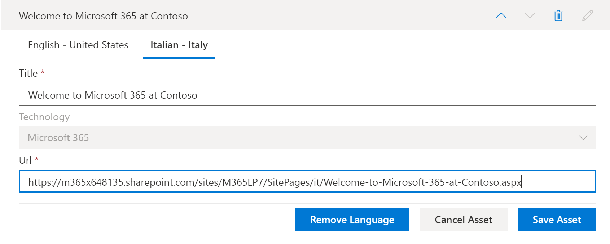

# 학습 경로 사용자 지정 재생 목록 번역Translate learning pathways custom playlists
학습 경로를 사용 하는 경우 사용자 지정 재생 목록을 사용 하는 방법은 학습 경로 사이트를 프로 비전 한 방법에 따라 달라 집니다.With Learning Pathways, the way you work with custom playlists depends on how you provisioned the Learning Pathways site. 

- 새 학습 경로 다국어 사이트를 구축한 경우 새 재생 목록을 복사 하거나 만든 다음 해당 재생 목록을 사이트에서 지 원하는 언어로 번역할 수 있습니다.If you provisioned a new learning pathways multilingual site, you can copy or create a new playlist and translate the playlist into the languages that the site supports.
- 기존 사용자 지정 재생 목록이 있는 기존 학습 경로 사이트를 업그레이드 한 경우 기존 재생 목록을 사이트에서 지 원하는 언어로 번역할 수 있습니다.If you upgraded an existing learning pathways site that has pre-existing custom playlists, you can translate the existing playlists into the languages that your site supports. 새 재생 목록을 복사 하 여 만들 수도 있습니다.You can also copy and create new playlists. 

> [!IMPORTANT]
> - Microsoft에서 제공 하는 재생 목록은 이미 번역 되었으며 재생 목록의 복사본을 만들지 않으면 수정할 수 없습니다.Microsoft-supplied playlists are already translated and can't be modified unless you create a copy of the playlist. 

## 재생 목록 만들기 또는 복사 및 번역Create or copy a playlist and have it translated
새 학습 경로 다국어 사이트를 프로 비전 하거나 다국어 웹 파트로 사이트를 업그레이드 한 경우에는 사용자 지정 재생 목록을 복사 하거나 만든 후 재생 목록 및 재생 목록 자산을 사이트에서 지 원하는 언어로 번역할 수 있습니다.If you've provisioned a new learning pathways multilingual site or upgraded the site with the multilingual web part, you can copy or a create custom playlist and translate the playlist and playlist assets into the languages supported by your site. 

### 재생 목록 복사 및 변환Copy a playlist and have it translated
새 사용자 지정 재생 목록을 만들어 번역 하는 방법을 보여 주기 위해 학습 경로의 복사본 재생 목록 기능을 사용 합니다.To demonstrate how to create a new custom playlist and have it translated, we'll use the Copy playlist feature of learning pathways.

1.  학습 경로 **홈** 메뉴에서 **경로 관리**를 클릭 합니다.From the learning pathways **Home** menu, click **Learning pathways administration**. 
2.  **Microsoft 365 학습 경로**에서 **처음 일**을 선택 하 고 **간단한 6 단계를 선택 하 여 microsoft 365을 시작**합니다.Under **Microsoft 365 learning pathways**, select **First Days**, then select **Six Simple Steps - Welcome to Microsoft 365**. 
3. **재생 목록 복사**를 클릭 하 고 페이지를 아래로 스크롤한 다음 **세부 정보 편집**을 클릭 합니다.Click **Copy Playlist**, scroll down the page and click **Edit Detail**.   
4. 재생 목록의 제목을 변경 합니다.Change the title of the playlist. 이 예에서는 재생 목록 제목을 **간단한 5 단계로**변경 합니다.In this example, we'll change the playlist title to to **Five Simple Steps**. 사용할 수 있는 언어는 사이트에 대해 선택 된 지원 되는 언어에 따라 달라 집니다.Note that the languages available will depend on the supported languages selected for the site. 다른 언어를 추가 하려면 사이트에 추가 지원 언어를 추가 해야 합니다.To add additional languages, you need to add additional supported languages to the site.   
5. **세부 정보 저장**을 클릭 합니다.Click **Save Detail**. 
6. 기본 언어 (이 경우 영어) 오른쪽에 있는 언어를 클릭 하 여 복사 된 재생 목록 세부 정보를 확인 합니다.Click a language to the right of the default language (in this case English) to view the copied playlist details. 새 언어에 대 한 세부 정보에는 원본으로 복사 된 재생 목록이 반영 되며 변환이 필요 합니다.The details for the new language reflect the original copied playlist and require translation.
7. 변환 가능한 재생 목록 정보를 번역자에 게 알려 주도록 메모를 작성 합니다.Make a note to notify the translator of the playlist details to be translated.  

> [!IMPORTANT]
> 변환기 알림은 사용자 지정 재생 목록에 기본적으로 제공 되지 않습니다.Translator notifications are not built into custom playlists. 번역자에 게는 알림을 제공 해야 합니다.Translators will need to be notified manually. 번역자는 기본 언어 세부 정보의 복사본을 지정 된 언어로 수동으로 번역 합니다.Translators manually translate the copies of the default language details into the language(s) specified. 재생 목록 세부 정보에 필요한 번역을 번역자에 게 알려야 합니다.You will need to notify the translator of the translations required for playlist details. 재생 목록 자산을 추가, 편집 또는 삭제 하는 등의 재생 목록 변경 내용을 모두 완료 한 다음 재생 목록 세부 정보 및 자산에 대 한 필수 번역을 번역자에 게 알려 주는 것이 좋습니다.It's recommended that you finish all playlist changes,including adding, editing, or deleting playlist assets, then notify the translator of the required translations for playlist details and assets.

## 사용자 지정 재생 목록에 다국어 자산 만들기Create multilingual assets in a custom playlist
Microsoft에서 제공 하는 재생 목록의 모든 자산은 편집할 수 없으며 변환이 필요 하지 않습니다.Any assets in a playlist that are supplied by Microsoft are not editable and do not require translation. Microsoft에서 제공 하는 자산은 사이트에서 지 원하는 언어로 제공 됩니다.Microsoft-supplied assets will be available in the languages supported by the site. 사용자가 직접 만들거나 기존 사용자 지정 자산에 대해 사이트에서 지 원하는 언어를 추가할 수 있습니다.For custom assets that you create, or existing custom assets, you can add the languages supported by the site.  재생 목록에 기존 사용자 지정 자산의 새 자산 및 언어를 추가 하는 방법을 살펴보겠습니다.Let's take a look at how to add languages for new and existing custom assets in a playlist. 

### 재생 목록의 새 다국어 자산 만들기Create a new multilingual asset for a playlist
이러한 지침에서는이 항목의 예제에 나와 있는 5 가지 간단한 단계 재생 목록을 사용 하는 것으로 가정 합니다.These instructions assume you're using the Five Simple Steps playlist in the example in this topic. 

**자산을 만들려면****To create the asset**
1. 5 가지 간단한 단계 재생 목록의 경우 **자산**에서 **+ 새 자산** 을 선택한 다음 자산에 대 한 세부 정보를 입력 합니다.For the Five Simple Steps playlist, under **Assets**, select **+ New Asset** and then fill out the details for the asset. 
- **제목**으로 "Contoso에서 Microsoft 365 시작"을 입력 합니다.For **Title**, enter "Welcome to Microsoft 365 at Contoso". 
- **기술**에 대해서는 **Microsoft 365**을 선택 합니다.For **Technology**, select **Microsoft 365**.

2. **자산 만들기**를 선택 하 고 **자산 저장**을 선택 합니다.Select **Create Asset**, and then select **Save Asset**.

**자산을 열려면****To open the asset**
1. 방금 만든 자산을 선택한 다음 **열기**를 클릭 합니다.Select the asset you just created, and then click **Open**.  
2. 페이지를 원하는 대로 변경 합니다.Make the changes to the page as desired. 지금은 페이지 제목을 변경 하 고 다음 예제와 같이 페이지에 텍스트를 추가 하 고 **게시**를 클릭할 수 있습니다.For now, you can change the title of the page and add some text to the page as shown in the following example, and then click **Publish**. 
3. **번역**을 클릭 합니다.Click **Translation**.
4. 원하는 언어에 대해 **만들기** 를 선택 합니다.Select **Create** for the language(s) you want. 이 예에서는 이탈리아어를 선택 합니다.For this example, we'll select Italian.
5. **보기**를 선택 합니다.Select **View**. 그러면 지원 되는 언어에 따라 다음 예제와 비슷한 페이지가 표시 됩니다.You should now see a page similar to the following example depending on your supported languages.

6. **게시**를 클릭합니다.Click **Publish**.
7. 만든 번역 페이지에 대해 브라우저에서 URL을 복사 하 고 학습 경로 관리 페이지로 돌아갑니다.For the translation page you created, copy the URL from the browser and return to the learning pathways Administration page.

**사용자가 만든 번역 자산의 언어를 추가 하려면****To add a language for the translation asset you created** 
1. 학습 경로 관리 페이지로 돌아간 후 열린 "다섯 가지 간단한 단계" 자산에 대 한 편집 아이콘 (연필)을 선택 합니다.Return to the learning pathways Administration page and select the Edit icon (pencil) for the "Five Simple Steps" asset you opened. 
2. **언어 추가**를 클릭 한 다음 언어를 선택 합니다.Click **Add language**, and then select a language. 이 예에서는 이탈리아어를 선택 했습니다.In this example, we've selected Italian. 
3. 만든 번역 된 페이지의 URL을 입력 합니다.Enter the URL of the translated page you created. 다음 예제와 비슷한 페이지가 표시 됩니다.You should see a page similar to the following example. 

4. **자산 저장**을 클릭 합니다.Click **Save Asset**.

## 기존 사용자 지정 재생 목록 및 자산에 대 한 언어 추가Add languages for existing custom playlists and assets
다국어 지원을 위한 학습 경로를 업그레이드 했으며 기존 사용자 지정 재생 목록 및 에셋이 있는 경우 재생 목록 및 에셋에 대해 지원 되는 언어를 추가할 수 있습니다.If you have upgraded learning pathways for multilingual support and have existing custom playlists and assets, you can add supported languages for the playlists and assets. 이러한 지침에서는 언어를 추가할 수 있는 사용자 지정 재생 목록이 있다고 가정 합니다.These instructions assume you have a custom playlist to which you can add languages. 사용자 지정 재생 목록이 없는 경우이 항목 앞부분의 "재생 목록 만들기 또는 복사"를 참조 하세요.If you don't have a custom playlist, see "Create or Copy a Playlist" earlier in this topic. 

> [!IMPORTANT]
> - Microsoft에서 제공 하는 재생 목록은 이미 번역 되었으며 재생 목록의 복사본을 만들지 않으면 수정할 수 없습니다.Microsoft-supplied playlists are already translated and can't be modified unless you create a copy of the playlist. 사용자 지정 재생 목록에 대해서만 언어를 추가할 수 있습니다.You can only add languages for custom playlists. 
> - 사용자 지정 재생 목록 및 에셋의 언어를 추가 하려면 다국어 지원 및 언어를 사용 하도록 설정 해야 합니다.To add languages for custom playlists and assets, multilingual support and languages must be enabled. 다국어 지원 및 옵션을 사용 하도록 설정 하는 방법에 대 한 자세한 내용은 [Set Language Settings](https://docs.microsoft.com/office365/customlearning/custom_update_ml#set-language-settings)를 참조 하십시오.For more details on enabling multilingual support and options, see [Set Language Settings](https://docs.microsoft.com/office365/customlearning/custom_update_ml#set-language-settings). 

### 기존 재생 목록의 언어를 추가 하려면To add languages for an existing playlist
1.  학습 경로 **홈** 메뉴에서 **경로 관리**를 클릭 합니다.From the learning pathways **Home** menu, click **Learning pathways administration**. 
2.  사용자 지정 재생 목록을 선택 합니다.Select a custom playlist. 사용자 지정 재생 목록은 다음 예에 표시 된 대로 확인 표시가 있는 사용자 아이콘으로 식별 됩니다.A custom playlist is identified by the people icon with the checkmark as shown in the following example.
 
3. **세부 정보 편집**을 선택 합니다.Select **Edit Detail**. **하위 수준 편집** 단추를 찾기 위해 아래로 스크롤해야 할 수도 있습니다.You may need to scroll down to find the **Edit Detail** button.   
4. **언어 추가** 를 선택한 다음 언어를 선택 합니다.Select **Add language** and then select a language. 
5. **세부 정보 저장**을 선택 합니다.Select **Save Detail**.
 사용할 수 있는 언어는 사이트에 대해 선택 된 지원 되는 언어에 따라 달라 집니다.Note that the languages available will depend on the supported languages selected for the site. 다른 언어를 추가 하려면 사이트에 추가 지원 언어를 추가 해야 합니다.To add additional languages, you need to add additional supported languages to the site.   
5. 기본 언어 (이 경우 영어) 오른쪽에 있는 언어를 클릭 하 여 복사 된 재생 목록 세부 정보를 확인 합니다.Click a language to the right of the default language (in this case English) to view the copied playlist details. 새 언어에 대 한 세부 정보에는 원본으로 복사 된 재생 목록이 반영 되며 변환이 필요 합니다.The details for the new language reflect the original copied playlist and require translation.
 
7. 변환 가능한 재생 목록 정보를 번역자에 게 알려 주도록 메모를 작성 합니다.Make a note to notify the translator of the playlist details to be translated.  

**자산을 열려면****To open the asset**
1. 방금 만든 자산을 선택한 다음 **열기**를 클릭 합니다.Select the asset you just created, and then click **Open**.  
2. 페이지를 원하는 대로 변경 합니다.Make the changes to the page as desired. 지금은 페이지 제목을 변경 하 고 다음 예제와 같이 페이지에 텍스트를 추가 하 고 **게시**를 클릭할 수 있습니다.For now, you can change the title of the page and add some text to the page as shown in the following example, and then click **Publish**. 
3. **번역**을 클릭 합니다.Click **Translation**.
4. 원하는 언어에 대해 **만들기** 를 선택 합니다.Select **Create** for the language(s) you want. 이 예에서는 이탈리아어를 선택 합니다.For this example, we'll select Italian.
5. **보기**를 선택 합니다.Select **View**. 그러면 지원 되는 언어에 따라 다음 예제와 비슷한 페이지가 표시 됩니다.You should now see a page similar to the following example depending on your supported languages.

6. **게시**를 클릭합니다.Click **Publish**.
7. 만든 번역 페이지에 대해 브라우저에서 URL을 복사 하 고 학습 경로 관리 페이지로 돌아갑니다.For the translation page you created, copy the URL from the browser and return to the learning pathways Administration page.

## 번역자에 게 알림Notify the translator
번역 자산 만들기가 완료 되 면 필요한 번역을 번역자에 게 알립니다.When you've finished creating translation assets, notify the translator of the required translations. 변환기는 다음과 같은 작업을 수행 합니다.The translator will:
- 재생 목록 세부 정보를 번역 합니다.Translate playlist details.
- 자산 정보를 번역 합니다.Translate asset details.
- 자산에 대해 추가 된 언어 페이지를 번역 합니다.Translate added language pages for an asset.
- 번역을 검토할 준비가 되었음을 번역에 대 한 요청자에 게 알립니다.Notify the requestor of the translations that the translations are ready for review

## 기존 사용자 지정 재생 목록의 언어 추가Add languages for an existing custom playlist
다국어 지원을 위한 학습 경로를 업그레이드 했으며 기존 사용자 지정 재생 목록 및 에셋이 있는 경우 재생 목록 및 에셋에 대해 지원 되는 언어를 추가할 수 있습니다.If you have upgraded learning pathways for multilingual support and have existing custom playlists and assets, you can add supported languages for the playlists and assets. 

> [!IMPORTANT]
> - Microsoft에서 제공 하는 재생 목록은 이미 번역 되었으며 재생 목록의 복사본을 만들지 않으면 수정할 수 없습니다.Microsoft-supplied playlists are already translated and can't be modified unless you create a copy of the playlist. 사용자 지정 재생 목록에 대해서만 언어를 추가할 수 있습니다.You can only add languages for custom playlists. 
> - 사용자 지정 재생 목록 및 에셋의 언어를 추가 하려면 다국어 지원 및 언어를 사용 하도록 설정 해야 합니다.To add languages for custom playlists and assets, multilingual support and languages must be enabled. 다국어 지원 및 옵션을 사용 하도록 설정 하는 방법에 대 한 자세한 내용은 [Set Language Settings](https://docs.microsoft.com/office365/customlearning/custom_update_ml#set-language-settings)를 참조 하십시오.For more details on enabling multilingual support and options, see [Set Language Settings](https://docs.microsoft.com/office365/customlearning/custom_update_ml#set-language-settings). 

## 번역기에 대 한 지침Instructions for the translator

### 재생 목록 세부 정보 변환Translate playlist details
학습 경로 **홈** 메뉴에서 **경로 관리**를 클릭 합니다.From the Learning Pathways **Home** menu, click **Learning pathways administration**. 
1. 변환이 필요한 사용자 지정 재생 목록을 클릭 한 다음 언어를 클릭 합니다.Click the custom playlist that requires translation, then click the languages. 
2. **자세한 정보 편집**을 클릭 하 고 재생 목록에 대 한 번역을 수행한 후Click **Edit Detail**, make the translations for the playlist, then click 
3. **세부 정보 저장**을 클릭 합니다.Click **Save Detail**. 
4. 번역이 완료 되었음을 번역 요청자에 게 알립니다.Notify the translation requestor that the translation is complete. 

### 자산 정보 번역Translate asset details
학습 경로 **홈** 메뉴에서 **경로 관리**를 클릭 합니다.From the Learning Pathways **Home** menu, click **Learning pathways administration**. 
1. 변환이 필요한 사용자 지정 재생 목록을 클릭 합니다.Click the custom playlist that requires translation. 
2. 페이지 아래로 스크롤한 다음 자산에서 편집 하려는 자산의 편집을 선택한 다음 해당 언어를 선택 합니다.Scroll down the page, then under Assets, select edit for the asset you want to edit, then select the language. 
3. 자산에 대 한 번역을 수행한 다음 **자산 저장**을 클릭 합니다.Make the translations for the asset, and then click **Save Asset**.  

### 자산에 대 한 추가 된 언어 페이지 번역Translate the added language page for the asset
학습 경로 **홈** 메뉴에서 **경로 관리**를 클릭 합니다.From the Learning Pathways **Home** menu, click **Learning pathways administration**. 
1. 변환이 필요한 사용자 지정 재생 목록을 클릭 합니다.Click the custom playlist that requires translation. 
2. 페이지 아래로 스크롤한 다음 자산에서 자산을 선택 하 고 언어를 선택한 다음 열기를 클릭 합니다.Scroll down the page, then under Assets, select the asset, select the language, and then click Open. 
3. 페이지 번역을 수행한 다음 **게시**를 클릭 합니다.Make the translations for the page, and then click **Publish**.   

