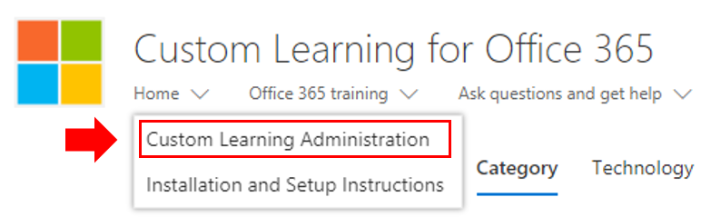

# 교육 환경 사용자 지정

테스트 4입니다. 기본적으로 사이트 환경과 웹 사이트에는 모든 Office 365 및 Windows 10 서비스에 대한 콘텐츠가 포함됩니다.  회사에서 이러한 서비스 전체 또는 일부만 사용할 수 있는 경우 사용자가 사용할 수 있는 콘텐츠를 조정할 수 있습니다.  

이 사이트의 소유자가 사용할 수 있는 몇 가지 종류의 사용자 지정이 있습니다. 

- [웹 페이지 사용자 지정](#customizing-web-pages)
- [사용 가능한 서비스 사용자 지정](#customize-available-services)
- [재생 목록 사용자 지정 및 공유](customplaylist.md)

사이트가 사용자 커뮤니티로 시작되기 전에 이러한 사용자 지정의 일부 또는 전체를 완료할 수 있습니다.  

> [!TIP]
> 직원의 피드백을 수집하고 주기적으로 추가 사용자 지정을 완료합니다.  재생 목록을 추가하거나, 특정 역할에 웹 페이지를 지정하거나, 새 서비스를 시작하면 새 교육 콘텐츠를 켜야 합니다. 

## 웹 페이지 사용자 지정

사용자 지정 학습 웹 사이트를 완전히 사용자 지정할 수 있습니다. 최신 SharePoint Online 사이트 내에서 페이지를 만드는 데 익숙하지 않은 경우 해당 사이트에서 [SharePoint](https://support.office.com/article/customize-your-sharepoint-site-320b43e5-b047-4fda-8381-f61e8ac7f59b) 사이트 사용자 지정 문서를 support.office.com. 

### 질문하기 **및 도움말 확인 페이지 사용자** 지정

사이트를 사용자 지정하기 위한 시작점으로 질문하기를 선택하고 메뉴 표시줄에서 도움말을 확인한 다음 SharePoint 편집 단추를 클릭하고 이미지 및 링크를 변경합니다. 

## 사용 가능한 서비스 사용자 지정

1.  웹 사이트 내에서 사용자 지정 학습 관리 페이지 사용자 지정 학습 관리 
1. 기술을 **선택하여** 솔루션에 포함된 전체 서비스 목록을 볼 수 있습니다.
1. 기술을 선택하고 **눈 기호를 클릭하여** 이 콘텐츠를 숨길 수 있습니다.  환경 내에서 콘텐츠를 표시하려면 눈 기호를 다시 클릭합니다. 

환경 내의 재생 목록 범주에 대해 동일한 프로세스를 반복할 수 있습니다.  범주 옵션을 선택하여 재생 목록을 표시/숨기기만 합니다. 

### 다음 단계

- [재생 목록 사용자 지정 및 공유](customplaylist.md)
- [도입 주도](driveadoption.md) 
