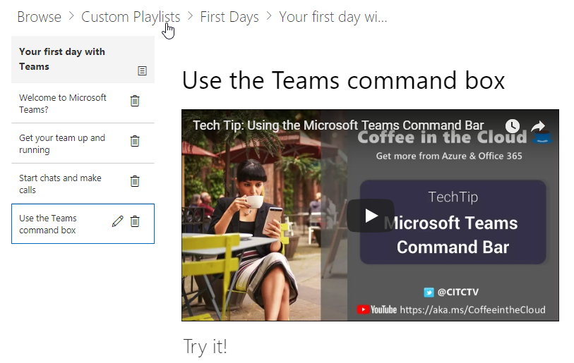

# 서비스 및 재생 목록 사용자 지정Customize the Services and Playlists

기본적으로 사이트 경험와 웹 파트는 모든 Office 365 서비스에 대 한 콘텐츠를 포함 합니다.  이러한 서비스의 전부 또는 일부 회사에서 사용할 수 있는 하나만 있는 경우 사용자에 게 사용할 수 있는 콘텐츠를 조정할 수 있습니다.  이 문서 웹 파트 콘텐츠에 사용자 지정 합니다.By default both the site experience and the webpart include content for all Office 365 services.  If only all or some of these services are available in your company you can adjust what content is available to your users.  In this article we will customize the webpart content.  

## 웹 파트 콘텐츠를 사용자 지정Customizing the webpart content

사용자 정의 학습 웹 파트는 두가지 주요 기능을 제공합니다.The Custom Learning webpart provides two key features:
- 기술 표시/숨기기Hide/Show Technologies
- 재생 목록 만들기Create a Playlist

### 숨기기 또는 표시 기술 범주Hide or Show Technology Categories

숨기고 웹 파트에서 콘텐츠를 표시 합니다.To hide and show content in the Web part: 
1.  웹 파트에 있는 드롭다운 메뉴를 클릭 한 다음 표시/숨기기 기술을 클릭 합니다.Click the dropdown menu on the webpart, then click Hide/Show Technologies

2. 숨기 거 나 표시 하는 기술 및 **적용**을 선택 하려면 checkox를 선택 합니다.Select a checkox to hide or show a technology and select **Apply**.

### 재생 목록 만들기Create a Playlist

재생 목록은 "자산" compliation 합니다. "자산" SharePoint 페이지 또는 기존 항목 Microsoft 교육 콘텐츠입니다. 함께 이동 하는 자산을 선택 하는 재생 목록을 만들 때 사용자에 대 한 학습 경로 만들 수 있습니다.A playlist is a compliation of "assets". An "asset" is a SharePoint page or existing item of Microsoft training content. When you create a playlist you select assets that go together to create a learning path for your user.  

SharePoint 페이지를 추가 하는 이점은 YouTube와 SharePoint 페이지를 만들 수는 비디오 또는 조직에서 호스팅되는 비디오입니다. 양식 또는 다른 Office 365 콘텐츠 페이지를 만들 수도 있습니다.The benefit of adding SharePoint pages is that you can create SharePoint pages with a YouTube videos or videos hosted in your organization. You can also create pages with Forms or other Office 365 content.  

#### 1 단계: 재생 목록에 대 한 SharePoint 페이지 만들기Step 1: Create a SharePoint page for your playlist
이 예제에서는 먼저 재생 목록에 추가 하기 SharePoint 페이지를 만듭니다. YouTube 비디오 웹 파트 및 텍스트 웹 파트 페이지를 만듭니다.  이러한 지침 SharePoint Online 서비스를 사용 하는 가정 합니다.In this example, we’ll first create a SharePoint page to add to the playlist. We’ll create a page with a YouTube video web part and Text web part.  These instructions assume you are using the SharePoint Online service. 

#### 새 페이지 만들기Create a new page
1.  설정 메뉴 gt_ 사이트 콘텐츠 gt_ 사이트 페이지 gt_ 새 gt_ 사이트 페이지를 선택 합니다.Select the Settings menu > Site Contents > Site Pages > New > Site Page.
2.  제목 영역에서 팀 명령 상자를 사용 하 여 입력In the title area, type Use the Teams command box
3.  새 섹션을 추가 선택 하 고 두 열을 선택 합니다.Select the Add a new section, and then select Two Columns.

4.  왼쪽 상자에 새 웹 파트 추가 선택 하 고 Embed를 선택 합니다.In the left-hand box, select Add a new web part, and then select Embed. 
5.  이 URL로 이동 하는 웹 브라우저에서 https://youtu.be/wYrRCRphrp0 하 고 비디오에 대 한 embed를 얻으십시오.In a Web browser, go to this URL https://youtu.be/wYrRCRphrp0 and get the embed code for the video. 
6.  SharePoint 웹 파트에 포함할 추가 코드를 선택 하 고 Embed 상자에 붙여넣습니다.In the SharePoint Web part, select Add Embed code and then paste it into the Embed box. 
7.  오른쪽 상자에 새 웹 파트 추가 선택 하 고 텍스트를 선택 합니다.In the right-hand box, select Add a new web part, and then select Text. 
8.  웹 브라우저에서이 URL로 이동: https://support.office.com/en-us/article/13c4e429-7324-4886-b377-5dbed539193b 시도 복사 하 고 해당! 페이지의 지침 텍스트 웹 파트에 붙여넣습니다. 페이지에는 다음과 같습니다.In a Web browser, go to this URL: https://support.office.com/en-us/article/13c4e429-7324-4886-b377-5dbed539193b and copy the Try it! Instructions from the page and paste them into the Text Web part. Your page should look like the following. 

9.  게시를 클릭 한 다음 페이지의 URL을 복사 하 고 메모장에 붙여넣습니다Click Publish, and then copy the URL of the page and paste it in Notepad

#### 2 단계: 재생 목록 만들기Step 2: Create the Playlist
1.  사용자 정의 학습 웹 파트를 설치한로 이동 합니다. 전체 사이트 환경에서 Office 365 교육 페이지에서 호스팅됩니다.Navigate to where you have installed the Custom Learning webpart. In the full site experience it is hosted on the Office 365 training page. 
2.  드롭다운 메뉴에서 새 재생 목록 만들기를 선택 합니다.From the dropdown menu select Create New Playlist. 

3.  아래 예제와 같이 값 입력 하 고 **만들기**를 선택 합니다.Fill in the values as shown in the example below and select **Create**. 

#### 3 단계: 자산을 재생 목록에 추가Step 3: Add assets to the playlist
이 단계에서 재생 목록에 Microsoft와 만든 SharePoint 페이지에서 기존 자산을 추가할 수 있습니다.In this step, you’ll add existing assets from Microsoft and the SharePoint page you created to the playlist. 

1.  메뉴 단추를 클릭 한 다음 기존 자산 추가 클릭 합니다.Click the menu button, then click Add Existing Asset.

2.  Office 365 앱 gt_ Microsoft 팀의 교육 필터링Filter on Office 365 Apps > Microsoft Teams Training
3.  시작 Microsoft 팀에 추가 하 채팅을 통해 팀을 이해 하 고 실행을 시작한 전화를 걸 합니다.Add Welcome to Microsoft Teams, Get your team up and running, and Start chats and make calls.
4.  메뉴 단추 gt_ 만들기 자산을 선택 합니다.Select the menu button > Create Asset.
5.  자산 제목 상자에 팀 명령 상자를 사용 하는 형식입니다.Type Use the Teams command box in the Asset title box. 
6.  SharePoint 사용 자산 콘텐츠 필드에 복사한 팀 명령 상자 페이지 URL을 붙여넣습니다.Paste the SharePoint Use the Teams command box page URL you copied in the Asset content field. 
7.  이제 다시 탐색할 홈페이지 gt_ 사용자 정의 재생 목록을 gt_ 처음 팀 gt_ 함께 일 팀 명령 상자를 사용 합니다. 페이지에는 다음과 같습니다.Now navigate back to the Home Page > Custom Playlists > Your first days with Teams > Use the Teams command box. Your page should look like the following. 

이 콘텐츠가 포함 된 재생 목록을 이제 사용할 수 있습니다 설치 / 사용자 정의 학습 웹 파트를 포함 한 어디.Your playlist with this content will now be available anywhere you have installed / embedded the Custom Learning webpart. 

#### 에 대 한 고려 사항Things to Think About

사용자 지정 재생 작업의 vareity에서 최종 사용자를 지원 하기 위해 사용할 수 있습니다.  요청 양식 휴무 시간 있습니까?  하드웨어 장비를 요청 하려면 양식?  경험에는 모든 기존 교육 자산을 프로그래밍할 수 있습니다.Custom playlists can be used to assist your end users in a vareity of tasks.  Do you have a time off request form?  A form to request hardware equipment?  Any existing training assets can be programmed into the experience.  
