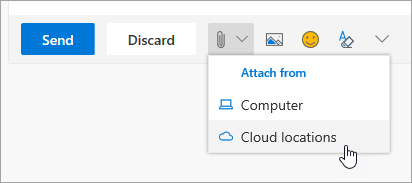

# 동료와의 공동 작업

이것이, 오후 2시 및 동료 들과 공동 작업을 수행할 시간입니다. Office 365에서 다양 한 방법으로 함께 사용 하 여 팀을 사용 하도록 설정 하는 공동 작업을 위한 최고의 기회를 제공 합니다. 

## 도구
- Microsoft Teams
- Office Online
- OneNote
- SharePoint & OneDrive
- 
## 동료 들과 공동 작업을 수행 하는 것에 대 한 검사 목록
- 만들기 또는 공동 작업을 수행할 Microsoft 팀에 참가
- 만들기 및 OneDrive에서 파일 공유 
- Office 365의에서 공동 작성을 
- 클라우드 첨부 파일을 사용 하 여

## 만들기 또는 공동 작업에 대 한 Microsoft 팀에 참가

팀이 Microsoft와 채널은 파일을 공유 하 여 사람들이 공동 작업할 수 있는 위치 팀 작업 항목 및 추가 정보를 추적 합니다. Microsoft 팀의 모든는 SharePoint 사이트, OneNote 전자 필기장 및 기타 자산에 통합 합니다. Office 365의이 서비스는 가장 자주 공유 프로젝트 또는 성과에 협력 하는 사람들을 위해 사용 됩니다. 

## OneDrive에서 파일 공유
비즈니스용 OneDrive에 저장 된 파일을 브라우저 또는 Word 또는 Excel과 같은 Office 365 데스크톱 응용 프로그램에서 모든 사용자와 공유할 수 있습니다. 자신의 이름, 별칭 또는 회사 전자 메일 주소를 사용 하 여 개별 사용자와 공유 하는 것이 불가능 합니다. 

## Office 365의에서 공동 작성을
작업 동시에 동료 들과 동일한 파일에서 공동 작성 되어야 됩니다. 이 웹 기반 버전의 핵심 Office 365 앱 및 해당 응용 프로그램의 Office 2016에서 이후로 데스크톱 버전에서 가능 합니다.  시간과 같은 문서 및 Office에서 함께 작동 하는 저장가 동기화 이러한 변경 내용을 사용자에 대 한 여러분 중 하나는 오프 라인 하는 경우에 합니다. 

## 클라우드 첨부 파일을 사용 하 여 하-해당 스프레드시트를 전자 메일 보내기 중지!
전자 메일에 첨부 된 경우 올바른 버전의 문서에 대 한 헌트 몇 번 했습니다가? 이제 Office 365의 클라우드 첨부 파일을 호출 하 여 모든 사용자가 동일한 버전을 편집 하는 파일에 대 한 링크를 공유할 수 있습니다.  하기로 선택 하거나 링크 및 사용자 수 보거나 파일을 편집 하는 여부를 보낼 수 있습니다. 

