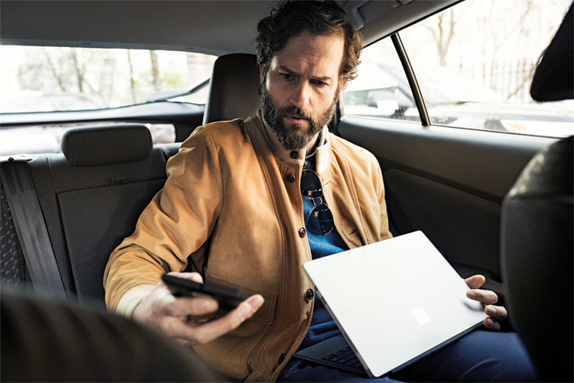

# 사용자 이동 하는 동안

아침에 작동 하도록 통근 하지만 뒤에 모든 작업을 남길 필요가 없습니다. Office 365와 모바일 장치를 진행 중인 작업을 이동할 수 있으며 수행 중인 작업을 계속 키를 누릅니다.  모바일 경험상으로 안전 하 고 생산성을 이동이 있을 수 있습니다.  

> [!IMPORTANT]
> 작동 하도록 드라이브 하는 경우 안전을 우선순위를 지정 하 고 글을 제어를 제어 하는 모든 구동 법률에 따라 있는지 확인 하십시오. 모임에 참가, 텍스트 하지 않으면 또는 motor vehicle를 운영 하는 동안 메시징 읽고 정말-중요 한 기능에 초점을 두는 있는지 확인을 통해 가져올 **안전**을!

## 도구
- Microsoft Teams
- 사무실 

## 사용자 이동에 대 한 검사 목록
- 모바일 장치에 대 한 호출 전송
- 모임에 참가 하거나 팀이 Microsoft에서 호출 1:1
- 모바일 장치에서 Office 365에 연결
 
## 모바일 장치에 대 한 호출 전송
Microsoft 팀에 대 한 호출 없이 이동 중일 곧바로 준비를 해야 하는 경우 휴대폰으로 통화를 전송 하기 위한 것이 같습니다. 이를 자신의 책상을 떠나지 되었지만를 표시 하거나 프레젠테이션을 공유할 우리 것이 불가능 한 경우에 중단 없이 대화를 계속할 수 있습니다. 전송으로 전화에 대 한 호출 보내는 대화 다음과 같은 일반적인 전화 네트워크를 통해 수 요금 연결할이입니다.

## 모임에 참가 하거나 팀이 Microsoft에서 호출 1:1
모바일 응용 프로그램을 사용 하 여 Microsoft 팀에 대 한 이벤트의 일정을 볼 수 있습니다.  Microsoft 팀과 모임을 예약 하는 경우 모바일 응용 프로그램에서 "조인" 단추를 표시 됩니다. 모바일 네트워크를 사용 하 여 모임에 연결 됩니다.  음소거, 스피커 및 채팅 등의 일반적인 기능 기능이 작동 합니다.  콘텐츠를 보기에 대 한 연결을 따라 비활성화 될 수 있습니다. 팀에서 대화 상대 목록에서 다른 사용자로 이동 하 고 직접 되어있는 1:1 전화를 걸 수도 있습니다. 

## 모바일 장치에서 Office 365에 연결
[Office 365 앱](https://support.office.com/en-us/article/set-up-office-apps-and-email-on-a-mobile-device-7dabb6cb-0046-40b6-81fe-767e0b1f014f?ui=en-US&rs=en-US&ad=US) 모든 주요 플랫폼에 대해 사용할 수 있고 사용 하 여 SharePoint Online 사이트 또는 비즈니스용 OneDrive에 있는 모든 파일에 액세스할 수 있습니다. 조직에서 2 단계 인증을 사용 하는 경우에 전화를 통해 또는 미리 설정 하는 인증 app 인증 해야할 수 있습니다.  

> [!NOTE]
> 전화기에서 온라인 기능을 사용 하 여 수 인해 발생 하는 비용 모바일 네트워크를 사용 하는 경우에 유의 합니다. 최상의 기능을 제공 하 고 모든 추가 비용이 발생 하지는 되도록 수 있도록 가능한 Wi-fi를 사용 해야 합니다.