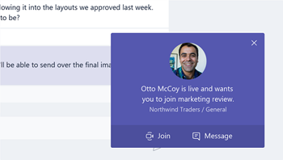
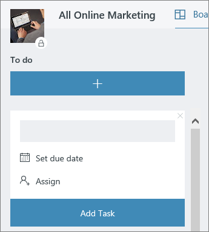

# Office에서 모임Meeting at the Office

모임에 대 한 오전 10:00 시가 됩니다.It's 10:00 AM and time for your meeting. 이 섹션에서는 모임을 보다 생산적으로 만드는 방법을 보여 줍니다.In this section, we'll show you how to make your meetings more productive.  이 작업은 모임 준비 및 Office 365 도구에 대 한 모범 사례를 포함 합니다.This involves best practices for meeting preparation and Office 365 tools.  

## 도구Tools
- OutlookOutlook
- Microsoft TeamsMicrosoft Teams
- 비즈니스용 SkypeSkype for Business
- OneNoteOneNote

## 모임에 대 한 검사 목록Checklist for your meeting
- 모임 계획 및 예약Plan and book your meeting
- 모임 참가Join a meeting
- 모임에 정보 표시Present information in a meeting
- 공동 작성 및 메모를 위해 모임에 OneNote 사용Use OneNote in a meeting for co-creation and notes
- 모임에서 Planner를 사용 하 여 해당 프로젝트에 대 한 작업 항목 추적Use Planner in a meeting to track action items for that project
- 모임 종료End a meeting
 
## 모임 계획 및 예약Plan and book your meeting
모임을 가능한 한 생산적으로 유지 하려면 다음과 같은 몇 가지 작업을 수행할 수 있습니다.There are a few things you can do to ensure your meeting is as productive as possible:

1. **모임이 필요 한가요?****Do you need a meeting?** 먼저 필요한 승인자와 채팅에서 파일을 공유 하는 것이 좋습니다.Consider sharing a file in chat with the necessary approvers first.  
1. **의제를 명확 하 게 합니다.****Have a clear agenda.**  참석자를 준비할 수 있도록 온라인 모임 초대의 메모 섹션에 모임 안건을 포함 합니다.Include your meeting agenda in the notes section of your online meeting invitation so attendees can be prepared.
1. **모임 녹음**  Microsoft 팀의 모임 기록 기능을 사용 하 여 회의를 참석 하거나 나중에 메모를 기록을 수 있는 사람과 모임을 공유 합니다.**Record your meeting**  Use meeting recording functions in Microsoft Teams to share the meeting with people who could not attend or to transcribe notes later.  

이제 회의를 예약할 준비가 되었습니다: Microsoft 팀의 모임 또는 Outlook의 비즈니스용 Skype 세부 정보를 예약할 수 있습니다.Now you're ready to book that meeting:  Book the meeting with Microsoft Teams or Skype for Business details in Outlook. 이렇게 하면 서로 다른 위치의 팀 구성원을 포함 하 고, 모임을 기록 하 고, 비디오를 활용 (사용 가능한 경우) 하 여 통신을 향상 시킬 수 있습니다.Doing so enables you to include team members from different locations, record the meeting and utilize video (when available) to enhance communication. 

## 모임 참가Join a meeting
어디에서 나 참석 합니다.Join from anywhere. 모임 세부 정보에서 전화 접속 번호를 통화 하거나 모바일 앱을 사용 하 여 어디에서 든 지 모바일 장치를 사용 하 여 Microsoft 팀 또는 비즈니스용 Skype 모임에 참가할 수 있습니다.It is possible to join a Microsoft Teams or Skype for Business meeting from anywhere using a mobile device, either by calling the dial-in number in the meeting details or using the mobile apps. 모바일 앱을 사용 하는 경우 사용자 또는 국가에 적용 되는 모바일 데이터 사용에 대 한 제한 사항을 준수 해야 합니다.When using the mobile apps, be conscious of mobile data usage limits that apply to you or your country.

> [!TIP]
> **헤드셋을 사용 합니다.****Use a headset.** 컴퓨터에서 책상에 연결 하는 경우 컴퓨터의 기본 제공 마이크 및 스피커가 아닌 헤드셋을 사용 하 여 더 나은 통화 품질을 보장 합니다.If you are connecting from your computer at your desk, use a headset rather than your computer's built-in microphone and speakers to ensure a better call quality.

> [!TIP]
> 비디오를 켜십시오.Turn on your video! 카메라를 사용할 수 있는 경우에는이를 사용 하는 것이 좋습니다 .에 대 한 통신은 음성을 사용 하는 경우 부재 중에 발생할 수 있는 구두 없는 큐를 제공 합니다.When cameras are available, it's worth using them, as face-to-face communication provides non-verbal cues that can be missed when just using voice. 머리에는 걱정할 필요가 없습니다.Don't worry, your hair looks great. 

## 모임에 정보 표시Present information in a meeting
장치에서 콘텐츠를 공유 하는 것은 모임에 집중 하 고 토론에 대 한 컨텍스트를 제공 하는 좋은 방법입니다.Sharing content from your device is a great way to focus your meeting and provide context to the discussion. 일반적으로 전체 화면을 공유 하는 것은 좋지 않은 생각이 될 수 있습니다.In general, sharing your entire screen can be a bad idea. 이는 화면에 표시 되는 모든 항목이 모임에 참가 하는 모든 사용자의 화면에 나타나도록 하는 것을 의미 합니다.It means that everything that comes up on your screen will appear on the screens of everyone attending the meeting. Microsoft 팀에서 공유할 콘텐츠를 선택 하기만 하면이를 방지할 수 있습니다.Avoid this by simply selecting the content you want to share in Microsoft Teams. 

## 모임에서 OneNote 사용Use OneNote in a meeting
OneNote에서는 실시간 공동 작업 및 공동 작성을 가능 하 게 하 여 모임에서 브레인스토밍 및 메모 참여에 이상적인 도구를 만들 수 있습니다.OneNote can allow for real-time collaboration and co-creation, making it an ideal tool for brainstorming and note taking in meetings. 모든 사용자가 OneNote를 공유 하는 위치에 대 한 액세스 권한이 있으면 전자 필기장에 대 한 링크를 게시 하 고 토론을 바로 시작할 수 있습니다.As long as everyone has access to the location where the OneNote is shared, you can post a link to the notebook and start brainstorming right away.

팀 전자 필기장에서 모임 메모에 대 한 특정 섹션을 만들 수 있습니다.You can create a specific section for meeting notes in the team notebook. OneNote에서 "모임 세부 정보" 기능을 사용 하 여 모임 세부 정보의 요약을 포함 하 여 페이지를 만들 수도 있습니다.You can also use the "meeting details" functionality in OneNote to create pages with a summary of the details of the meeting.

## 모임에서 Planner 사용Use Planner in a meeting
프로젝트 계획에 작업 항목을 직접 추가 하면 기록 후에도 해당 항목이 저장 됩니다.Directly adding action items into a plan for your project saves you from transcribing them after the fact. & 노트 작성 작업 추적에 자신을 할당 하는 것이 대규모 프로젝트 모임에서 가장 좋은 방법입니다.It's a best practice in large project meetings to assign someone to action tracking & note taking. 이는 일반적으로 모임을 실행 하는 사용자와는 다릅니다.This is normally a different person than the individual running the meeting. 작업 항목 미리 알림은 항목이 기한이 지나면 미리 알림으로 자신에 게 직접 전송 됩니다.Action item reminders are sent directly to the individual to whom it is assigned as are reminders if the item passes it's due date. 

## 모임 종료End a meeting
회의록에 나와 있는 모든 내용을 토론 한 후에는 시간에 관계 없이 모임을 종료 합니다.When everything on the agenda has been discussed, end the meeting, regardless of the time. 모든 참가자에 게 작업 항목을 할당 하 고 보냅니다.Assign and send action items to all participants. Microsoft 팀에서 공동 작업을 하는 경우 적절 한 채널에서 의결 항목을 쉽게 공유할 수 있습니다.If you are collaborating in Microsoft Teams, you can easily share action items in the appropriate channel. 모임 중에 작업 항목을 Planner에서 입력 및 할당할 수도 있으며,이를 통해 [Microsoft 팀에서 액세스할](https://support.office.com/article/use-planner-in-microsoft-teams-62798a9f-e8f7-4722-a700-27dd28a06ee0)수 있는 완료를 빠르게 추적할 수 있습니다.Action items can also be entered and assigned in Planner during the meeting, providing a fast way to track for completion which can also be [accessed in Microsoft Teams](https://support.office.com/article/use-planner-in-microsoft-teams-62798a9f-e8f7-4722-a700-27dd28a06ee0). 