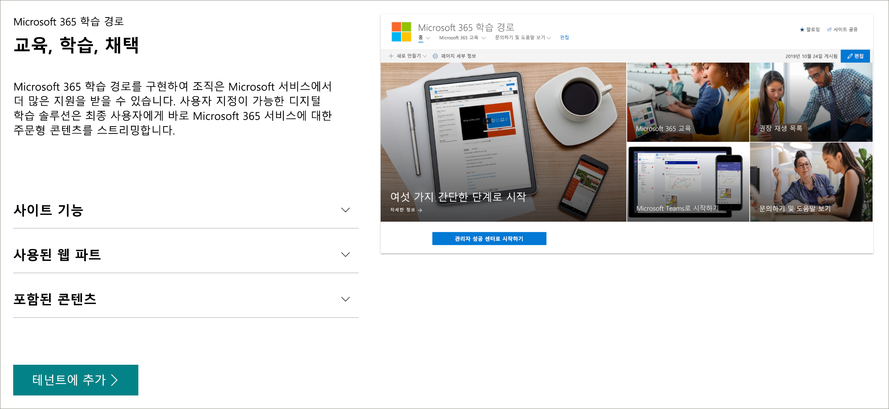

# Microsoft 365 학습 경로 
Microsoft 365 학습 경로는 조직에서 Microsoft 365 서비스의 사용과 채택을 향상 시키기 위해 설계 된 맞춤형 주문형 학습 솔루션입니다.    

> [!IMPORTANT]
> 학습 경로는 분기별 콘텐츠 업데이트 사이클을 따르도록 합니다. 9/24/2020 년 9 월 콘텐츠 업데이트에 대 한 학습 경로 콘텐츠가 업데이트 되었습니다. 9 월 2020 콘텐츠 업데이트에 대 한 자세한 내용은 [콘텐츠 업데이트](custom_contentupdates.md)를 참조 하세요. 콘텐츠 업데이트를 적용 하는 방법과 콘텐츠를 관리 하는 방법에 대 한 자세한 내용은 [콘텐츠 업데이트 관리](custom_contentupdatesmanage.md)를 참조 하세요.  

## 주문형, Microsoft의 사용자 지정 교육

Microsoft 365 학습 경로는 다음과 같은 기능을 제공 합니다.

- **완벽 하 게 사용자 지정 가능한 SharePoint Online communication site** -학습 경로 교육 포털을 사용자 지정 하 여 조직의 도움말, 지원 및 커뮤니티 콘텐츠를 추가할 수 있습니다.
- **Easy 프로비저닝** -간단한 몇 단계만 사용 하 여 SharePoint Online 프로 비전 서비스에서 학습 경로를 프로 비전 합니다.
- **자체 교육 재생 목록을 만드는 기능** -학습 경로를 사용 하 여 환경의 고유한 요구 사항에 맞는 대상 교육 재생 목록을 만들 수 있습니다.
- 최신 **콘텐츠** -학습 경로는 Microsoft online 콘텐츠 카탈로그를 통해 콘텐츠를 제공 하므로 사이트의 콘텐츠가 정기적으로 업데이트 됩니다.

> [!VIDEO https://www.microsoft.com/videoplayer/embed/RE42hMy]

## SharePoint 보기 서적 서비스
SharePoint look book 서비스에서 학습 경로를 프로 비전 할 수 있습니다. Microsoft 365 학습 경로가 구축 되 면 조직에서는 온라인 교육 콘텐츠에 연결 된 학습 경로 웹 파트와 함께 기본 교육 포털로 설계 된 SharePoint Online 통신 사이트를 가져옵니다. 

## 간단한 4 단계
이제 환경에 대 한 학습 경로 환경 만들기를 시작 해 보겠습니다.
1. [학습 경로에 대 한 다국어 지원 개요](custom_overview_ml.md)를 읽으십시오. 
2. [설치 옵션](custom_setupoptions.md) 을 선택 하 고 Microsoft 365 학습 경로를 프로 비전 합니다.  
3. 사용자 환경에 맞게 학습 경로를 조정 합니다.
4. [채택 도구](driveadoption.md)를 사용 하 여 사용자와 학습 경로를 공유 합니다.

## 피드백 및 지원

Microsoft 365 학습 경로는 GitHub의 [온라인 문제 목록을](https://aka.ms/CustomLearningHelp) 통해 지원 되는 오픈 소스 프로젝트입니다. 학습 경로 솔루션과 해당 구성 요소는 기존 Microsoft 지원 계약에 포함 되지 않습니다.  

## 추가 리소스
Microsoft 365 learning 경로 사이트를 사용 하 여 새 또는 기존 사용자 커뮤니티 포럼에 대 한 링크를 제공할 수 있습니다. 내부 사용자 그룹을 아직 설치 하지 않은 경우 시작 하 여 사용자가 자신의 성공을 공유 하 고 서로 정보를 공유할 수 있도록 하는 것이 좋습니다.  내부 사용자 그룹을 nurture 할 시간이 없는 경우에는 직원 들이 [Microsoft office 365 챔피언 커뮤니티](https://aka.ms/O365Champions) 에 참여 하 여 월별 교육, 온라인 커뮤니티의 멤버 자격 및 Office 365의 도구 및 리소스에 대 한 초기 액세스 권한을 부여할 수 있습니다.