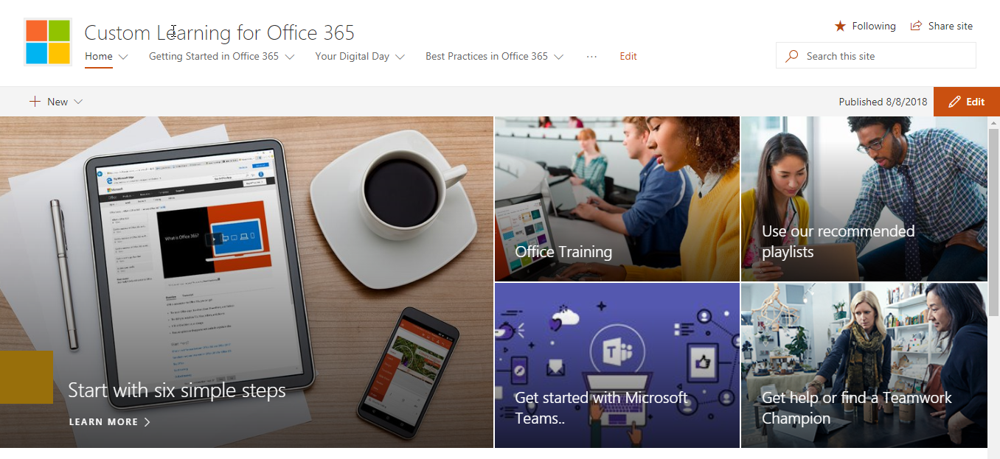

# Office 365에 대 한 학습 하는 사용자 정의Custom Learning for Office 365

## 자체 서비스, Microsoft에서 사용자 지정할 수 있는 교육 솔루션Self service, customizable training solutions from Microsoft

Office 365에 대 한 학습 하는 사용자 정의 교육 및 적용 오픈 소스 도구 조직에서 Office 365의 사용을 증가 시킬 하도록 설계의 집합입니다. Microsoft 팀과 SharePoint 제품 엔지니어링 그룹 및 현대 지원 및 경험 팀과의 제휴를 만든, 이러한 단순 사용 하 여 솔루션 설치 하 고 수 SharePoint Online 테 넌 트에 사용자 지정 합니다.Custom Learning for Office 365 is a set of training and adoption open source tools designed to increase usage of Office 365 in your organization. Created in partnership with Microsoft Teams and SharePoint Product Engineering groups and the Modern Assistance and Experience team, these simple-to-use solutions can be installed and customized in your SharePoint Online tenant. 

이러한 솔루션 최종 사용자에 게 Microsoft에서 제공 하 고 필요에 따라 해당 콘텐츠를 최신 상태로 유지 모든 교육 콘텐츠를 가져옵니다.  사이트는 Microsoft 팀 또는 회사 내에서 다른 기존 SharePoint Online 사이트의 설치와 쉽게 통합 될 수 있습니다.These solutions bring to your end-users all the training content that Microsoft has to offer and keeps that content up to date on demand.  The site can easily be integrated with your installation of Microsoft Teams or other existing SharePoint Online sites in your company.

사용자 지정 학습 콘텐츠는 현재 Office 365 제품에 대 한 콘텐츠를 시작 하려면 범위가 제한 됩니다.  더 많은 콘텐츠를 포함 하려는 경우 귀하에 게 제공 [추천 단어 및 피드백](feedback.md) 사용해 온라인 포럼에 합니다.Our custom learning content is currently scoped to beginning content for Office 365 products.  If you'd like to see more content included, give us [suggestions and feedback](feedback.md) in our online forum.  

## 사용자 지정 학습 오픈 소스 구성 요소Custom Learning Open Source Components

Office 365에 대 한 학습 하는 사용자 지정에는 두가지 옵션이 제공 됩니다.Custom Learning for Office 365 provides two options: 

**옵션 1**: [SharePoint Online 사이트의 패키지 학습 사용자 정의](installsitepackage.md)**Option 1**: [The Custom Learning SharePoint Online Site Package](installsitepackage.md)

선택 하 고, 설치 및 회사에 대 한 교육 포털을 만들려면이 SharePoint Online 통신 사이트 패키지를 구성 합니다. 도구 키트는 더욱 원활 이전의이 교육 포털 조직의 도움말, 지원 및 커뮤니티 콘텐츠를 추가할 사용자 지정할 수 있습니다. 조직 내에서 지원 되지 서비스와 관련 된 모든 콘텐츠를 제거할 수도 있습니다. 사용자 지정 학습 사이트 패키지도 조직에 Office 365 교육 콘텐츠를 최신 상태로 피드를 제공 하는 사용자 지정 학습 웹 파트를 포함 합니다.Select, install, and configure this SharePoint Online communication site package to create a training portal for your company. Formerly known as Toolkit for Teamwork, this training portal can be customized to add your organization's help, support, and community content. You can also remove any content related to services not supported within your organization. The custom learning site package also includes the Custom Learning web part that provides an up-to-date feed of Office 365 training content to your organization. 

**옵션 2**: [Office 365 웹 파트에는 사용자 정의 학습](installwebpart.md) 는 사용자 정의 학습 웹 파트 옵션은 기존 SharePoint Online 통신 사이트에 Office 365 교육을 통합 하는 조직을 위해 설계 되었습니다. 사용자 정의 학습 웹 파트는 모든 SharePoint Online 페이지에 설치할 수 있습니다 하 고 Microsoft의 Support.Office.com 사이트에서 Office 365 교육 콘텐츠의 전체 제품군의 최신는 피드를 제공 합니다. 웹 파트를 통해 전달 되는 콘텐츠를 교육 사용을 쉽게 재생 목록에서 구성 됩니다. 관리자가 웹 파트를 사용 하 여 결합 콘텐츠 YouTube, 같은 로컬로 호스팅된 콘텐츠를에서 사용자 지정 교육 재생 목록 작성 수 있습니다. Pdf 및 조직의 고유한 요구 사항에 맞게 조정 된 경험을 교육을 제공 하려면 Office 365 교육 콘텐츠입니다.**Option 2**: [The Custom Learning for Office 365 web part ](installwebpart.md) The Custom Learning web part option is designed for organizations that want to integrate Office 365 training into an existing SharePoint Online communication site. The Custom Learning web part can be installed on any SharePoint Online page and provides an up-to-date feed of the full suite of Office 365 training content from Microsoft's Support.Office.com site. Training content delivered through the web part is organized in easy-to-consume playlists. Administrators can also use the web part to build custom training playlists, combining content from YouTube, locally hosted content like .PDFs, and Office 365 training content, to provide training experiences tailored to the unique needs of the organization.

## 3 단계3 Easy Steps

최신 Microsoft와 간단한 교육 솔루션을 콘텐츠 만들기를 [시작 하기](prereqs.md) 수 있도록 합니다.Lets [get started](prereqs.md) creating a simple training solutions with up to date Microsoft content.

1. 솔루션 오른쪽 선택Select the solution right for you
2. 전체 설치 &를 사용자 지정 콘텐츠Complete your installation & customize your content
3. 당사의 [채택 도구](driveadoption.md) 를 사용 하 여 사용자와 사이트를 공유 합니다.Share your site with your users using our [adoption tools](driveadoption.md)
