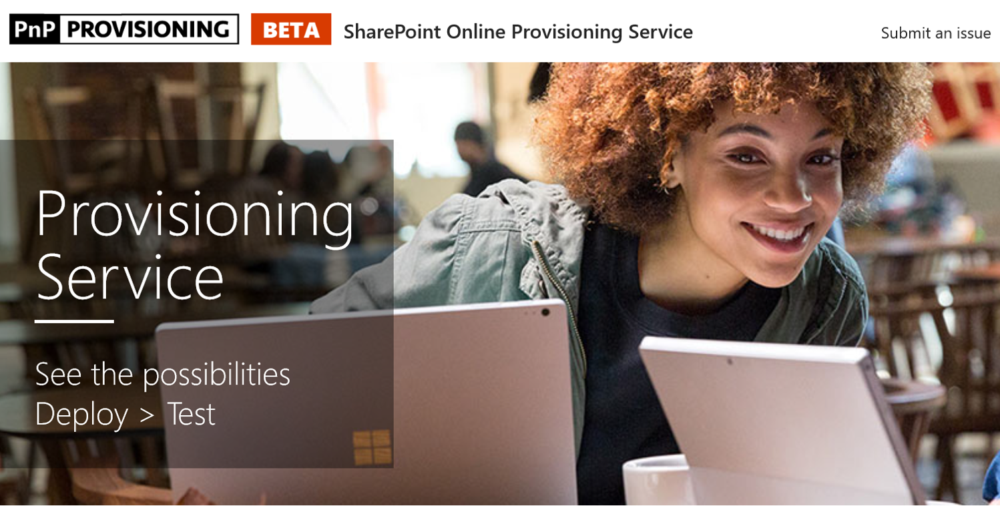

# 사용자 지정 학습 사이트 구축Provision the Custom Learning Site

1. 이동 http://provisioning.sharepointpnp.com 하 고 설치를 사용 하 여 로그인 하는 대상 테 넌 트 하기에 대 한 자격 증명을 사용 하 여 계획 합니다. Go to http://provisioning.sharepointpnp.com and sign in using your credentials for the targeted tenant you plan on using for the installation. 
1. 조직을 대신 하 여 사용자의 동의 해제 확인 하 고 수락을 선택 합니다.Check off Consent on behalf of your organization and select Accept.
1. 솔루션 갤러리에서 Office 365에 대 한 사용자 정의 학습을 선택 합니다.Select Custom Learning for Office 365 from the solution gallery. 
1. 테 넌 트에 추가 선택Select Add to your Tenant 
1. 필수 / 선택 프로 비전 테 넌 트 환경에 CLO365를 설치할 준비가 되 면으로 프로 비전 페이지에서 기본 선택 항목을 조정 합니다.Adjust default selections on the provisioning page as required and select Provision when ready to install CLO365 into your tenant environment.  
1. 프로 비전 하는 프로세스에는 최대 15 분까지 수행 됩니다. 전자 메일 (준비 페이지에서 입력 한 알림 전자 메일 주소)을 통해 알림을 받게 됩니다 사이트 액세스에 대 한 준비가 된 경우.The provisioning process will take up to 15 minutes. You will be notified via email (to the notification email address you entered on the Provisioning page) when the site is ready for access. 
1. 한번에 로그인 한 CLO365 테 넌 트를 자주 사용에 사이트 하 고 나중에 참조할 수에 대 한 url을 복사 합니다.Once logged on to CLO365 in your tenant, favorite the site and copy the url for future reference.  

## 다음 단계Next Steps
- 웹 파트에 포함 된 [기본 콘텐츠](sitecontent.md) 를 탐색 합니다.Explore the [default content](sitecontent.md) included in the webpart.
- [사용자 지정](customization.md) 하면 조직에 대 한 교육 경험 합니다.[Customize](customization.md) the training experience for your organization.
- 교육 솔루션의 [채택 드라이브](driveadoption.md) 를 합니다.[Drive adoption](driveadoption.md) of your training solution.

