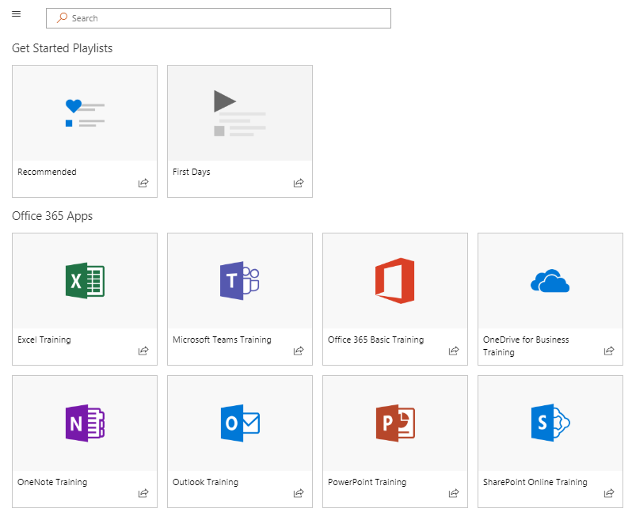

# 사이트 및 기본 콘텐츠 탐색Explore the site and default content

### 사이트 둘러보기Tour the site 

홈 페이지로 이동 하 여 Office 365 교육을 선택 합니다. SharePoint Online 사이트의 각 페이지는 Microsoft Learning webpart를 호스팅하도록 구성 됩니다. 이렇게 하면 페이지에서 웹 파트 내에서 사용할 수 있는 모든 콘텐츠를 표시할 수 있습니다.Navigate to the Home page and select Office 365 Training. EAch page in the SharePoint Online site is configured to host the Microsoft Learning webpart. This enables the page to  display all the content available within the webpart.

메뉴 모음에서 탐색 항목 **Office 365 학습** 을 선택한 다음 **OneDrive 시작**을 선택 합니다. 이 경우 웹 파트는 콘텐츠를 필터링 하 여 OneDrive 콘텐츠만 표시 합니다.From the menu bar, select the navigation item **Office 365 Training** and then select **Get Started with OneDrive**. In this case, the Web part filters the content to show only OneDrive content.

다른 두 메뉴 옵션에 대해이 단계를 반복 하 되, **팀을 시작** 하 고 **SharePoint Online을 시작** 하 여 콘텐츠를 검토 하 고 탐색을 테스트 합니다.Repeat these steps for the other two menu options, **Get Started with Teams** and **Get Started with SharePoint Online** to review their content and test the navigation.

홈 페이지로 다시 이동한 후 **6 가지 간단한 단계로 시작**을 선택 합니다. 이 작업을 수행 하면 6 가지 간단한 단계 재생 목록으로 이동할 수 있습니다.Navigate back to the Home page and select **Start with Six Simple Steps**. This takes you to the Six Simple Steps playlist.

> [!TIP]
> 6 개의 간단한 단계는 Microsoft research 팀에서 도출 됩니다. Microsoft 연구원 들이 가장 오래 된 것으로 확인 된 단계 이며, 사용자가 이러한 단계를 수행 하는 경우 Office 365 사용이 증가 하 고 생산성 높은 근로자의 작업 자가 될 수 있습니다. 이는 모든 사람에 게 적합 합니다.The Six Simple Steps are derived from a Microsoft research team. These are the steps that Microsoft researchers have found to be the most sticky, meaning if users go through these steps, their use of Office 365 will increase and they will become more productive workers. And that’s good for everybody.

### 간단한 6 단계 시작으로 이동Go to Start with Six Simple Steps
- 홈 페이지에서 6 가지 간단한 단계로 시작을 클릭 합니다.From the Home page, click Start with six simple steps. 
- 사용자 지정 학습 웹 파트가 6 개의 간단한 단계 7 단계로 시작 하는 Office 교육 페이지를 볼 수 있습니다.You see the Office Training page with the Custom Learning web part routed to the Start with six simple steps playlist.  

### 종류의 재생 목록 목록 보기View a list of playlists for a category

Office 365 교육 페이지에서 excel 교육 재생 목록으로 이동 하는 엑셀 교육을 선택 합니다.From the Office 365 training page select Excel Training to go to a list of Excel Training playlists.

### 재생 목록 보기View a Playlist

**Excel 시작** 을 클릭 하 여 재생 목록을 확인 합니다.Click **Welcome to Excel** to view the playlist

이제 각 페이지에 올바른 콘텐츠가 표시 되도록 사이트가 설정 됩니다.Your site is now set up with the correct content being displayed on each page. 

## 다음 단계Next Steps
- [사이트 콘텐츠 사용자 지정Customize site content](customization.md)
- [드라이브 도입Drive adoption](driveadoption.md) 
