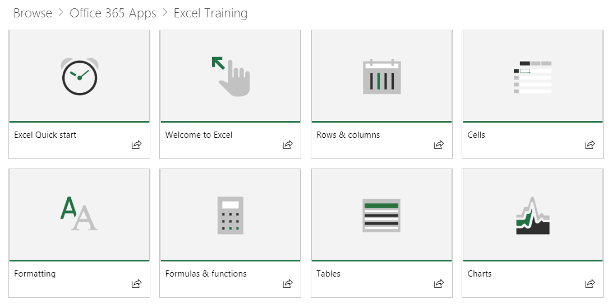

# Webpart 기본 콘텐츠Webpart Default Content

## 재생 목록 모델The Playlist Model

이 웹 파트는 익숙한 재생 목록 모델을 사용 하 여 콘텐츠를 구성 합니다.Our webpart uses a familiar playlist model to organize the content.  이 모델은 최종 사용자가 쉽게 이해 하 고 사용자 지정할 수 있는 방법입니다.This model is simple for your end users to understand and for you to customize should you choose to.  사용자 지정이 필요 하지 않습니다.Customization is not required.  우리의 기본 경험을 바탕으로 폭넓은 연구를 기반으로 효과적인 교육 콘텐츠를 제공 합니다.Our out of the box experience provides you with effective training content based on our extensive research.

이러한 재생 목록은 조직에서 사용자에 대 한 학습 환경을 구성 하 고, 사용 하기 쉬운 재생 목록으로 제공 하 여 새로운 기능을 소개 하 고 생산성 높은 행동을 할 수 있도록 설계 되었습니다.These playlists are designed to help organizations tailor the learning experience for users and present them with easy-to-consume playlists to teach them new, and more productive behaviors. Support.Office.com에서 제공 되는 콘텐츠 이며, 자산은 peppy가 포함 된 짧고 간단 합니다.The serve content from Support.Office.com, and the assets are short and sweet, with peppy, engaging videos. 

각 타일은 개별 주요 재생 목록 또는 콘텐츠 범주를 나타냅니다.Each tile represents either an individual featured playlist or a content category. 재생 목록 또는 범주 타일을 빠르게 클릭 하면 사용자가 선택한 영역으로 이동 합니다.Clicking on any playlist or category tile quickly navigates the user into the selected area. 아래 그래픽에는 "시작 된 재생 목록" 및 Office 365 앱 범주 (Excel, Microsoft 팀 및 기타)의 주요 목록이 나와 있습니다.The graphic below shows both featured lists under "Get Started Playlist" and Office 365 App categories like Excel, Microsoft Teams and others. 

예를 들어 Excel 범주를 클릭 하면 재생 목록 모음으로 이동 합니다.Clicking the Excel category for instance navigates them to a collection of playlists.  이러한 사용자는 콘텐츠를 순서 대로 시청 하거나, 사용자의 학습 요구에 따라 관심 있는 항목을 선택할 수 있습니다.They can watch content in order or select what interests them based on their learning needs. 

선택한 재생 목록 보기Selected playlist view

## 다음 단계Next Steps

- 기존 콘텐츠 찾아보기 및 숙지Browse and familiarize yourself with the existing content
- [재생 목록 사용자 지정](customplaylists.md) 진행Proceed to [customize playlists](customplaylists.md)